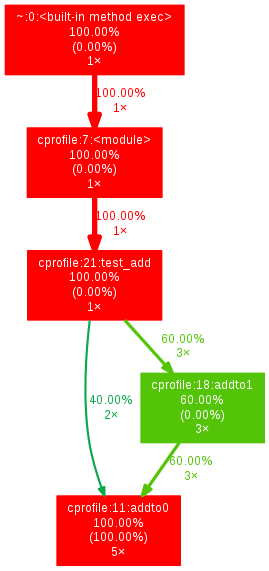

调试和性能优化
================

定制调试信息
----------------------

打印文件名和行号
~~~~~~~~~~~~~~~~~~~

借助sys.exc_info 模块自己捕获异常，来打印调用者信息，同时打印当前调试信息。

.. code-block:: python
  :linenos:
  :lineno-start: 0

  import sys
  def xprint(msg=""):
      try:
          print("do try")
          raise Exception
      except:
          f = sys.exc_info()[2].tb_frame.f_back

      print('%s[%s]: %s' % (f.f_code.co_filename, str(f.f_lineno), msg))

  def test_xprint():
      xprint()
      xprint("%d %s" %(10, "hello"))

  test_xprint()
  
  >>>
  C:/Users/Red/.spyder/test/test.py[218]: 
  C:/Users/Red/.spyder/test.py[219]: 10 hello

异常时打印函数调用栈
~~~~~~~~~~~~~~~~~~~~~~

异常发生时，Python默认处理方式将中断程序的运行，有时候我们希望程序继续运行。
可以通过 try 语句结合 sys.exc_info() 和 traceback模块抛出异常，并给出提示信息。

.. code-block:: python
  :linenos:
  :lineno-start: 0

  import traceback
  import sys
  
  def xtry(runstr):
      ret, status = None, True
      try:
          ret = eval(runstr)
      except:
          info = traceback.format_exc()
          try:
              raise Exception
          except:
              f = sys.exc_info()[2].tb_frame.f_back
  
          print('%s[%s]: %s' % (f.f_code.co_filename, str(f.f_lineno), info))
          status = False
      return status, ret

xtry()函数接受一个字符串作为表达式，与xprint()函数类似，在异常出现时打印出文件名和行号，并且借助traceback模块格式化调用栈信息。
同时返回是否出现异常和表达式的执行结果，status为True表示可以正常执行，否则出现异常。

下面是一个示例：

.. code-block:: sh
  :linenos:
  :lineno-start: 0

  def divide(a, b):
      return a / b
  
  status, ret = xtry("divide0(100, 0)")
  print(status, ret)
  print("still running!!") # 继续执行

  >>>
  C:/Users/Red/.spyder/dolist/except.py[37]: Traceback (most recent call last):
    File "C:/Users/Red/.spyder/dolist/except.py", line 22, in xtry
      ret = eval(runstr)
    File "<string>", line 1, in <module>
    File "C:/Users/Red/.spyder/dolist/except.py", line 12, in divide0
      try:
  ZeroDivisionError: division by zero
  
  False None
  still running!!

断言和测试框架
---------------

assert 语句
~~~~~~~~~~~~~

断言语句 assert 在表达式为假时抛出断言异常 AssertionError 并终止程序的执行。
这在调试和测试代码时非常有用。 

.. code-block:: python
  :linenos:
  :lineno-start: 0

  assert 1 == 2
  assert isinstance('str', str)
  assert 0
  assert False

0 和 False是等价的，1 和 True 是等价的，当表达式为假时，抛出如下的异常信息：

.. code-block:: python
  :linenos:
  :lineno-start: 0

  assert 1 == 2
  
  >>>
    File "C:/Users/Red/.spyder/except.py", line 107, in <module>
      assert 1 == 2

  AssertionError

断言语句还支持一个格式化字符串参数，以逗号区分，用于提供更明确的断言信息。

.. code-block:: python
  :linenos:
  :lineno-start: 0
  
  oct_num = -1
  assert oct_num in range(10), "Oct number must be in (%d-%d)" % (0, 9)
  
  >>>
    File "C:/Users/Red/.spyder/except.py", line 107
      assert oct_num in range(10), "Oct number must be in (%d-%d)" % (0, 9)
  
  AssertionError: Oct number must be in (0-9)

专门的测试框架工具通常会对 Python 自带的断言功能进行扩展，以提供更强大的测试和诊断能力。

单元测试模块 unittest
~~~~~~~~~~~~~~~~~~~~~~~~

单元测试主要针对最基础的代码可测单元进行测试，比如一个表达式，一个变量值的合法性，一个函数的入参和出参规格直至一个模块的功能。
著名的极限编程中的测试驱动开发（TDD：Test-Driven Development）就是以单元测试为基础的开发方式，
单元测试代码在编写功能代码时同时进行，每次对代码的增删和缺陷修复都要进行单元测试，以保证代码是符合预期的。
这很像在修路的同时，同时修筑了足够高的防护栏，而在赛车选手变换各类驾驶技巧时，不会冲出赛道。

可以这样说，只要单元测试没有漏洞，编码者就有底气说问题已经彻底修复了。

unittest 测试用例
```````````````````

Python 自带单元测试框架 unittest ， 它将测试用例定义为 TestCase 类。
编写单元测试时，首先需要编写一个测试类，并继承 unittest.TestCase，类中的方法必须以 test 开头：

.. code-block:: python
  :linenos:
  :lineno-start: 0
  
  import unittest
  
  class test_suit1(unittest.TestCase): 
      def test1(self):  
          '''test suit 1'''     # 测试用例描述，同用例标题一并显示在测试报告里
          self.assertEqual(1, 1)# 测试用例断言，期望 1 == 1，否则抛出异常
  
  class test_suit2(unittest.TestCase):
      def test2(self):
          '''test suit 2'''
          self.assertEqual(2, 0)
  
  unittest.main()               # 可以传入 verbosity=1 打印每一测试用例结果
  
  >>>
  .F
  ======================================================================
  FAIL: test2 (unit.test_suit2)
  test suit 2
  ----------------------------------------------------------------------
  Traceback (most recent call last):
    File "/home/red/sdc/lbooks/ml/unit.py", line 14, in test2
      self.assertEqual(2, 0)
  AssertionError: 2 != 0
  
  ----------------------------------------------------------------------
  Ran 2 tests in 0.001s

测试结果的第一行给出所有测试用例的结果， . 和 F 分别表示测试通过或失败，每一个测试用例对应一个字符。

接着给出出错所用例的类名和描述，并附上对应出错代码的文件和行号等信息。最后给出总的运行用例数和测试耗时。

上面的示例直接通过 unittest.main() 函数运行，也可以在命令行中调用 unittest 模块，注意要注释掉 unittest.main()。

.. code-block:: python
  :linenos:
  :lineno-start: 0
  
  python3.4 -m unittest unit_sample.py    # 可以添加 -v 打印每一测试用例结果

unittest 目前支持如下断言函数：

  =========================  ======================  ==========
  名称                         等价                       版本
  =========================  ======================  ==========
  assertEqual(a, b)          a == b
  assertNotEqual(a, b)       a != b    
  assertTrue(x)              bool(x) is True    
  assertFalse(x)             bool(x) is False    
  assertIs(a, b)             a is b                  3.1
  assertIsNot(a, b)          a is not b               3.1
  assertIsNone(x)            x is None               3.1
  assertIsNotNone(x)         x is not None           3.1
  assertIn(a, b)             a in b                   3.1
  assertNotIn(a, b)          a not in b               3.1
  assertIsInstance(a, b)     isinstance(a, b)         3.2
  assertNotIsInstance(a, b)  not isinstance(a, b)     3.2
  =========================  ======================  ==========

unittest 测试套件
```````````````````

上面的例子在实际的运行中，测试顺序并不是严格按照我们定义的测试用例顺序执行，有时我们的测试用例可能依赖执行顺序，比如打开文件，写文件等。
测试套件 TestSuite 可以解决该问题，同时它可以组织多个脚本文件的测试用例。

.. code-block:: python
  :linenos:
  :lineno-start: 0
  
  class TestMathFunc(unittest.TestCase):
      def test_abs(self): 
          """Test method abs()""" 
          self.assertEqual(1, abs(-1)) 
          self.assertEqual(1, abs(1)) 
          
      def test_max(self): 
          """Test method max(x1,x2...)""" 
          self.assertEqual(2, max(1, 2)) 
      
      def test_min(self): 
          """Test method min(x1,x2...)""" 
          self.assertEqual(1, min(1, 2)) 

  # 创建测试套件
  suite = unittest.TestSuite() 
  
  # 1. 添加部分测试用例
  tests = [TestMathFunc("test_max"), TestMathFunc("test_min")] 
  suite.addTests(tests)
  
  # 2. 添加所有测试用例
  suite.addTest(unittest.makeSuite(TestMathFunc))
  
  runner = unittest.TextTestRunner(verbosity=1) # verbosity=0-2 调整输出
  runner.run(suite)

  >>>
  .....
  ----------------------------------------------------------------------
  Ran 5 tests in 0.000s
  
  OK

示例中提供了两种向测试套件添加测试用例的方法，通过 addTests() 部分添加测试用例或通过 addTest() 导入套件中全部用例。测试结果中显示运行了5个用例。

测试结果输出到文件
```````````````````

.. code-block:: python
  :linenos:
  :lineno-start: 0
  
  ......
  suite.addTest(unittest.makeSuite(TestMathFunc))
  
  with open('unittest_report.txt', 'w') as f:
    runner = unittest.TextTestRunner(stream=f, verbosity=1)
    runner.run(suite)

查看 unittest_report.txt 文件，可以发现与上面示例相同的输出。这里采用 unittest 自带的 TextTestRunner()，输出结果为普通文本文件。
verbosity 参数可以控制执行结果的输出：0 是简单报告，1 是一般报告，2 是详细报告。

可以借助 HTMLTestRunner 和 xmlrunner 模块生成 html 或者 xml 格式的报告文件。

测试环境的布置和清理
```````````````````````

如果测试需要在每次执行之前准备环境，并且在每次执行完后需要进行测试环境的撤销，比如执行前创建临时文件夹，临时文件，测试用数据，连接数据库，创建并连接套接字等，
执行完成之后要删除临时文件夹，临时数据，断开连接。不可能为了每个测试用例都添加准备环境、清理环境的操作。

我们只要在测试类中，重写 unnitest 模块提供的 setUp() 和 tearDown() 两个方法即可。

.. code-block:: python
  :linenos:
  :lineno-start: 0
  
  class TestMathFunc(unittest.TestCase):
      def setUp(self): 
          print("Prepare unittest environment.") 
      
      def tearDown(self): 
          print("Clean up unittest environment.")

      ......

  >>>
  Prepare unittest environment.
  Clean up unittest environment.
  .Prepare unittest environment.
  Clean up unittest environment.
  ......

可以看到 setUp() 和 tearDown() 在每个测试用例执行前后都会执行一次。
也可以借助这一机制，来统计每个测试用例的运行时间。

如果想要在所有测试用例执行之前和结束之后，只执行一次准备和清理动作，可以用 setUpClass() 与 tearDownClass()。

.. code-block:: python
  :linenos:
  :lineno-start: 0
  
  class TestMathFunc(unittest.TestCase):
      @classmethod
      def setUpClass(cls):
          print("Prepare unittest environment.") 
      
      @classmethod
      def tearDownClass(cls):
          print("Clean up unittest environment.")
      
      ......
      
  >>>
  Prepare unittest environment.
  .....Clean up unittest environment.
  
  ----------------------------------------------------------------------
  Ran 5 tests in 0.000s
  
  OK

注意：必须使用 classmethod 修饰符来指明 setUpClass() 与 tearDownClass() 是类的方法，不需要实例化即可执行。

跳过特定测试用例
````````````````````````

如果想要跳过某个测试用例不执行，可以在测试函数前使用 skip 修饰器。

.. code-block:: python
  :linenos:
  :lineno-start: 0
  
  class TestMathFunc(unittest.TestCase):
      def test_abs(self):
          """Test method abs()"""
          self.assertEqual(1, abs(-1))
          self.assertEqual(1, abs(1))
  
      @unittest.skip("Don't run it now!")
      def test_max(self):
          """Test method max(x1,x2...)"""
          self.assertEqual(2, max(1, 2))
  
      ......
      
  >>>
  s..s.
  ----------------------------------------------------------------------
  Ran 5 tests in 0.001s
  
  OK (skipped=2)

可以看到在 test_max() 用例在执行时标记为 s，表示跳过。
    
skip 修饰器一共有三种：

- unittest.skip(reason) 无条件跳过。
- unittest.skipIf(condition, reason) 当 condition 为 True 时跳过。
- unittest.skipUnless(condition, reason) 当 condition 为 False 时跳过。

参数化测试
``````````````

如果要针对某个函数，或者类进行多种数据输入组合的测试，特别是完整性测试时，为每一种情况写一句断言，是非常麻烦的事情，借助参数化模块
parameterized，可以解决这一问题。

安装它的命令为 sudo pythonX.Y -m pip install parameterized，注意 Python 版本。

.. code-block:: python
  :linenos:
  :lineno-start: 0
  
  from parameterized import parameterized
  class TestCanDrive(unittest.TestCase):
      @parameterized.expand([
          [True, True, False], # 也可以是 tuple
          [True, False, True],
          [False, False, False],
          [False, False, False]
      ])
      
      # 运行时遍历上述列表里的参数，把所有项执行一遍
      def test_can_drive(self, with_license, drunk, expected): 
          status = can_drive(with_license, drunk)
          self.assertEqual(status, expected)
  
  suite.addTest(unittest.makeSuite(TestCanDrive))
  runner = unittest.TextTestRunner(verbosity=1) 
  runner.run(suite)

  >>>
  ....
  ----------------------------------------------------------------------
  Ran 4 tests in 0.000s
  
  OK

尽管我们只定义了一个测试函数，却运行了4个测试用例。如果测试用例数据非常多，我们可以把需要传递给 parameterized.expand()
函数的列表参数的数据放在一个文件里面，使用的时候读取。这样在修改维护测试数据上都将轻松很多。

批量执行测试用例
`````````````````

尽管通过 import 所有的测试模块脚本，并将它们加入到当前总的测试脚本中的测试套件中，以实现批量处理，但是每次
增删模块，都需要修改当前测试脚本，非常麻烦。

unittest 里的 defaultTestLoader.discover() 方法可以对指定路径下的测试脚本文件进行通配符匹配，直接返回测试套件。

.. code-block:: python
  :linenos:
  :lineno-start: 0
  
  cases_suit = unittest.defaultTestLoader.discover("test_dir", \
               pattern="test_*.py", top_level_dir=None)

  runner = unittest.TextTestRunner(verbosity=1) 
  runner.run(cases_suit)

注意：defaultTestLoader.discover() 方法只处理包类型目录，也即目录下必须存在 __init__.py 文件，top_level_dir 指明包的顶层目录。

性能分析
-------------------------

在分析python代码执行效率时经常使用time包中的time.time()和time.clock()函数。但是两者是有区别的。

根据cpu的运行机制，cpu是多任务的，如在多进程的执行过程中，一段时间内会被多个进程或者线程占用。
一个进程从开始到结束其实是在这期间的一系列时间片(tick)上断断续续执行的。
此外，如果cpu是多核的或者超线程的，那么多线程的程序执行占用的cpu时间也可能多于真实世界流逝的时间。所以这就引出了程序执行的cpu时间（在这段系统时间内程序占用cpu运行的时间）和墙上时钟（wall time）。

绝对时间(absolute time)：也即真实世界时间（real-world time），由time.time()返回。
它是从某个过去固定的时间点（比如 UNIX epoch为00:00:00 UTC on 01/01/1970）到当前时刻
真实世界经过的秒数。系统通过RTC(real-time clock)电路和纽扣电池来保持该时间。系统启动时读取
该秒数，在运行时，也可以通过NTP协议动态修改该秒数。系统基于该值，通过时区和夏令时转换显示为
便于理解的当地时间。UTC时区又被称为GMT或者Zulu时间。

real-world time或者real time在英文中还被称为墙上时钟(wall time或者wall-clock time)，所以time.time()
两次返回的值的差就和墙上挂钟或者手表走过的时间是一样的。计算机中的RTC时钟系统是可以进行调整的，
这和真实世界中的钟表是一样的，任何人造计时装置都会走快走慢，RTC时钟系统也一样。

time和clock函数
~~~~~~~~~~~~~~~~~~~~~

- time.time()统计的是墙上时钟(wall time)，也就是系统时钟的时间戳（1970纪元后经过的浮点秒数）。所以两次调用的时间差即为系统经过的总时间。

- time.clock()统计的是cpu时间，这在统计某一进程或者线程或函数的执行速度最为合适。两次调用time.clock()函数值即为程序运行占用的cpu时间。cpu时间又可细分为用户时间(User Time)和系统时间(System Time)，分别表示进程/线程运行在用户态和内核态所占用的时间。

这两个函数均返回浮点数，单位秒。以下是两个函数的对比：

.. code-block:: python
  :linenos:
  :lineno-start: 0
  
  import time
  
  def addto(n):
      time.sleep(3) # 区分clock()和time()不同平台实现不同
      return sum(range(n + 1))

  start = time.time()
  addto(10000000)
  end = time.time()
  print("time.time():\t\t%f" % (end - start))

  start = time.clock()
  addto(10000000)
  end = time.clock()
  print("time.clock():\t\t%f" % (end - start))

  >>> # Windows 运行结果
  time.time():            3.573660
  time.clock():           3.552534

  >>> # Linux 运行结果
  time.time():            4.246678
  time.clock():           1.216453

以上结果令人迷惑，在不同的平台上运行结果不一致。Linux上time.clock()要比time.time()短得多，而Windows平台相差不多。

如果去掉测试函数中的sleep(3)，则两个函数在Linux平台上的输出也变成接近的。睡眠函数让程序让出cpu，显然在Linux平台上clock()函数统计的是程序实际消耗的cpu时间，而Windows平台返回的则是墙上时间。

通过查看系统clock()函数的底层调用，可以了解不同平台的区别。

.. code-block:: python
  :linenos:
  :lineno-start: 0
  
  print(time.get_clock_info("clock"))

  >>> # Windows 运行结果
  namespace(adjustable=False, implementation='QueryPerformanceCounter()', 
  monotonic=True, resolution=3.9506172839506174e-07)
  
  >>> # Linux 运行结果
  namespace(adjustable=False, implementation='clock()', monotonic=True, resolution=1e-06)

Windows 平台底层调用 QueryPerformanceCounter() 函数，它实际上返回的就是墙上时间。

由以上测试用例，可以看出采用 time.clock() 来统计代码运行效率，具有平台不确定性，代码不可移植，该函数官方在Python 3.3版本已不再推荐使用。已被time.perf_counter()和time.process_time()取代。

详细说明请参考 `PEP0418 <https://www.python.org/dev/peps/pep-0418/#time-clock>`_ 。

高精度时间统计函数
~~~~~~~~~~~~~~~~~~~~

高精度的时间间隔统计的实现基于cpu频率计数器，最高可以精确到cpu的工作频率。

time.perf_counter() 函数返回cpu时间，包括用户时间和系统时间，sleep 的时间，它包含了当前函数开始和结束间隔内被调度出的时间。

time.process_time() 函数返回本进程或者线程的cpu占用时间，包括用户时间和系统时间，不包含 sleep 时间。

.. code-block:: python
  :linenos:
  :lineno-start: 0
  
  start = time.perf_counter()
  addto(10000000)
  end = time.perf_counter()
  print("time.perf_counter():\t%f" % (end - start))
  
  start = time.process_time()
  addto(10000000)
  end = time.process_time()
  print("time.process_time():\t%f" % (end - start))
  
  >>> # Windows 运行结果
  time.perf_counter():    3.553474
  time.process_time():    0.578125
  
  >>> # Linux 运行结果
  time.perf_counter():    4.178790
  time.process_time():    1.130667

通常情况下，使用这两个函数来对代码效率进行简单统计。

timeit性能分析模块
~~~~~~~~~~~~~~~~~~~~

timeit模块默认使用 perf_counter() 时钟计时函数。

.. code-block:: python
  :linenos:
  :lineno-start: 0

  import timeit
  
  # 通过 timer 参数可以指定计时器
  # print(timeit.timeit('x=1', timer=time.process_time))
  print(timeit.default_timer)
  
  >>>
  <built-in function perf_counter>

timeit模块提供了 timeit() 和 repeat() 函数用于对代码片段或者函数进行重复测试。

.. code-block:: python
  :linenos:
  :lineno-start: 0
    
  #看执行1000000次x=1的时间：
  print(timeit.timeit('x=1'))
  
  #看x=1的执行时间，执行1次(number可以省略，默认值为1000000)：
  print(timeit.timeit('x=1', number=1))
  
  #看一个列表生成器的执行时间,执行10000次：
  t = timeit.timeit('[i for i in range(100) if i%2==0]', number=10000)
  print(t)
  
  t = timeit.timeit('addto(100000)', 'from __main__ import addto', number=1000)
  print(t)

  >>>
  0.013765925919869915
  3.950553946197033e-07
  0.07114627161354292
  2.6092641975410515

repeat和timeit用法相似，多了一个repeat参数，表示重复测试的次数(默认值为3)，
返回值为一个时间的列表。

.. code-block:: python
  :linenos:
  :lineno-start: 0
   
  t = timeit.repeat('addto(100000)', 'from __main__ import addto', number=100, repeat=3)
  print(t) 
  print(min(t))

  >>>
  [0.2632288394961506, 0.25551288889255375, 0.2601240493822843]
  0.25551288889255375

cProfile 和 profile  
~~~~~~~~~~~~~~~~~~~~~~~~~~

确定性性能分析((Deterministic Profiling))指的是反映所有的函数调用，返回，和异常事件的执行所用的时间，以及它们之间的时间间隔。相比之下，统计性性能分析指的是取样有效的程序指令，然后推导出所需要的时间，后者花费比较少的开销，但是给出的结果不够精确。

因Python是解释性语言，在执行程序的时候，需要解释器解析执行，这部分的执行是不需要进行性能分析的。Python自动为每一个事件提供一个hook，来定位需要分析的代码。除此之外，因为Python解释型语言的本质往往需要在执行程序的时候加入很多其它的开销，而确定性性能分析只会加入一点点处理开销。这样一来，确定性性能分析其实开销不大，还可以提供丰富的统计信息。

函数调用次数的统计能够被用于确定程序中的bug，比如一个不符合常理的次数，明显偏多之类的，还可以用来确定可能的内联函数。函数内部运行时间的统计可被用来确定”hot loops”，那些运行时间过长，需要优化的部分；累计时间的统计可被用来确定比较高层次的错误，比如算法选择上的错误。

cProfile 和 profile 均是标准库内建的确定性性能分析工具。

profile是原始的纯Python分析器。它提供的函数接口和调用方式与cProfile完全兼容。与cProfile相比，用户可以根据需要，在脚本层面扩展该模块。

cProfile是默认的分析工具，它基于lsprof，一个用C语言实现的扩展库，
底层调用 C 语言接口提供的动态库，在Unix系统上，它通常是位于Python共享库文件夹
/usr/lib/pythonx.y/lib-dynload/下的_lsprof.cpython-xxx-linux-gnu.so。所以相对于profile，它的运行效率要高。

使用 cProfile 进行性能分析有两种方式，可以使用命令行执行，也可以在脚本中导入函数。
使用命令行执行时，无需对脚本做任何改动。

.. code-block:: python
  :linenos:
  :lineno-start: 0
  
  # cprofile.py 中的测试代码
  def addto0(n):
    total = 1.0
    for i in range(1,n+1):
      total += i
  
    return total
  
  def addto1(n):
    return addto0(n)
  
  def test_add(n):
    for i in range(2):
      addto0(n)
    for i in range(3):
      addto1(n)
  
  test_add(10000000)
  
  # 直接命令行调用cProfile模块
  # python -m cProfile -s cumulative cprofile.py 
  
         12 function calls in 5.643 seconds

  Ordered by: cumulative time
  
  ncalls  tottime  percall  cumtime  percall filename:lineno(function)
      1    0.000    0.000    5.643    5.643 {built-in method exec}
      1    0.000    0.000    5.643    5.643 cprofile.py:7(<module>)
      1    0.000    0.000    5.643    5.643 cprofile.py:19(test_add)
      5    5.643    1.129    5.643    1.129 cprofile.py:9(addto0)
      3    0.000    0.000    3.385    1.128 cprofile.py:16(addto1)
      1    0.000    0.000    0.000    0.000 {method 'disable' of '_lsprof.Profiler' objects}

-s 参数指明输出排序方式为 cumulative，也即按照函数累计耗时大小排序。这方便找到耗时最久的代码点。

第一行指明脚本中共执行了 12 次函数调用，一共耗时 5.642秒。

- ncalls：每个函数调用的次数，这里它们的和正好是12。
- tottime： 每个函数调用累计耗时，不含函数中子函数耗时。
- percall： 函数每次调用累计耗时的平均时间，等于 tottime / ncalls。
- cumtime： 每个函数调用累计耗时，含函数中子函数耗时。
- precall：函数每次调用累计耗时的平均时间，等于 cumtime / ncalls。
- filename:lineno(function)：给出文件名，行号和函数名

test_add()函数被调用1次，其中调用了2次addto0() 和 3次addto1()，addto1()中调用了addto0()，
所以 addto0() 一共被调用了5次。

-s 参数还支持 ncalls，tottime，filename，line和module等排序方式。

代码中直接调用cProfile函数，这里用 ncalls排序：

.. code-block:: python
  :linenos:
  :lineno-start: 0

  import cProfile
  
  # 直接把分析结果打印到控制台
  cProfile.run("test_add(10000000)", sort="ncalls")
  
  >>>
         12 function calls in 5.693 seconds
  
  Ordered by: call count
  
  ncalls  tottime  percall  cumtime  percall filename:lineno(function)
      5    5.693    1.139    5.693    1.139 cprofile.py:11(addto0)
      3    0.000    0.000    3.319    1.106 cprofile.py:18(addto1)
      1    0.000    0.000    0.000    0.000 {method 'disable' of '_lsprof.Profiler' objects}
      1    0.000    0.000    5.693    5.693 {built-in method exec}
      1    0.000    0.000    5.693    5.693 <string>:1(<module>)
      1    0.000    0.000    5.693    5.693 cprofile.py:21(test_add)

pstats分析输出结果
````````````````````````

cProfile 统计结果输出到文件：

.. code-block:: python
  :linenos:
  :lineno-start: 0
  
  # python -m cProfile -o profile.stats cprofile.py   # 命令方式

  cProfile.run("addto(10000000)", filename="profile.stats")# 脚本调用函数方式

pstates 模块完成对文件 profile.stats 的分析。print_stats()输出跟之前一样的累计报告信息。

.. code-block:: python
  :linenos:
  :lineno-start: 0
  
  import pstats
  
  p = pstats.Stats("profile.stats")
  p.sort_stats("cumulative")
  p.print_stats()
  
  >>>
       12 function calls in 5.631 seconds
  
  Ordered by: cumulative time
  
  ncalls  tottime  percall  cumtime  percall filename:lineno(function)
      1    0.000    0.000    5.631    5.631 {built-in method exec}
      1    0.000    0.000    5.631    5.631 cprofile.py:7(<module>)
      1    0.000    0.000    5.631    5.631 cprofile.py:21(test_add)
      5    5.631    1.126    5.631    1.126 cprofile.py:11(addto0)
      3    0.000    0.000    3.378    1.126 cprofile.py:18(addto1)
      1    0.000    0.000    0.000    0.000 {method 'disable' of '_lsprof.Profiler' objects}

为了追溯关心的函数，可以通过print_callers()打印调用者的信息。

.. code-block:: python
  :linenos:
  :lineno-start: 0
    
  p.print_callers()
  
  >>>
     Ordered by: cumulative time
  
  Function                                          was called by...
                                                        ncalls  tottime  cumtime
  {built-in method exec}                            <- 
  cprofile.py:7(<module>)                           <-       1    0.000    5.631  {built-in method exec}
  cprofile.py:21(test_add)                          <-       1    0.000    5.631  cprofile.py:7(<module>)
  cprofile.py:11(addto0)                            <-       3    3.378    3.378  cprofile.py:18(addto1)
                                                             2    2.252    2.252  cprofile.py:21(test_add)
  cprofile.py:18(addto1)                            <-       3    0.000    3.378  cprofile.py:21(test_add)
  {method 'disable' of '_lsprof.Profiler' objects}  <- 

反过来，还可以通过print_callees()打印被调用者的信息。
  
.. code-block:: python
  :linenos:
  :lineno-start: 0

  p.print_callees()

  >>>
     Ordered by: cumulative time
  
  Function                                          called...
                                                        ncalls  tottime  cumtime
  {built-in method exec}                            ->       1    0.000    5.631  cprofile.py:7(<module>)
  cprofile.py:7(<module>)                           ->       1    0.000    5.631  cprofile.py:21(test_add)
  cprofile.py:21(test_add)                          ->       2    2.252    2.252  cprofile.py:11(addto0)
                                                             3    0.000    3.378  cprofile.py:18(addto1)
  cprofile.py:11(addto0)                            -> 
  cprofile.py:18(addto1)                            ->       3    3.378    3.378  cprofile.py:11(addto0)
  {method 'disable' of '_lsprof.Profiler' objects}  ->   

查看前特定行的函数信息，如下所示：

.. code-block:: python
  :linenos:
  :lineno-start: 0
  
  # 打印指定的前多少行
  p.print_stats(2)
  
  # 以百分比，打印前50%的行数
  p.print_stats(0.5)

  >>>
  ...     
  ncalls  tottime  percall  cumtime  percall filename:lineno(function)
       1    0.000    0.000    5.631    5.631 {built-in method exec}
       1    0.000    0.000    5.631    5.631 cprofile.py:7(<module>)
       
  ...     
  ncalls  tottime  percall  cumtime  percall filename:lineno(function)
       1    0.000    0.000    5.631    5.631 {built-in method exec}
       1    0.000    0.000    5.631    5.631 cprofile.py:7(<module>)
       1    0.000    0.000    5.631    5.631 cprofile.py:21(test_add)

查看给定的函数调用信息，比如想查看哪些函数调用了 addto0() 函数：

.. code-block:: python
  :linenos:
  :lineno-start: 0    
  
  p.print_callers("addto0")
   
  >>>
     Ordered by: cumulative time
     List reduced from 6 to 1 due to restriction <'addto0'>
  
  Function                was called by...
                              ncalls  tottime  cumtime
  cprofile.py:11(addto0)  <-       3    3.378    3.378  cprofile.py:18(addto1)
                                   2    2.252    2.252  cprofile.py:21(test_add)

同理，如果要查看test_add()函数调用了哪些函数：

.. code-block:: python
  :linenos:
  :lineno-start: 0
  
  p.print_callees("test_add")  
  
  >>>
     Ordered by: cumulative time
     List reduced from 6 to 1 due to restriction <'test_add'>
  
  Function                  called...
                                ncalls  tottime  cumtime
  cprofile.py:21(test_add)  ->       2    2.252    2.252  cprofile.py:11(addto0)
                                     3    0.000    3.378  cprofile.py:18(addto1)

cProfile数据可视化
````````````````````````

使用 gprof2dot 脚本和 dot命令可以根据cProfile统计信息生成函数调用流程图。

.. code-block:: python
  :linenos:
  :lineno-start: 0
  
  # pip install gprof2dot
  # gprof2dot -f pstats profile.stats | dot -Tpng -o output.png



  gprof2dot生成的函数调用流程图

逐行分析模块line_profiler  
~~~~~~~~~~~~~~~~~~~~~~~~~~


Python环境配置
-------------------------

为不同版本的 Python 环境安装模块

sudo pythonX.Y -m pip install module_name

pip 安装软件报错：Python.h: No such file or directory的解决方法

有两种情况，一种是没有Python.h这个文件，一种是Python的版本不对，

可以进入/usr/include/文件夹下的Pythonx.x文件夹里查找是否有Python.h这个文件。
如果是第一种情况，那么需要安装python-dev这个包，(sudo apt-get install python-dev)。
