matplotlib
================

matplotlib 是 python 中一个非常强大的 2D 函数绘图模块，它提供了子模块 pyplot 和 pylab 。pylab 是对 pyplot 和 numpy 模块的封装，更适合在 IPython 交互式环境中使用。

对于一个项目来说，官方建议分别导入使用，这样代码更清晰，即：

.. code-block:: python
  :linenos:
  :lineno-start: 0

  import numpy as np
  import matplotlib.pyplot as plt

而不是

.. code-block:: python
  :linenos:
  :lineno-start: 0

  import pylab as pl

基本绘图流程
------------------

这里以绘制正余弦函数图像为例。

.. code-block:: python
  :linenos:
  :lineno-start: 0
  
  # 分别导入 numpy 和 pyplot 模块
  import numpy as np
  import matplotlib.pyplot as plt
  
  # 生成 X 坐标，256个采样值足够图像平滑
  X = np.linspace(-np.pi, np.pi, 256, endpoint=True)

  # 生成 Y 坐标
  C,S = np.cos(X), np.sin(X)
  
  # 绘制正余弦
  plt.plot(X,S)
  plt.plot(X,C)
  
  # 显示图像
  plt.show()

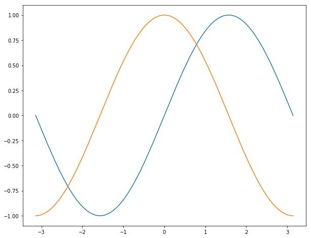
  
  matplotlib 默认绘制的正余弦函数图像

默认配置
~~~~~~~~~~~~

matplotlib 的相关配置主要包括以下几种，用户可以自定义它们：

- 图片大小和分辨率（dpi）
- 线宽、颜色、风格
- 坐标轴、坐标轴以及网格的属性
- 文字与字体属性。

所有的默认属性均保存在 matplotlib.rcParams 字典中。

默认配置概览
`````````````

.. code-block:: python
  :linenos:
  :lineno-start: 0
  
  X = np.linspace(-np.pi, np.pi, 256, endpoint=True)
  C,S = np.cos(X), np.sin(X)

  # 创建一个宽10，高8 英寸（inches，1inch = 2.54cm）的图，并设置分辨率为72 (每英寸像素点数)
  plt.figure(figsize=(10, 8), dpi=72)

  # 创建一个新的 1 * 1 的子图，接下来的图样绘制在其中的第 1 块（也是唯一的一块）
  plt.subplot(1,1,1)
  
  # 绘制正弦曲线，使用绿色的、连续的、宽度为 1 （像素）的线条
  plt.plot(X, S, color="orange", linewidth=1.0, linestyle="-")
  
  # 绘制余弦曲线，使用蓝色的、连续的、宽度为 1 （像素）的线条
  plt.plot(X, C, color="blue", linewidth=1.0, linestyle="-")
  
  # 设置 x轴的上下限
  plt.xlim(-np.pi, np.pi)
  
  # 设置 x轴记号
  plt.xticks(np.linspace(-4, 4, 9, endpoint=True))
  
  # 设置 y轴的上下限
  plt.ylim(-1.0, 1.0)
  
  # 设置 y轴记号
  plt.yticks(np.linspace(-1, 1, 5, endpoint=True))
  
  # 在屏幕上显示
  plt.show()

我们可以依次改变上面的值，观察不同属性对图像的影响。

图像大小等
`````````````   

图像就是以「Figure #」为标题的那些窗口。图像编号从 1 开始，与 MATLAB 的风格一致，而于 Python 从 0 开始的索引编号不同。以下参数是图像的属性：

  ============= =================== ===========
  参数            默认值	          描述
  ============= =================== ===========
  num             1                 图像的数量
  figsize         figure.figsize    图像的长和宽（英寸）
  dpi             figure.dpi        分辨率（像素/英寸）
  facecolor       figure.facecolor  绘图区域的背景颜色
  edgecolor       figure.edgecolor  绘图区域边缘的颜色
  frameon         True              是否绘制图像边缘
  ============= =================== ===========

.. code-block:: python
  :linenos:
  :lineno-start: 0
  
  import matplotlib as mpl
  
  figparams = ['figsize', 'dpi', 'facecolor', 'edgecolor']
  for para in figparams:
      name = 'figure.' + para
      print(name + '\t:', mpl.rcParams[name])
  
  >>>
  figure.figsize  : [10.0, 8.0]
  figure.dpi      : 72.0
  figure.facecolor        : white
  figure.edgecolor        : white

我们可以通过查询参数字典来获取默认值。除了图像 num 这个参数，其余的参数都很少修改，num 可以是一个字符串，此时它会显示在图像窗口上。

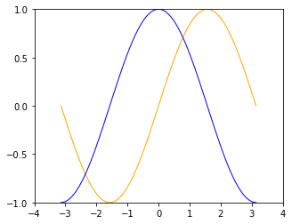
  
  plt.figure(figsize=(5, 4), dpi=72)
  
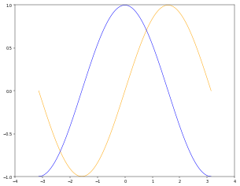
  
  plt.figure(figsize=(10, 8), dpi=36)

可以看到调整长宽英寸数和分辨率均会影响图片显示大小，以宽度为例，显示大小为 w * dpi / 显示屏幕宽度分辨率。

14 英寸显示屏是指屏幕对角线长度 35.56cm，如果屏幕宽高比为 16 : 9，则宽和高约为 31cm 和 17.4cm，如果分比率为 1920 * 1080，则上述图像显示宽度的
10 * 36 / 1920 * 31 = 5.8cm，或者 5 * 72 / 1920 * 31 = 5.8cm。

高 dpi 显示图像更细腻，但是图像尺寸也会变大。使用默认值即可。如果图像非常复杂，为了看清细节，我们可以调整宽高的英寸数。

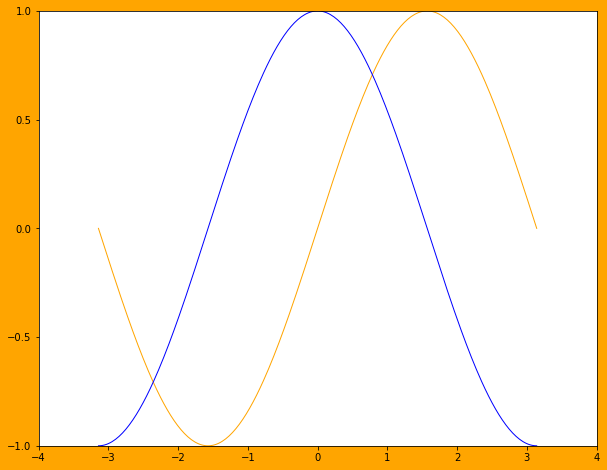
    
  plt.figure(figsize=(10, 8), dpi=72, facecolor='orange')

绘图区域的背景色改为橙色的效果，通常不需要改变它。

线条的颜色
````````````` 

.. code-block:: python
  :linenos:
  :lineno-start: 0
  
  plt.plot(X, S, color="orange", linewidth=1.0, linestyle="-")
  
上文中，已经观察到线条属性有如下几个：

**颜色**，color/c 参数指定。我们可以通过 help(plt.plot) 查看帮助信息，颜色属性可以通过如下方式指定：

- 颜色名，例如 'green'。
- 16进制的RGB值 '#008000'，或者元组类型 RGBA (0,1,0,1)。
- 灰度值，例如 '0.8'。
- 颜色缩写字符，例如 'r' 表示 'red'

当前支持的颜色缩写有：

  ==========  ========
  缩写字符    颜色
  ==========  ========
  'b'         blue
  'g'         green
  'r'         red
  'c'         cyan
  'm'         magenta
  'y'         yellow
  'k'         black
  'w'         white
  ==========  ========

.. code-block:: python
  :linenos:
  :lineno-start: 0

  plt.subplot(2,2,1)
  plt.plot(X, S, color='orange', linewidth=1.0, linestyle="-")
  plt.subplot(2,2,2)
  plt.plot(X, S, color='b', linewidth=1.0, linestyle="-")
  plt.subplot(2,2,3)
  plt.plot(X, S, color='0.8', linewidth=1.0, linestyle="-")
  plt.subplot(2,2,4)
  plt.plot(X, S, color='#003333', linewidth=1.0, linestyle="-")
  
.. figure:: imgs/sincolor0.png
  :scale: 80%
  :align: center
  :alt: sincolor0
  
  分别指定四种颜色参数画图

线条的粗细
`````````````

**线宽**，linewidth/lw，浮点值，指定绘制线条宽度点数。

.. code-block:: python
  :linenos:
  :lineno-start: 0
  
  plt.subplot(2,2,1)
  plt.plot(X, S, color='blue', linewidth=0.5, linestyle="-")
  plt.subplot(2,2,2)
  plt.plot(X, S, color='blue', linewidth=1.0, linestyle="-")
  plt.subplot(2,2,3)
  plt.plot(X, S, color='blue', linewidth=1.5, linestyle="-")
  plt.subplot(2,2,4)
  plt.plot(X, S, color='blue', linewidth=2.0, linestyle="-")
  
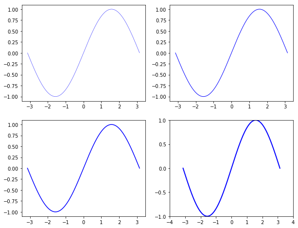
  
  四种线宽画图

线条的样式
````````````` 

**线条样式**， linestyle/ls 指定绘制线条的样式，当前支持的线条样式表如下：

  ================    ===============================
  样式缩写            描述
  ================    ===============================
    '-'               实线
    '--'              短划线
    '-.'              点划线
    ':'               虚线
  ================    ===============================

.. code-block:: python
  :linenos:
  :lineno-start: 0
  
  linestyles = ['-', '--', '-.', ':']
  for i in range(1, 5, 1):
      plt.subplot(2,2,i)
      plt.plot(X, S, color='blue', linewidth=1.0, linestyle=linestyles[i-1])

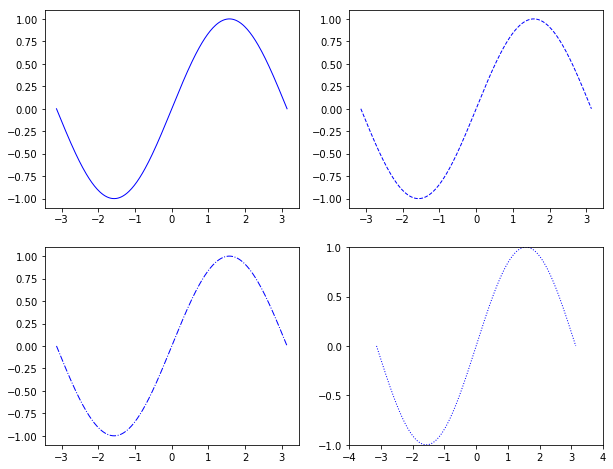
  
  四种线条样式画图

线条的标记
````````````` 

**标记**，marker，可以使用标记代替 linestyle 画图。常用标记如下：

  ================    ===============================
  标记缩写            描述
  ================    ===============================
    '.'               point marker
    ','               pixel marker
    'o'               circle marker
    'v'               triangle_down marker
    '^'               triangle_up marker
    '<'               triangle_left marker
    '>'               triangle_right marker
    '1'               tri_down marker
    '2'               tri_up marker
    '3'               tri_left marker
    '4'               tri_right marker
    's'               square marker
    'p'               pentagon marker
    '*'               star marker
    'h'               hexagon1 marker
    'H'               hexagon2 marker
    '+'               plus marker
    'x'               x marker
    'D'               diamond marker
    'd'               thin_diamond marker
    '|'               vline marker
    '_'               hline marker
  ================    ===============================
  
.. code-block:: python
  :linenos:
  :lineno-start: 0
  
  # 降低X坐标数量，以观察标记的作用
  X = np.linspace(-np.pi, np.pi, 56, endpoint=True)
  ......
  markers = ['.', ',', 'o', 'v']
  for i in range(1, 5, 1):
      plt.subplot(2,2,i)
      plt.plot(X, S, color='blue', linewidth=0.0, marker=markers[i-1])

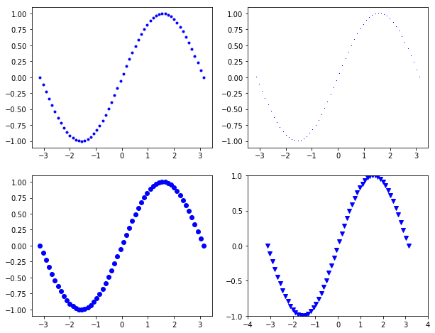
  
  四种标记画图

图片边界
``````````

上述图像在 Y 轴上会和边界重合，我们可以调整轴的上下限来调整曲线在图像中的位置。

.. code-block:: python
  :linenos:
  :lineno-start: 0
  
  # 设置 x轴的上下限
  plt.xlim(-np.pi, np.pi)
  
  # 设置 y轴的上下限
  plt.ylim(-1.0, 1.0)

.. code-block:: python
  :linenos:
  :lineno-start: 0  
  
  # 扩展 y轴的上下限 10%
  plt.ylim(-1.1, 1.1)

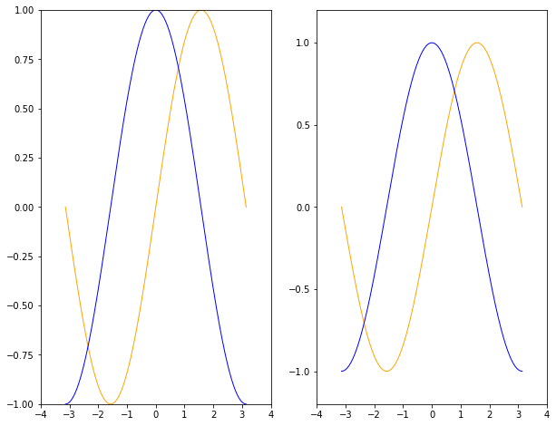
  
  扩展Y轴上下10%对比图

一个可重用的设置边界的扩展函数如下：

.. code-block:: python
  :linenos:
  :lineno-start: 0
  
  def scope_adjust(X, axis='X', scale=0.1):
      xmin, xmax = X.min(), X.max()
      
      dx = (xmax - xmin) * scale
      if axis == 'X':
          plt.xlim(xmin - dx, xmax + dx)
      else:
          plt.ylim(xmin - dx, xmax + dx)
  
  # 扩展 x 轴边界 10%
  def xscope_adjust(X):
      scope_adjust(X, 'X')
  
  # 扩展 y 轴边界 10%   
  def yscope_adjust(Y):
      scope_adjust(Y, 'Y')

坐标记号标签
````````````

当讨论正弦和余弦函数的时候，通常希望知道函数在 ±π 和 ±π/2 的值。这样看来，当前的设置就不那么理想了。默认坐标记号总是位于整的分界点处，例如 1,2,3或者0.1,0.2处。

我们要在 x = π 处做记号，就要使用 xticks() 和 yticks() 函数：

.. code-block:: python
  :linenos:
  :lineno-start: 0
  
  # 设置 x轴记号
  plt.xticks([-np.pi, -np.pi/2, 0, np.pi/2, np.pi])
  
  # 设置 y轴记号
  plt.yticks([-1, 0, +1])

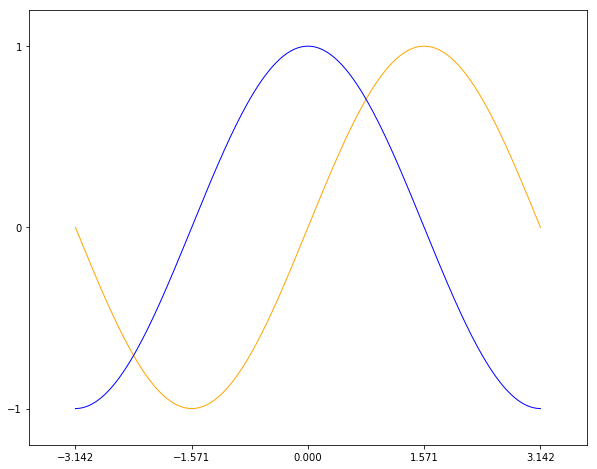
  
  设置 x轴和 y轴记号

记号现在没问题了，不过标签却不大符合期望。我们可以把 3.142 当做是 π，但毕竟不够精确。当我们设置记号的时候，我们可以同时设置记号的标签。注意这里使用了 LaTeX 数学公式语法。

.. code-block:: python
  :linenos:
  :lineno-start: 0
    
  # 设置 x轴记号和标签  
  plt.xticks([-np.pi, -np.pi/2, 0, np.pi/2, np.pi],
             [r'$-\pi$', r'$-\pi/2$', r'$0$', r'$+\pi/2$', r'$+\pi$'])
  
  # 设置 y轴记号和标签
  plt.yticks([-1, 0, +1], [r'$-1$', r'$0$', r'$+1$'])

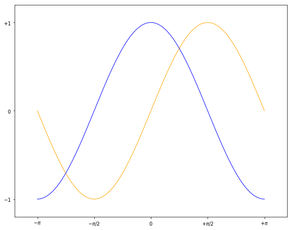
  
  设置 x轴和 y轴记号和标签

移动脊柱(坐标轴)
````````````````````

坐标轴线和上面的记号连在一起就形成了脊柱（Spines，一条线段上有一系列的凸起，很像脊柱骨），它记录了数据区域的范围。它们可以放在任意位置，不过至今为止，我们都把它放在图的四边。

实际上每幅图有四条脊柱（上下对应 x坐标轴，左右对应 y坐标轴），为了将脊柱放在图的中间，我们必须将其中的两条（上和左）设置为无色，然后调整剩下的两条到合适的位置，这里为坐标轴原点。

.. code-block:: python
  :linenos:
  :lineno-start: 0

  ax = plt.gca()
  ax.spines['left'].set_color('none')
  ax.spines['top'].set_color('none')
  ax.xaxis.set_ticks_position('bottom')
  ax.spines['bottom'].set_position(('data', 0))
  ax.yaxis.set_ticks_position('right')
  ax.spines['right'].set_position(('data', 0))

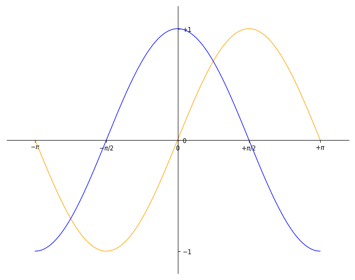
  
  移动脊柱后的效果图

添加图例
`````````````

我们在图的左上角添加一个图例。为此，我们只需要在 plot 函数里以键值的形式增加一个参数。

.. code-block:: python
  :linenos:
  :lineno-start: 0

  plt.plot(X, S, color='orange', linewidth=1.0, linestyle='-', label='sin(x)')
  plt.plot(X, C, color='blue', linewidth=1.0, linestyle='-', label='cos(x)')
  plt.legend(loc='upper left', fontsize='large')

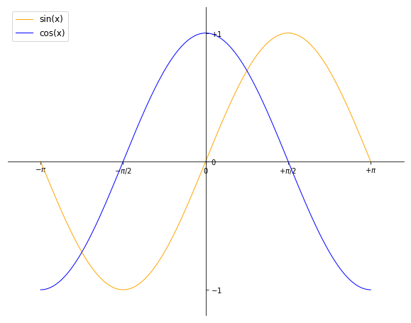
  
  添加图例后的效果图

特殊点做注释
```````````````

.. code-block:: python
  :linenos:
  :lineno-start: 0

  t = 2 * np.pi / 3
  
  # 两个坐标点，画一条竖线
  plt.plot([t,t],[0,np.cos(t)], color ='blue', linewidth=1.5, linestyle="--")
  # 在竖线一端画一个点，颜色 blue，30个像素宽 
  plt.scatter([t,],[np.cos(t),], 30, color ='blue')
  # 在特定点添加注释
  plt.annotate(r'$\sin(\frac{2\pi}{3})=\frac{\sqrt{3}}{2}$',
               xy=(t,np.sin(t)), xycoords='data',
               xytext=(+10, +30), textcoords='offset points', fontsize=16,
               arrowprops=dict(arrowstyle="->", connectionstyle="arc3,rad=.2"))

  plt.plot([t,t],[0,np.sin(t)], color ='orange', linewidth=1.5, linestyle="--")
  plt.scatter([t,],[np.sin(t),], 30, color ='orange')

  plt.annotate(r'$\cos(\frac{2\pi}{3})=-\frac{1}{2}$',
               xy=(t, np.cos(t)), xycoords='data',
               xytext=(-90, -50), textcoords='offset points', fontsize=16,
               arrowprops=dict(arrowstyle="->", connectionstyle="arc3,rad=.2"))

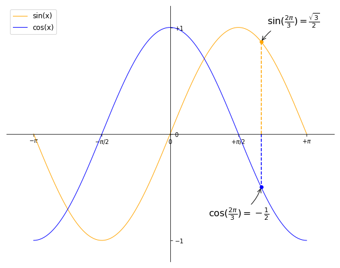
  
  为特殊点添加注释

各类参数的表示
~~~~~~~~~~~~~~~

尺寸
```````````````

在 matplotlib 中有三个概念与尺寸相关。

- inch，英寸，1英寸约等于 2.54cm，它是永恒不变的。
- point，点，缩写为 pt，常用于排版印刷领域。字体大小常称为“磅”，“磅”指的是 point 的音译发音，正确的中文译名应为“点”或“点数”，和重量单位没有任何关系。它是一种固定长度的度量单位，大小为1/72英寸，1 inch = 72 points。A4 纸宽度为 8.27 英寸，595 pt。
- pixel，像素，缩写为 px。像素有两个概念，图片中的像素，它是一个bits序列，比如bmp文件中一个8bits 的0-255的灰度值描述了一个像素点，没有物理大小。 另一个概念是指显示屏或者摄像机的像素，一个像素由RGB 3个显示单元组成，它的物理大小并不是一样的，它的尺寸不是一个绝对值。计算机显示屏可以调整屏幕分辨率，其实是通过算法转换的，比如用四个像素表示原一个像素，那么垂直和水平分辨率就各降低了一半。
- 分辨率/屏幕分辨率：横纵2个方向的像素（pixels）数量，常见取值 1024*768 ，1920*1080。在Windows中 一张基于存储像素值的图片(例如BMP，PNG，JPG等格式)的分辨率也可以这样表示。
- 图像分辨率：在图像处理领域，图像分辨率是指每英寸图像内的像素点数。它的单位是 PPI（像素每英寸，pixels per inch），**图像分辨率参数通常用于照相机和摄影机等摄录设备，而不是图片本身**，图片本身只有像素，而像素在1:1比例下查看，对应显示设备的1个像素。
- DPI(Dots Per Inch)，打印分辨率，也称为打印精度，单位每英寸点数。也即每英寸打印的墨点数，普通喷墨打印机在 300-500 DPI，激光打印机可以达到 2000 DPI。

了解了这些概念，我们就可以理解几种常见情况了：

**0.图片中dpi和图像分辨率**

我们已经强调，图像分辨率参数通常用于照相机和摄影机等摄录设备，而不是图片本身。但是很多图片格式，例如 jpg 文件通过 windows 可以查看文件属性中有 96 dpi 字样，又是什么意思呢？

参考 `图片DPI <https://convert.town/image-dpi>`_，图片中的 dpi 值保存在图片文件格式头部的某个字段，它仅仅是一个数值，用于被某些设备读取做图片处理的参考，例如打印机，在打印时每英寸打印多少个像素点。

JPG, PNG, TIF, BMP 和 ICO 均支持设置图片文件的 dpi 参数。该参数不影响图片的分辨率，分辨率与像素数量有关。

**1.图片像素和屏幕显示大小**

一张图片在屏幕上显示的大小是由图片像素数和屏幕尺寸以及屏幕分辨率共同决定。例如一张图片分辨率是640x480，这张图片在屏幕上默认按1:1显示，水平方向有640个像素点，垂直方向有480个像素点。

14英寸的16:9屏幕，也即显示屏对角线长度 35.56cm = 14 inch * 2.54cm/inch，屏幕宽高比为 16 : 9，根据勾股定理宽和高约为 31cm 和 17.4cm，如果分比率为 1920 * 1080，则图像显示宽度 640 / 1920 * 31 = 10.33cm，高度为 480 /1080 * 17.4 = 7.73cm。

如果分辨率是 1600*900，则显示的图片尺寸约为 640 / 1600 * 31 = 12.40cm 和 480 / 900 * 17.4 = 9.28cm。

.. code-block:: python
  :linenos:
  :lineno-start: 0

  def scatter_create_test_graph(): 
      plt.figure(figsize=(6.4, 4.8), dpi=100)
      ax.set_ylim(0, 2)
      ax.set_xlim(0, 2)
      plt.xticks([0, 1, 2])
      plt.yticks([0, 1, 2])
      plt.scatter(1, 1)
      plt.savefig(filename="test.jpg", format='jpg', facecolor='orange')

以上代码生成一张640*480的JPG图片，背景为橘黄色。

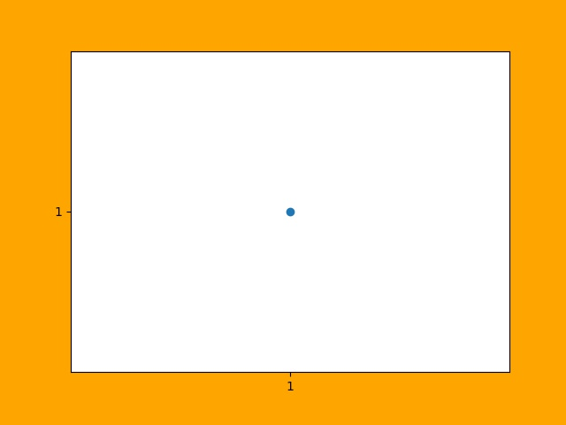
  
  一张 640 * 480 的JPG图片

上图是一张640*480的JPG图片，为了避免网页对图片缩放，可以先保存它并用画图编辑器在**不缩放**的情况下查看它，根据电脑显示屏的分辨率来换算它的宽和高，然后对比用尺子在屏幕上测量的结果，大小是一定不会错的。

总结：1:1显示时，图片的像素点和屏幕的像素点是一一对应的，在同一台设备上，图片分辨率越高（图片像素越多），图片显示面积越大；图片分辨率越低，图片显示面积越小。对于同一张图片，屏幕分辨率越高，显示越小，屏幕分辨率越低，显示越大。对图片进行放大或者缩小显示时，计算机通过算法对图像进行了像素补足或者压缩。

图像是否清晰与图像分辨率有关。显示器是否能显示清晰的图片需同时考虑屏幕尺寸和分辨率大小，屏幕尺寸相同时，分辨率越高显示越清晰。

**2.图片像素和打印**

DPI(Dots Per Inch)，打印分辨率用于描述打印精度，这里的 Dot 对于使用计算机打印图片来讲就是 Pixel。也即用一个打印墨点打印一个图像像素。通常 300 DPI是照片打印的标准。

照片规格通常用“寸”表示，它是指照片长方向上的边长英寸数，一般四舍五入取整数表示。

======== ========= =========== =============
照片规格  英寸表示  厘米       图片像素(最低)
======== ========= =========== =============
5寸       5 * 3    12.7 * 8.9    1200 * 840
6寸       6 * 4    15.2 * 10.2   1440 * 960
7寸       7 * 5    17.8 * 12.7   1680 * 1200
8寸       8 * 6    20.3 * 15.2   1920 * 1440
10寸      10 * 8   25.4 * 20.3   2400 * 1920
12寸      12 * 10  30.5 * 20.3   2500 * 2000
15寸      15 * 10  38.1 * 25.4   3000 * 2000
======== ========= =========== =============

图片像素的要求为何是最低呢？因为当图片过大时，打印驱动会帮我们压缩像素来适应打印机的DPI要求，但是如果图片像素不足于一个像素对应一个墨点，驱动就要进行像素插值，导致图片模糊。

**3.matplotlib中的dpi**，matplotlib 不是打印机，为何需要 DPI 参数？实际上在 matplotlib 中，figure 对象被当作一张打印纸，而 matplotlib 的绘图引擎(backend)就是打印机。

图片的数字化，也即将图片存储为数据有两种方案：

- 位图，也被称为光栅图。即是以自然的光学的眼光将图片看成在平面上密集排布的点的集合。每个点发出的光有独立的频率和强度，反映在视觉上，就是颜色和亮度。这些信息有不同的编码方案，最常见的就是RGB。根据需要，编码后的信息可以有不同的位(bit)数——位深。位数越高，颜色越清晰，对比度越高；占用的空间也越大。另一项决定位图的精细度的是其中点的数量。一个位图文件就是所有构成其的点的数据的集合，它的大小自然就等于点数乘以位深。位图格式是一个庞大的家族，包括常见的JPEG/JPG, GIF, TIFF, PNG, BMP。

- 矢量图。它记录其中展示的模式而不是各个点的原始数据。它将图片看成各个“对象”的组合，用曲线记录对象的轮廓，用某种颜色的模式描述对象内部的图案（如用梯度描述渐变色）。比如一张留影，被看成各个人物和背景中各种景物的组合。这种更高级的视角，正是人类看世界时在意识里的反映。矢量图格式有CGM, SVG, AI (Adobe Illustrator), CDR (CorelDRAW), PDF, SWF, VML等等。

matplotlib 支持将图像保存为 eps, jpeg, jpg, pdf, pgf, png, ps, raw, rgba, svg, svgz, tif, tiff 格式。如果要生成 jpg 文件就相当于“打印”一张图像到 figure 打印纸上。

matplotlib 在“打印”位图时需要 DPI 来指示如何把逻辑图形转换为像素。打印纸的大小由 figsize 参数指定，单位 pt(point)，这与现实中的纸张单位一致，而 dpi 参数决定了在 1 inch (72pts) 要生成的像素数。

.. code-block:: python
  :linenos:
  :lineno-start: 0
  
  plt.figure(figsize=(6.4, 4.8), dpi=100)

如果 dpi 为 72，那么一个 point 就对应 jpg 中的一个 pixel，如果 dpi 为 100，则一个 point 对应 jpg 中的 100/72 pixels。注意这里没有尺寸(位图图像无法用尺寸描述，只能用分辨率描述)的对应关系，只有个数的对应关系。

以下关系总是成立：

.. code-block:: python
  :linenos:
  :lineno-start: 0

  1 point == fig.dpi/72 pixels

matplotlib 在生成矢量图时总是使用72dpi，而忽略用户指定的dpi参数，矢量图中只保存宽和高，也即figsize参数，单位pt。 

.. code-block:: sh
  :linenos:
  :lineno-start: 0
  
  <svg height="345pt" version="1.1" viewBox="0 0 460 345" 
   width="460pt" xmlns="http://www.w3.org/2000/svg" 
   xmlns:xlink="http://www.w3.org/1999/xlink">

一张 figsize=(6.4, 4.8) 参数生成的 svg 图片文件中指定了宽 width = 6.4 * 72 = 460pt，高 height = 4.8 * 72 = 345pt。即便我们认为指定了 dpi = 100，生成的 svg 图片的宽高不会有任何改变。

**dpi对生成位图的影响**

我们知道 fig.dpi 参数对矢量图的大小没有影响，而对位图有影响。考虑如下两张图片：

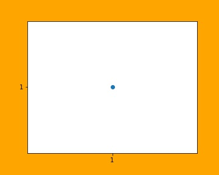

  plt.figure(figsize=(5, 4), dpi=72)

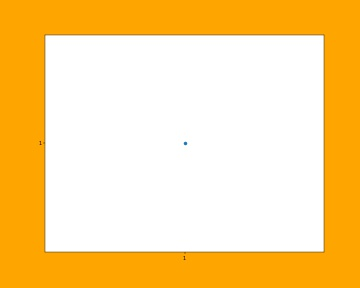

  plt.figure(figsize=(10, 8), dpi=36)

图片的宽和高像素数是一致的，但是 dpi = 72 时图片明显清晰，所以 dpi 参数会影响图片中的字体大小和线条粗细，当 dpi 小时，系统会选择小字体和细线条，dpi 大时则相反。

point 和 pixel
````````````````

由于以下关系总是成立，强烈建议将 fig.dpi 设置为 72，并保存为 svg 矢量格式，这会为处理一些关于尺寸的函数参数提供方便。此时计算时生成图片时这些参数就会直接对应（从屏幕上观察）到生成的图片上的元素的长宽或者字体大小上。 

.. code-block:: python
  :linenos:
  :lineno-start: 0

  1 point == fig.dpi/72 pixels

这些参数包括 markersize，linewidth，markeredgewidth，scatter中的 s 参数和坐标系统相关参数，例如注释的相对坐标 textcoords。

这些参数的单位通常为 points。唯一例外的是 scatter() 函数中的 s 参数。

s 参数可以为一个标量或 array_like，shape(n,)，指定绘制点的大小，默认值 rcParams [‘lines.markersize’]^2。注意这里的平方，所以 s 是指的标记所占面积的像素数。

.. code-block:: python
  :linenos:
  :lineno-start: 0
  
  plt.figure(figsize=(8,4), dpi=72)
  
  plt.plot([0],[1], marker="o", markersize=30)
  plt.plot([0.2, 1.8], [1, 1], linewidth=30)
  plt.scatter([2],[1], s=30**2)
  
  plt.annotate('plt.plot([0],[1], marker="o", markersize=30)',
              xy=(0, 1), xycoords='data',
              xytext=(0, 70), textcoords='offset points',fontsize=12,
              arrowprops=dict(arrowstyle="->", connectionstyle="arc3,rad=.2"))
  ......
  plt.rcParams['font.sans-serif']=['SimHei']
  plt.annotate('ABC123abc 30号中文字体', xy=(0.2, 1), xycoords='data',
               xytext=(-10,-10), textcoords='offset pixels', fontsize=30)
  
  plt.savefig(filename="markersize.svg", format='svg')

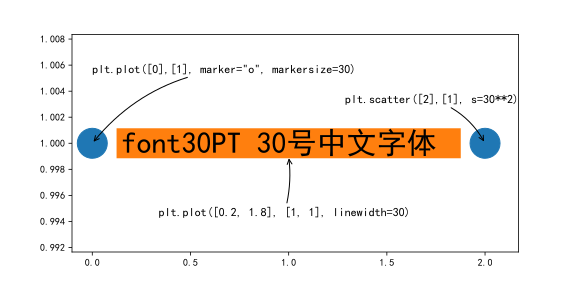

  scatter 中的 s 参数和 plot 中的 markersize 参数关系

由上图可以得到以下几点结论：

- scatter 中的 s 参数和 plot 中的 markersize 参数关系为，s = markersize^2，markersize = linewidth。
- s 是指的标记所占面积的像素数。所以可以开根号求出高度或者宽度的 point 值。
- markersize 和 linewidth 单位均是 points，当 dpi 设置为 72 时，它们的单位等同于 pixels。
- 可以看到字体大小 fontsize 单位是 points，和 markersize ，linewidth 是一致的。
- dpi 设置为 72 时，textcoords='offset points' 和 textcoords='offset pixels' 是等价的。

如果 dpi 设置超过 72，相对于生成的像素增多，图片显示出来会增大，否则显示会变小。

生成的图像分辨率就是 fig.dpi，Windows 中显示的分辨率为图像的宽和高，对应 dpi * figsize。

颜色
````````````

颜色参数通常为 color 或者 c，它们有几种形式，参考 线条的颜色。在不同的函数中，它们格式基本是通用的。

.. _marker:

marker
```````

**标记**，marker，可以使用 marker 标记坐标点。所有标记如下：

  ================    ===============================
  标记缩写            描述
  ================    ===============================
    '.'               point marker
    ','               pixel marker
    'o'               circle marker
    'v'               triangle_down marker
    '^'               triangle_up marker
    '<'               triangle_left marker
    '>'               triangle_right marker
    '1'               tri_down marker
    '2'               tri_up marker
    '3'               tri_left marker
    '4'               tri_right marker
    's'               square marker
    'p'               pentagon marker
    '*'               star marker
    'h'               hexagon1 marker
    'H'               hexagon2 marker
    '+'               plus marker
    'x'               x marker
    'D'               diamond marker
    'd'               thin_diamond marker
    '|'               vline marker
    '_'               hline marker
  ================    ===============================

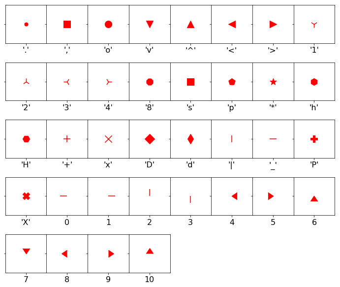
  
  各类标记对应的图形

matplotlib.markers.MarkerStyle 类定义标记和标记的各种样式。可以看到 1-11 个数字也可作为标记，它们表示的图形中心不对应坐标点，而是图形的一个边对应坐标点。

.. code-block:: python
  :linenos:
  :lineno-start: 0
  
  # print(mpl.markers.MarkerStyle().markers)      # 所有支持的标记
  print(mpl.markers.MarkerStyle().filled_markers) # 可填充的标记
  print(mpl.markers.MarkerStyle().fillstyles)     # 填充类型

  >>>
  ('o', 'v', '^', '<', '>', '8', 's', 'p', '*', 'h', 'H', 'D', 'd', 'P', 'X')
  ('full', 'left', 'right', 'bottom', 'top', 'none')

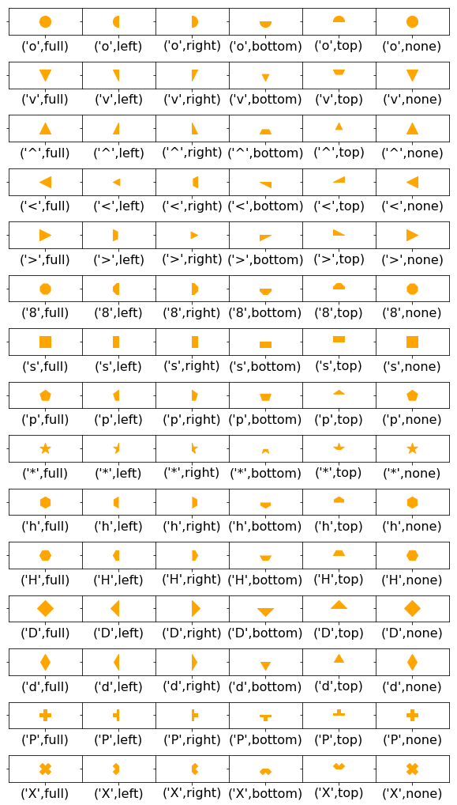
  
  支持填充的标记使用不同填充样式对应的图形

annotate注释
~~~~~~~~~~~~~~

annotate() 注释可以将文本放于任意坐标位置。

::
  
  matplotlib.pyplot.annotate(s, xy, *args, **kwargs)

- s，要注释的文本字符串
- xy，(float, float) 要注释的坐标
- xycoords，指定 xy 坐标系统，默认 data。
- xytext，(float, float)，注释要放置的坐标，如果不提供则使用 xy。textcoords 参数指定 xytext 如何使用。
- textcoords，指定 xytext 坐标与 xy 之间的关系。如果不提供，则使用 xycoords。
- ha /horizontalalignment，水平对齐，和点 xy 的水平对齐关系。取值 'center', 'right' 或 'left'。
- va /verticalalignment，垂直对齐，和点 xy 的垂直对齐关系。取值 'center', 'top', 'bottom', 'baseline' 或 'center_baseline'。
- \*\*kwargs 	参数可以是  `matplotlib.text.Text <https://matplotlib.org/api/text_api.html#matplotlib.text.Text>`_ 中的任意属性，例如 color。

  =================  =====================================
  xycoords 值        坐标系统
  =================  =====================================
  'figure points'    距离图形左下角点数
  'figure pixels'    距离图形左下角像素数
  'figure fraction'  0,0 是图形左下角，1,1 是右上角
  'axes points'      距离轴域左下角的点数量
  'axes pixels'      距离轴域左下角的像素数量
  'axes fraction'    0,0 是轴域左下角，1,1 是右上角
  'data'             使用轴域数据坐标系
  'polar'            极坐标
  =================  =====================================

  ===============  =====================================
  textcoords 取值  描述
  ===============  =====================================
  'offset points'  相对于 xy 进行值偏移(inch)
  'offset pixels'  相对于 xy 进行像素偏移
  ===============  =====================================

注释位置
`````````````````

.. code-block:: python
  :linenos:
  :lineno-start: 0
  
  def annotate():
      
      fig = plt.figure(dpi=72, facecolor='#dddddd')
      ax = fig.add_subplot(111, autoscale_on=False, xlim=(-1, 5), ylim=(-3, 5))
      plt.rcParams['font.sans-serif']=['SimHei']
      
      t = np.arange(0.0, 5.0, 0.01)
      s = np.cos(2 * np.pi * t)
      line, = ax.plot(t, s)
      
      # 相对于图像最左下角的偏移像素数，未提供xytext，则表示注释在xy点
      ax.annotate('1.figure pixels',
                  xy=(0, 0), xycoords='figure pixels', color='r', fontsize=16)
      
      # 相对于图像最左下角的偏移点数，由于 dpi=72，这里与'figure pixels' 效果相同
      ax.annotate('2.figure points',
                  xy=(0, 50), xycoords='figure points', color='r', fontsize=16)
      
      # 使用轴域数据坐标系，也即 2,1 相对于坐标原点 (0,0)，注释位置再相对于xy 偏移 xytext
      ax.annotate('3.data',
                  xy=(2, 1), xycoords='data',
                  xytext=(-15, 25), textcoords='offset points',
                  arrowprops=dict(facecolor='black', shrink=0.05),
                  horizontalalignment='right', verticalalignment='top',
                  color='r')
      
      # 整个图像的左下角为 0,0，右上角为1,1，xy 在[0-1] 之间取值
      ax.annotate('4.figure fraction',
                  xy=(0.0, .95), xycoords='figure fraction',
                  horizontalalignment='left', verticalalignment='top',
                  fontsize=16, color='r')
  
      # 0,0 是轴域左下角，1,1 是轴域右上角
      ax.annotate('5.axes fraction',
                  xy=(3, 1), xycoords='data',
                  xytext=(0.8, 0.95), textcoords='axes fraction',
                  arrowprops=dict(facecolor='black', shrink=0.05),
                  horizontalalignment='right', verticalalignment='top',
                  color='r')
  
          
      # xy被注释点使用轴域偏移 'axes fraction', xytext使用相对偏移
      ax.annotate('6.pixel offset from axes fraction',
                  xy=(1, 0), xycoords='axes fraction',
                  xytext=(-20, 20), textcoords='offset pixels',
                  horizontalalignment='right',
                  verticalalignment='bottom', color='r')
  
      plt.show()
    
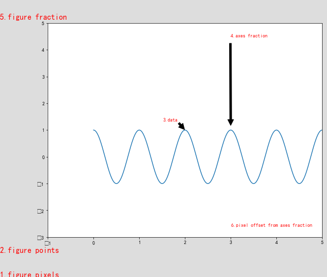
  
  使用各类坐标系统进行注释

对于上图，有几点需要说明：

- matplotlib 中有两个区域，图形区域（整个图形区域，包括灰色和白色两部分）；轴域，上图中的白色部分。
- 每个区域有自己的坐标系统，左下角均为 (0, 0)，可以使用点或者像素偏移，或者指定 fraction 坐标，此时右上角坐标值为 (1,1)，整个区域的坐标用[0-1]之间的小数表示。 
- xycoords 值中 'figure points' 和 'figure pixels' 相对于图形区域左下角偏移点和像素数。
- xycoords 值中 'figure fraction' 直接指定图形区域的 fraction 小数坐标 。
- xycoords 值中 'axes points'，'axes pixels' 和 'axes fraction' 类似。
- xycoords 值中 'data' 指定使用轴域数据坐标系。

坐标点注释
``````````````````

.. code-block:: python
  :linenos:
  :lineno-start: 0
  
  def scatter_create_annotate_graph(): 
      x = np.array([i for i in range(10)])
      y = [0,1,2,3,4,4,3,2,1,0]
      plt.figure(figsize=(10,10))
      
      plt.scatter(x, y, marker='s', s = 50)
      for x, y in zip(x, y):
          plt.annotate('(%s,%s)'%(x,y), xy=(x,y), xytext=(0, -5), 
                       textcoords = 'offset pixels', ha='left', va='top')
      plt.show()

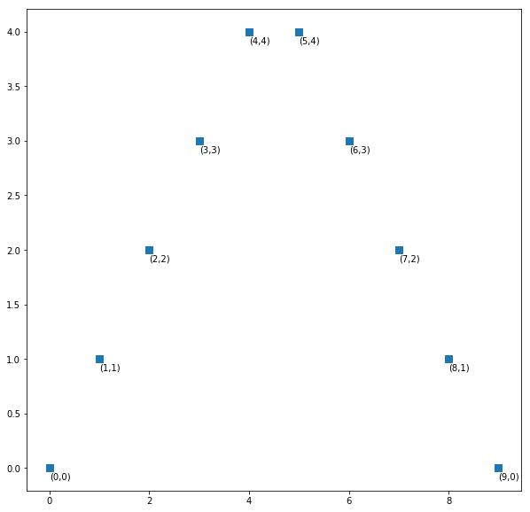

  对坐标点进行注释

添加箭头
`````````````````

可以通过参数 arrowprops 在注释文本和注释点之间添加箭头。

=============== ==============
arrowprops属性 	   描述
=============== ==============
width 	        箭头的宽度，以点为单位
frac 	          箭头的头部所占据的比例
headwidth 	    箭头的头部宽度，以点为单位
shrink 	        收缩箭头头部和尾部，使其离注释点和注释文本多一些距离
=============== ==============

.. code-block:: python
  :linenos:
  :lineno-start: 0
  
  def annotate_arrow():
      plt.figure(dpi=72)
      plt.xticks([0, 1, 2, 3], ['width','headwidth','shrink',''], fontsize=16)
      plt.yticks([0, 1, 1.4], ['']*3)
  
      ax = plt.gca()
      ax.spines['left'].set_color('none')
      ax.spines['top'].set_color('none')
      ax.spines['bottom'].set_color('none')
      ax.spines['right'].set_color('none')
      
      # 调整箭头的宽度
      for i in [1, 2, 4, 6, 8, 10]:
          plt.annotate('annotate' + str(i), xy=(0, i/8), xycoords='data',
                       arrowprops=dict(facecolor='black', shrink=0.0, width=i, headwidth=20),
                       xytext=(50, i/8), textcoords='offset pixels', fontsize=16)
      # 调整箭头的箭头宽度
      for i in [1, 2, 4, 6, 8, 10]:
          plt.annotate('annotate' + str(i), xy=(1, i/8), xycoords='data',
                       arrowprops=dict(facecolor='r', edgecolor='r', shrink=0.0, 
                       width=3, headwidth=i*2),
                       xytext=(50, i/8), textcoords='offset pixels', fontsize=16)
      # 调整箭头的收缩比
      for i in [1, 2, 4, 6, 8, 10]:
          plt.annotate('annotate' + str(i), xy=(2, i/8), xycoords='data',
                       arrowprops=dict(facecolor='m', edgecolor='m', shrink=0.01 * i, 
                       width=3, headwidth=20),
                       xytext=(50, i/8), textcoords='offset pixels', fontsize=16)
      plt.show()

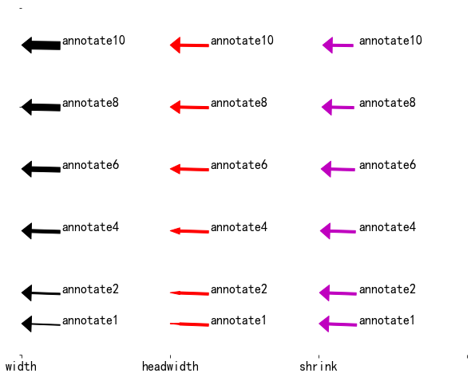

  调节箭头各个参数的效果图

箭头样式
``````````````

matplotlib 内置了丰富的箭头样式，参考 `注释箭头 <https://matplotlib.org/tutorials/text/annotations.html?highlight=arrowprops#annotating-with-arrow>`_。


绘制散点图
~~~~~~~~~~~~

::
  
  scatter(x, y, s=None, c=None, marker=None, cmap=None, norm=None, vmin=None, vmax=None, 
          alpha=None, linewidths=None, verts=None, edgecolors=None, 
          hold=None, data=None, **kwargs)

scatter() 用于绘制散点图，提供默认值的参数可选，各个参数意义如下：

- x, y：array 类型，shape(n,)，输入的坐标点。
- s ：标量或 array_like，shape(n,)，指定绘制点的大小，默认值 rcParams ['lines.markersize']^2。
- c：可以为单个颜色，默认：'b'，可以是缩写颜色的字符串，比如 'rgb'，或者颜色序列 ['c', '#001122', 'b']，长度必须与坐标点 n 相同。
- marker：默认值：'o'，可以为标记的缩写，也可以是类 matplotlib.markers.MarkerStyle 的实例。参考 :ref:`marker`。 
- linewidths：标记外边框的粗细，当个值或者序列。
- alpha：透明度，0 - 1.0 浮点值。
- edgecolors：标记外边框颜色，单个颜色，或者颜色序列。

.. code-block:: python
  :linenos:
  :lineno-start: 0
  
  def scatter_create_color_graph():
      x = [i for i in range(20)]
      y = [i for i in range(20)]
      
      plt.figure(figsize=(10, 8), dpi=72)
      
      plt.xticks(x)
      plt.yticks(y)
      c = np.linspace(0, 0xffffff, 20, endpoint=False)
      plt.scatter(x, y, c=c, s=200, marker='o')
      plt.show()

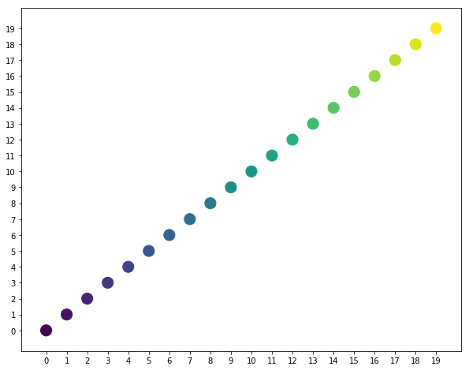
  
  不同颜色值绘制的散点图

.. code-block:: python
  :linenos:
  :lineno-start: 0
  
  def scatter_create_markers_graph():
      x = np.array([i for i in range(20)])
      y = np.array([i for i in range(20)])
      
      plt.figure(1)
      
      plt.xticks(x)
      plt.yticks(y)
      plt.scatter(x, y, c='orange', s=200, marker='v')
      plt.scatter(x + 1, y, c='gray', s=100, marker='^')
      plt.show()  

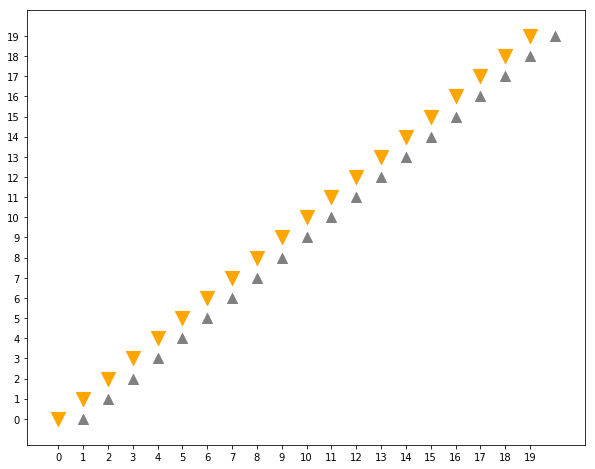
  
  不同标记大小和颜色绘制的散点图

.. code-block:: python
  :linenos:
  :lineno-start: 0
  
  def scatter_create_size_graph():
      x = np.array([i for i in range(10)])
      y = np.array([0] * len(x))
      plt.figure(1)
      plt.ylim(-0.5, 1.5)
      plt.yticks([0, 1])
      plt.xticks(x)
      
      sizes = [20 * (n + 1) ** 2 for n in range(len(x))]
      plt.scatter(x, y, c='m', s=sizes)
  
      sizes = [20 * (10 - n) ** 2 for n in range(len(x))]
      plt.scatter(x, y + 1, c='m', s=sizes)
      plt.show()
      
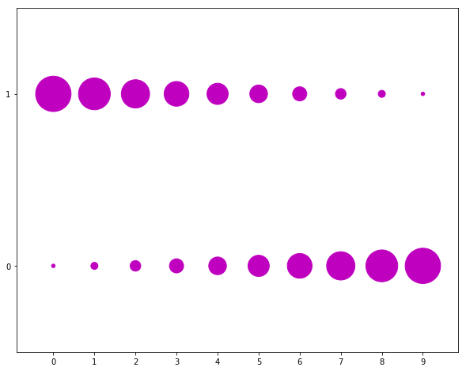
  
  根据坐标调整标记大小

.. code-block:: python
  :linenos:
  :lineno-start: 0

  def scatter_create_random_graph():
      x = np.random.randn(100)
      y = np.random.randn(100)
  
      plt.figure(1)
      plt.scatter(x, y, c='m', marker='p', s=500, alpha=0.6)
      plt.show()  
  
.. figure:: imgs/scatterand.png
  :scale: 80%
  :align: center
  :alt: scatterand
  
  随机坐标散点图
  
.. code-block:: python
  :linenos:
  :lineno-start: 0

  def scatter_create_guess_graph():
      mu_vec = np.array([0,0])
      cov_mat = np.array([[1,0],[0,1]])
      X = np.random.multivariate_normal(mu_vec, cov_mat, 1000)
      R = X ** 2
      R_sum = R.sum(axis = 1)
      plt.figure(1)
      plt.scatter(X[:,0], X[:,1], color='m', marker='o',
                  s = 32.*R_sum, edgecolor='black', alpha=0.5)
      plt.show()
    
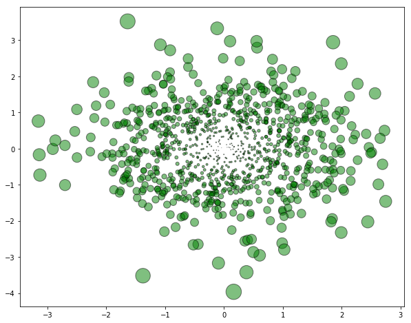
  
  多元高斯分布二维图

.. code-block:: python
  :linenos:
  :lineno-start: 0

  def scatter_create_gradual_graph():
      plt.figure(1)
      c = np.linspace(0xffff00, 0xffffff, 20, endpoint=False)
      for i in range(19,-1,-1):
          size = i * 10000 + 10
      
          cval = hex(int(c[i]))[2:]
          color = "#" + '0' * (6 - len(cval)) + cval 
          plt.scatter(0, 0, s=size, c=color)
      
      plt.show()

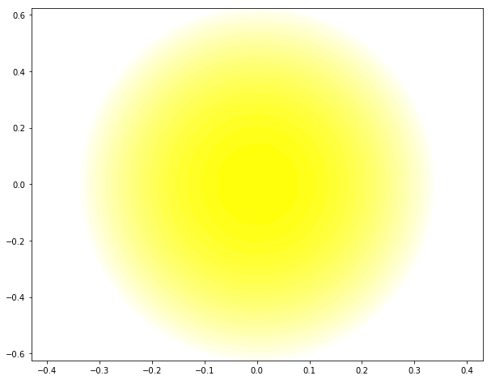
  
  同点渐变晕化


