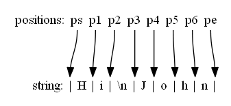

内建模块
================

inspect
---------------

inspect 模块用于收集 Python 对象的信息，可以获取类或函数的参数的信息，源码，解析堆栈，对对象进行类型检查等。

我们使用 sample.py 作为测试模块，源码如下：

.. code-block:: python
  :linenos:
  :lineno-start: 0

  # -*- coding: utf-8 -*-
  """
  Created on Wed Dec 12 17:16:47 2017
  @author: Red
  """

  sample_str = "sample module"  
  sample_list = [1, 2, 3]

  # This is a function of sample
  def sample_func(arg0, args1="name", *args, **kwargs):
      """This is a sample module function."""
      f_var = arg0 + 1
      return f_var
  
  class A():
      """Definition for A class."""
  
      def __init__(self, name):
          self.name = name
  
      def get_name(self):
          "Returns the name of the instance."
          return self.name
  
  obj_a = A('A Class instance')
  
  class B(A):
      """B class, inherit A class. """
  
      # This method is not part of A class.
      def cls_func(self):
          """Anything can be done here."""
  
      def get_name(self):
          "Overrides method from X"
          return 'B(' + self.name + ')'
  
  obj_b = B('B Class instance')

获取模块信息
~~~~~~~~~~~~~~~~~

getmodulename(path) 方法获取文件名，ismodule(obj) 判断对象是否为模块。

.. code-block:: python
  :linenos:
  :lineno-start: 0
  
  import sample
  print(inspect.getmodulename("./sample.py"))
  print(inspect.ismodule(sample))
  print(inspect.ismodule(1))
  
  >>>
  sample
  True
  False

我们也可以使用 getmembers() 获取更多的模块信息，关于 getmembers() 方法的详细使用请参考下一小节：

.. code-block:: python
  :linenos:
  :lineno-start: 0
  
  for name, data in inspect.getmembers(sample):
      if name == '__builtins__':
          continue
      if name.startswith('__'):
          print(name, repr(data))
  
  >>>
  __cached__ 'Z:\\sdc\\lbooks\\ml\\__pycache__\\sample.cpython-36.pyc'
  __doc__ '\nCreated on Wed Dec 12 17:16:47 2017\n@author: Red\n'
  __file__ 'Z:\\sdc\\lbooks\\ml\\sample.py'
  __loader__ <_frozen_importlib_external.SourceFileLoader object .....>
  __name__ 'sample'
  __package__ ''
  __spec__ ModuleSpec(name='sample', loader=......

getmembers
~~~~~~~~~~~~~~~~~

::
  
  getmembers(object, predicate=None)
      Return all members of an object as (name, value) pairs sorted by name.
      Optionally, only return members that satisfy a given predicate.

getmembers() 方法非常强大，它可以获取模块，对象成员属性。predicate 用于过滤特定属性的成员。
它返回一个列表，列表中的每个元素是一个形如 (name, value) 的元组。

.. code-block:: sh
  :linenos:
  :lineno-start: 0
  
  print(inspect.getmembers(sample))
  
  >>>
  [('A', <class 'sample.A'>), ('B', <class 'sample.B'>), ('__builtins__',
  ......

由于模块默认继承很多内建属性，它会打印很多信息，内建属性通常以 __ 开头，我们可以进行如下过滤：

.. code-block:: sh
  :linenos:
  :lineno-start: 0
  
  for name,type in inspect.getmembers(sample):
      if name.startswith('__'):
          continue
      print(name, type)
  
  >>>
  A <class 'sample.A'>
  B <class 'sample.B'>
  obj_a <sample.A object at 0x000002B5960E9128>
  obj_b <sample.B object at 0x000002B5960E99E8>
  sample_func <function sample_func at 0x000002B5960732F0>
  sample_list [1, 2, 3]
  sample_str sample module

通过 predicate 参数指定 inspect 自带的判定函数，可以获取类，函数等任何特定的信息。

查看模块中的类
`````````````````

.. code-block:: sh
  :linenos:
  :lineno-start: 0
  
  for name,type in inspect.getmembers(sample, inspect.isclass):
      print(name, type)

  >>>
  A <class 'sample.A'>
  B <class 'sample.B'>

查看模块中函数
`````````````````

.. code-block:: python
  :linenos:
  :lineno-start: 0
  
  for name,type in inspect.getmembers(sample, inspect.isfunction):
      print(name, type)

  >>>
  sample_func <function sample_func at 0x000002B5961F8840>

查看类属性
`````````````

查看类函数：

.. code-block:: python
  :linenos:
  :lineno-start: 0
  
  for name, type in inspect.getmembers(sample.A, inspect.isfunction):
      print(name, type)
  
  >>>
  __init__ <function A.__init__ at 0x000002B5961F8D08>
  get_name <function A.get_name at 0x000002B5961F80D0>

查看对象属性
`````````````

查看对象方法：

.. code-block:: python
  :linenos:
  :lineno-start: 0
  
  for name, type in inspect.getmembers(sample.obj_a, inspect.ismethod):
      print(name, type)
  print()
  for name, type in inspect.getmembers(sample.obj_b, inspect.ismethod):
      print(name, type)
  
  >>>
  __init__ <bound method A.__init__ of <sample.A object at 0x000002B5961BAA90>>
  get_name <bound method A.get_name of <sample.A object at 0x000002B5961BAA90>>
  
  __init__ <bound method A.__init__ of <sample.B object at 0x000002B596117278>>
  cls_func <bound method B.cls_func of <sample.B object at 0x000002B596117278>>
  get_name <bound method B.get_name of <sample.B object at 0x000002B596117278>>

getdoc 和 getcomments
~~~~~~~~~~~~~~~~~~~~~~~~

getdoc(object) 可以获取任一对象的 __doc__ 属性。

.. code-block:: python
  :linenos:
  :lineno-start: 0
  
  print('A.__doc__:')
  print(sample.A.__doc__)
  print()
  print('getdoc(A):')
  print(inspect.getdoc(sample.A))
  
  >>>
  A.__doc__:
  Definition for A class.
  
  getdoc(A):
  Definition for A class.

getcomments() 方法获取模块，函数或者类定义前的注释行，注释必须以 # 开头。

.. code-block:: python
  :linenos:
  :lineno-start: 0
  
  print(inspect.getcomments(sample))
  print(inspect.getcomments(sample.sample_func))

  >>>
  # -*- coding: utf-8 -*-

  # This is a function of sample

getsource
~~~~~~~~~~~~~~~~~~~~

getsource(object) 可以获模块，函数或者类，类方法的源代码。

.. code-block:: python
  :linenos:
  :lineno-start: 0

  print(inspect.getsource(sample.sample_func))  
  print(inspect.getsource(sample.B.get_name))
  
  >>>
  def sample_func(arg0, arg1="name", *args, **kwargs):
      """This is a sample module function."""
      f_var = arg0 + 1
      return f_var
      
    def get_name(self):
        "Overrides method from X"
        return 'B(' + self.name + ')'

getsourcelines(object) 返回一个元组，元组第一项为对象源代码行的列表，第二项是第一行源代码的行号。

.. code-block:: python
  :linenos:
  :lineno-start: 0
  
  print(inspect.getsourcelines(sample.sample_func))
  
  >>>
  (['def sample_func(arg0, *args, **kwargs):\n',...... return f_var\n'], 10)

函数参数相关
~~~~~~~~~~~~

signature() 返回函数的参数列表，常被 IDE 用来做代码提示：

.. code-block:: python
  :linenos:
  :lineno-start: 0
  
  print(inspect.signature(sample.sample_func))
  print(inspect.signature(sample.B.get_name))
  
  >>>
  (arg0, *args, **kwargs)
  (self)

getfullargspec() 将函数参数按不同类型返回。

.. code-block:: python
  :linenos:
  :lineno-start: 0

  arg_spec = inspect.getfullargspec(sample.sample_func)
  print('namedkey:', arg_spec[0])
  print('*       :', arg_spec[1])
  print('**      :', arg_spec[2])
  print('defaults:', arg_spec[3])
  
  >>>
  namedkey: ['arg0', 'args1']
  *       : args
  **      : kwargs
  defaults: ('name',)

getcallargs() 方法将函数形参与实参绑定，返回一个字典：

.. code-block:: python
  :linenos:
  :lineno-start: 0

  def f(a, b=1, *pos, **named):
    pass
  
  print(getcallargs(f, 1, 2, 3) == {'a': 1, 'named': {}, 'b': 2, 'pos': (3,)})
  print(getcallargs(f, a=2, x=4) == {'a': 2, 'named': {'x': 4}, 'b': 1, 'pos': ()})  
  
  >>> 
  True
  True

getmro
~~~~~~~~~~~~

获取继承序列，与类对象的 __mro__ 属性对应：

.. code-block:: sh
  :linenos:
  :lineno-start: 0

  print(B.__mro__)
  print(inspect.getmro(B))

  >>>
  (<class '__main__.B'>, <class '__main__.A'>, <class 'object'>)
  (<class '__main__.B'>, <class '__main__.A'>, <class 'object'>)

获取调用栈
~~~~~~~~~~~~~~

获取调用栈信息的系列方法均支持 context 参数，默认值为1，可以传入整数值 n 来获取调用栈的上线文的 n 行源码。

stack 和 getframeinfo
````````````````````````````

类似于 C 语言，Python 解释器也使用栈帧（Stack frame）机制来管理函数调用。

stack() 方法获取当前的所有栈帧信息，它是一个 list。getframeinfo() 打印栈帧信息。

.. code-block:: sh
  :linenos:
  :lineno-start: 0
  
  def dump_stack(stack):
      for i in stack:
          frame,filename,lineno,funcname,lines,index = i
          print(inspect.getframeinfo(frame))
          print(filename,lineno,funcname,lines,index)    
  
  dump_stack(inspect.stack())
  
  >>>
  Traceback(filename='tmp.py', lineno=29, function='<module>', 
  code_context=['dump_stack(inspect.stack())\n'], index=0)
  ('tmp.py', 29, '<module>', ['dump_stack(inspect.stack())\n'], 0)

可以看到一个栈帧是一个元组，包含文件名，行号，函数名（如果是在函数外调用，则显示模块名），调用 stack() 处的代码和上下文索引 6 个元素。

所谓上下文索引，即调用 stack() 所在语句在源码上下文的编号。如果要获取栈帧信息的更多源码，可以给传入 context 参数，默认为 1。

.. code-block:: sh
  :linenos:
  :lineno-start: 0

  # before line 2
  # before line 1
  dump_stack(inspect.stack(3))
  # after line 1

  >>>

  Traceback(filename='tmp.py', lineno=29, function='<module>', 
  code_context=['dump_stack(inspect.stack(3))\n'], index=0)
  ('tmp.py', 29, '<module>', ['# before line 1\n', 'dump_stack(inspect.stack(3))\n', 
   '# after line 1\n'], 1)

trace
````````````````````

trace() 返回异常时的栈帧信息，如果没有异常发生，trace() 返回空列表。

.. code-block:: sh
  :linenos:
  :lineno-start: 0

  def call():
      try:
          1/0
      except:
          dump_stack(inspect.trace())
  
  call()

  >>>

  Traceback(filename='tmp.py', lineno=31, function='call', 
  code_context=['        dump_stack(inspect.trace())\n'], index=0)
  ('tmp.py', 29, 'call', ['        1/0\n'], 0) # lines 返回触发异常时的代码

这里与 stack() 做一对比，显然 stack() 返回所有栈帧信息，顶层栈帧记录的不是触发异常的代码行，而是调用 stack() 的代码行。

.. code-block:: sh
  :linenos:
  :lineno-start: 0

  def call():
      try:
          1/0
      except:
          dump_stack(inspect.stack())
  
  call()
  
  >>>  
  Traceback(filename='tmp.py', lineno=31, function='call', 
  code_context=['        dump_stack(inspect.stack())\n'], index=0)
  ('tmp.py', 31, 'call', ['        dump_stack(inspect.stack())\n'], 0)
  Traceback(filename='tmp.py', lineno=33, function='<module>', 
  code_context=['call()\n'], index=0)
  ('tmp.py', 33, '<module>', ['call()\n'], 0)

currentframe
`````````````````````

获取当前正在运行的代码行所在的栈帧，也即当前栈帧。

.. code-block:: sh
  :linenos:
  :lineno-start: 0
  
  def dump_frame(frame):
      print(getframeinfo(frame))
  
  dump_frame(inspect.currentframe())
  
  >>>
  Traceback(filename='tmp.py', lineno=31, function='<module>', 
  code_context=['dump_frame(inspect.current)\n'], index=0)

getouterframes
````````````````````

getouterframes(frame) 返回从 frame 到栈底的所有栈帧，对于 frame 来说，从它到栈底的帧都被称为外部帧。

.. code-block:: sh
  :linenos:
  :lineno-start: 0
  
  def current_frame():
      return inspect.currentframe()
  
  stack = inspect.getouterframes(current_frame())

上述代码返回含当前栈帧的所有帧，等同于 stack()。

getinnerframes
```````````````````````

getinnerframes(traceback) 用于获取一个 traceback 对象中的栈帧。

.. code-block:: sh
  :linenos:
  :lineno-start: 0
  
  import sys
  try:
      1/0
  except:
      prev_cls, prev, tb = sys.exc_info()
      frames = inspect.getinnerframes(tb)
      dump_stack(frames)
  
  >>>
  Traceback(filename='tmp.py', lineno=42, function='<module>', 
  code_context=['    dump_stack(frames)\n'], index=0)
  tmp.py 38 <module> ['    1/0\n'] 0

re
---------------

我们常常需要判断一个给定字符串的合法性，比如一串数字是否是电话号码；一串字符是否是合法的 URL，Email 地址；用户输入的密码是否满足复杂度要求等等。

如果我们为每一种格式都定义一个判定函数，首先这种定义可能很复杂，比如电话号码可以为座机时表示为 010-12345678 ，也可以表示为 0510-12345678， 还可以是手机号 13800000000。这样代码的逻辑复杂度就线性增加。其次我们定义的函数功能很难重用，匹配 A 的不能匹配 B。能否有一个万能的函数，只要我们传入特定的参数就能实现我们特定的字符匹配需求呢？答案是肯定的。

在 :ref:`strs_map_replace` 中我们曾经使用过 re.sub 函数来替换多个字符串。这个问题看似简单，直接可以想到使用多次 replace 替换，但是会带来副作用，因为前一次被替换的字符串可能被再次替换掉，比如后面的替换字符串是前一个的子串，或者已经替换的字符串和前后字符正好形成了后来要替换的字符串。

一个可行的解决方案是使用第一个被替换字符串把字符串分割成多个子串，然后用第二个被替换字符串再次分割每一子串，依次类推，直至最后一个被替换字符分割完毕，再依次使用被替换字符进行合并逆操作。这种方案实现起来比较复杂，使用 re.sub 就简单多了。

正则表达式（Regular Expression）描述了一种字符串匹配的模式（Pattern），re 模块名就是正则表达式的缩写，它提供强大的字符匹配替换统计等操作，且适用于 Unicode 字符串。

正则表达式
~~~~~~~~~~~~~~~

这里简要总结正则表达式的语法，不做深入扩展。



  正则表达式中的两个概念：字符和位置

正则表达式中有两个概念，一个字符串包含若干个字符，每个字符在内存中都有对应的二进制编码，以及字符先后关系构成的位置，比如字符串开始位置和结束位置如图所示表示为 ps 和 pe。包含 N 个字符的字符串有 N+1 个位置，位置不占用内存，仅用于匹配定位。

正则表达式使用一些特殊字符（通常以 \\ 开头）来表示特定的一类字符集（比如数字0-9）和字符位置（比如字符串开始位置）。它们被称为元字符（metacharacter）。元字符和其他控制字符构成的表达式被称为匹配模式（pattern）。

匹配过程中有一个位置指针，开始总是指向位置 ps，根据匹配模式每匹配一次，就将指针移动到匹配字符的后序位置，并尝试在每一个位置上进行模式匹配，直至尝试过 pe 位置后匹配过程结束。

\\ 是转义字符，和其他语言中的转义字符作用类似，‘.’ 在正则表达式中表示匹配除换行符 \\n 外的所有字符，如果要匹配 ‘.’ 自身，就要使用 ‘\\ .’ 的形式。

由于 Python 字符串本身也采用 \\ 作为转义符，所以正则表达式字符串前要加 r ，表示原始输入，以防转义冲突。

匹配字符的元字符
``````````````````

======  ======================================== ====== ========================================
元字符   字符集                                   非集   字符集
======  ======================================== ====== ========================================
.        匹配除换行符 \\n 外的所有字符            \\n     换行符 \\n
\\d       匹配数字 0-9                            \\D     非数字
\\s       空白符: [<空格>\t\r\n\f\v]              \\S     非空白符
\\w       匹配单词字符                            \\W     非单词字符
======  ======================================== ====== ========================================

- d 是 digit numbers，s 是 sapce characters，w 是 word 的缩写。
- 元字符的非集也是元字符。
- 单词字符也即构成英文单词的字符，包括 [A-Za-z0-9\_]，对于中文来说，还包括 unicode 中的非特殊中文字符（比如中文标点符号）。

[...] 用于直接指定字符集，表示匹配其中任意一个：

- 可以直接给出，比如 [abc]
- 可以给定范围，比如 [a-c]
- 可以在开始位置添加 ^，表示取反，比如 [^a-c]，表示 abc 以外的所有字符集。
- 如果要在 [] 中指定特殊字符，比如 ^，需要转义。

匹配位置的元字符
``````````````````

======  ======================================== ====== ========================================
元字符   字符集                                   非集   字符集
======  ======================================== ====== ========================================
^         匹配字符串起始位置 ps                   $     匹配字符串末尾位置 pe
\\b       匹配 \\w 和 \\W 之间位置，ps,p2,p3,pe   \\B   \\w 和 \\W 之外位置，如图p1,p4,p5,p6
\\A       等同 ^                                  \\Z   等同 $
======  ======================================== ====== ========================================

- ^ 和 $ 在多行模式下支持每行的起始和末尾位置匹配。\\A 和 \\Z 不支持多行模式。
- ^ 在数学中被称为 hat ，帽子总是戴在头上，匹配字符起始位置，而 $ 很像蛇的尾巴，匹配字符结尾。
- A 和 Z 分别是字母表的首尾字母，分别匹配字符起止位置。
- b 表示 between，是 \\w 和 \\W 单词字符和非单词字符之间的位置。

findall 和 finditer
~~~~~~~~~~~~~~~~~~~~~~~

::

  findall(pattern, string, flags=0)
      Return a list of all non-overlapping matches in the string.
    
findall() 方法返回匹配的所有子串，并把它们作为一个列表返回。匹配从左到右有序返回子串。如果无匹配，返回空列表。

使用 findall() 来验证上述元字符的功能是一个好方法。

.. code-block:: python
  :linenos:
  :lineno-start: 0

  import re
  
  instr = "Hi\nJohn"
  cpattern_list = [r'.', r'\n', r'\d', r'\D', r'\s', r'\S', r'\w', r'\W']
  for i in cpattern_list:
      print('\'Hi\\nJohn\' -> %02s ->' % i, re.findall(i, instr))

  >>>
  'Hi\nJohn' ->  . -> ['H', 'i', 'J', 'o', 'h', 'n']
  'Hi\nJohn' -> \n -> ['\n']
  'Hi\nJohn' -> \d -> []
  'Hi\nJohn' -> \D -> ['H', 'i', '\n', 'J', 'o', 'h', 'n']  
  'Hi\nJohn' -> \s -> ['\n']
  'Hi\nJohn' -> \S -> ['H', 'i', 'J', 'o', 'h', 'n']
  'Hi\nJohn' -> \w -> ['H', 'i', 'J', 'o', 'h', 'n']
  'Hi\nJohn' -> \W -> ['\n']

字符集元字符返回的均是匹配的字符列表，而位置元字符返回的是位置，所以均是空字符，其中：

- ^ 和 $ 匹配位置 ps 和 pe。
- \\b 匹配到位置 ps，p2，p3 和 pe。
- \\B 匹配到位置 p1，p4，p5 和 p6。

.. code-block:: python
  :linenos:
  :lineno-start: 0

  instr = "Hi\nJohn"
  ppattern_list = [r'^', r'$', r'\A', r'\Z', r'\b', r'\B']
  for i in ppattern_list:
      print('\'Hi\\nJohn\' -> %02s ->' % i, re.findall(i, instr))
  
  >>>
  'Hi\nJohn' ->  ^ -> ['']
  'Hi\nJohn' ->  $ -> ['']
  'Hi\nJohn' -> \A -> ['']
  'Hi\nJohn' -> \Z -> ['']
  'Hi\nJohn' -> \b -> ['', '', '', '']
  'Hi\nJohn' -> \B -> ['', '', '', '']  

为了展示 \\b 和 \\B 确实匹配了相应位置，我们尝试匹配这个位置的下一个字符，由于 . 不能匹配 \\n ，所以要指定选择分支 (.|\n)。

.. code-block:: python
  :linenos:
  :lineno-start: 0

  instr = "Hi\nJohn"
  print(re.findall(r'\b(.|\n)', instr))
  print(re.findall(r'\B.', instr))
  
  >>>
  ['H', '\n', 'J']
  ['i', 'o', 'h', 'n']

::

  finditer(pattern, string, flags=0)
      Return an iterator over all non-overlapping matches in the
      string.  For each match, the iterator returns a match object.

finditer() 方法与 findall() 唯一不同在于返回的不是列表，而是一个返回 match 对象的迭代器，无匹配，则返回内容为空迭代器。

.. code-block:: python
  :linenos:
  :lineno-start: 0
  
  instr = "test1 test2"
  print(re.findall(r'(?<=test).', instr))
  it = re.finditer(r'(?<=test).', instr)
  print(type(it))
  for i in it:
      print(i.group(), end=' ')
  
  >>>
  ['1', '2']
  <class 'callable_iterator'>
  1 2     


重复字符
~~~~~~~~~~~~~~~~~~~

有了元字符，只能够匹配特定的单个字符或者位置，有了重复字符的参与，就可以生成更加复杂的模式，比如我们要匹配 8 个数字，不用写 8个 \\d，而直接用 \\d{8}。

重复字符又称为数量符，常用的重复字符表如下：

======= =====
数量符	描述
======= =====
\* 	    重复 >=0 次
\+ 	    重复 >=1 次
? 	    重复 0 或 1 次
{m} 	  重复 m 次
{m,n} 	重复 m 到 n 次
(,n)    重复 0 到 n 次
(m,)    重复 m 到无限次
======= =====

- 重复字符用在匹配字符的元字符之后，也可以用在分组后，参考 :ref:`re_group` 。不可单独使用，功能作用在前一个元字符或者分组上。
- 以上重复模式默认为贪婪模式，总是选择尽量多匹配的分支，比如 {m, n} 就尽量选择靠近 n 的分支，可以在其后加 ‘?’ 变成非贪婪模式，比如 \*?，{m,n}?。

继续借助 findall() 方法来验证以上重复字符的功能：

.. code-block:: python
  :linenos:
  :lineno-start: 0
  
  instr = "HHH"
  pattern_list = [r'H*', r'H+', r'H?', r'H{2}', r'H{2,3}', r'H{2,}', r'H{,3}']
  for i in pattern_list:
      print('\'HHH\' -> %06s' % i, re.findall(i, instr))
      
  >>>
  'HHH' ->     H* ['HHH', '']
  'HHH' ->     H+ ['HHH']
  'HHH' ->     H? ['H', 'H', 'H', '']
  'HHH' ->   H{2} ['HH']
  'HHH' -> H{2,3} ['HHH']
  'HHH' ->  H{2,} ['HHH']
  'HHH' ->  H{,3} ['HHH', '']

这里以 ‘H*’ 简述匹配过程：

- 指针 p 指向 ps，尝试尽量多的匹配， 匹配到 ‘HHH’，p 指向 pe。
- 指针指向 pe 匹配到 0 次，也即 ‘’。

所以以上结果中含有 ‘’ 的情况均是因为在 pe 处匹配 0 次出现的。

非贪婪模式
`````````````````

.. code-block:: python
  :linenos:
  :lineno-start: 0
  
  instr = "HHH"
  pattern_list = [r'H*', r'H+', r'H?', r'H{2}', r'H{2,3}', r'H{2,}', r'H{,3}']
  for i in pattern_list:
      print('\'HHH\' -> %07s' % (i + r'?'), re.findall(i + r'?', instr))
  
  >>>
  'HHH' ->     H*? ['', '', '', '']
  'HHH' ->     H+? ['H', 'H', 'H']
  'HHH' ->     H?? ['', '', '', '']
  'HHH' ->   H{2}? ['HH']
  'HHH' -> H{2,3}? ['HH']
  'HHH' ->  H{2,}? ['HH']
  'HHH' ->  H{,3}? ['', '', '', '']

这里以 ‘H\*’ 简述非贪婪模式匹配过程：

- 指针 p 指向 ps，尝试尽量少的 0 次匹配， 匹配到 ‘’，p 指向 p1。
- 依次采用尽量少的 0 次匹配，直至指向 pe 再次匹配到 ‘’。

所以 ‘H\*’ 最后匹配的 '' 个数是 H 的个数 3 加 1。

.. _re_group:

或逻辑和分组
~~~~~~~~~~~~~~~~~~

前文提到电话号码可以有不同的表示形式，比如区号分 3 位和 4 位，手机号总是 13 位。这就用到了或逻辑运算符 \|。

- 它用在多个表达式式中间，表示匹配其中任何一个，比如 A | B | C，它总是先尝试匹配左边的表达式，一旦成功匹配则跳过右边的表达式。
- 如果 | 没有包含在 () 中，则它的范围是整个表达式。

.. code-block:: python
  :linenos:
  :lineno-start: 0
  
  instr = "color colour"
  print(re.findall(r'color|colour', instr))
  
  >>>
  ['color', 'colour']

使用 () 括起来的表达式，被称为分组（Group）。重复字符可以加在分组之后。

.. code-block:: python
  :linenos:
  :lineno-start: 0
  
  instr = "color colour"
  print(re.findall(r'(colo)?', instr))
  
  >>>
  ['colo', '', '', 'colo', '', '', '']

表达式中的每个分组从左至右被自动从 1 编号，可以在表达式中引用编号。也可以为分组指定名字。

================  =====
分组操作           描述
================  =====
(exp)             匹配exp，并自动编号
\<id>             引用编号为<id>的分组匹配到的字符串，例如 (\d)abc\1
(?P<name>exp)     为分组命名，例如 (?P<id>ab){2}，匹配 abab
(?P=name)         引用命名为<name>的分组匹配到的字符串，例如 (?P<name>\d)abc(?P=name)
(?:exp)           匹配exp，但跳过匹配字符，且不为该分组编号
(?#comment)       正则表达式注释，不影响正则表达式的处理  
================  =====

.. code-block:: python
  :linenos:
  :lineno-start: 0

  instr = "1abc1 2abc2"
  print(re.findall(r'(\d)abc\1', instr))
  
  instr = "1abc1 2abc2"
  print(re.findall(r'(?P<name>\d)abc(?P=name)', instr))

  >>>
  ['1', '2']
  ['1', '2']

分组操作还支持以下语法，用于匹配特定位置：

================  =====
分组位置操作      描述
================  =====
(?=exp)           匹配exp字符串前的位置
(?<=exp)          匹配exp字符串后的位置
(?!exp)           不匹配exp字符串前的位置
(?<!exp)          不匹配exp字符串后的位置
================  =====

.. code-block:: python
  :linenos:
  :lineno-start: 0
  
  instr = "0abc1"
  print(re.findall(r'(?=abc).', instr))
  print(re.findall(r'(?<=abc).', instr))
  print(re.findall(r'(?!abc).', instr))
  print(re.findall(r'(?<!abc).', instr))
  
  >>>
  ['a']
  ['1']
  ['0', 'b', 'c', '1']
  ['0', 'a', 'b', 'c']

位置匹配可以对匹配字符进行条件选择，例如匹配三个连续的数字，且其后不能再跟数字：

.. code-block:: python
  :linenos:
  :lineno-start: 0
  
  instr = "111a1222"
  print(re.findall(r'\d{3}(?!\d)', instr))

  >>>
  ['111', '222']

匹配模式选项
~~~~~~~~~~~~~~~~~~

re 模块定义了 6 种模式选项： 

1. re.I (re.IGNORECASE): 匹配时忽略大小写。
#. re.M (re.MULTILINE): 多行模式，改变'^'和'$'的行为，可以匹配任意一行的行首和行尾。
#. re.S (re.DOTALL):   点任意匹配模式，此时'.' 匹配任意字符，包含 \\n。
#. re.L (re.LOCALE): 使预定字符类 \w \W \b \B \s \S 取决于当前区域设定。
#. re.U (re.UNICODE): 使预定字符类 \w \W \b \B \s \S \d \D 取决于 unicode 定义的字符属性。
#. re.X (re.VERBOSE): 详细模式。此模式下正则表达式可以写成多行，忽略空白字符，并可以加入注释。

以下两个表达式是等价的：

.. code-block:: python
  :linenos:
  :lineno-start: 0

  instr = "Hi\nJohn"
  print(re.findall(r'\b(.|\n)', instr))
  print(re.findall(r'\b(.)', instr, re.S))

以下两个正则表达式也是等价的：

.. code-block:: python
  :linenos:
  :lineno-start: 0
  
  pattern = re.compile(r'''\d +  # the integral part
                           \.    # the decimal point
                           \d *  # some fractional digits''', re.X)
  pattern = re.compile(r"\d+\.\d*")

compile
~~~~~~~~~~~~~~~~~~

::

  compile(pattern, flags=0)
    Compile a regular expression pattern, returning a pattern object.

compile() 方法将字符串形式的表达式编译成匹配模式对象。 第二个参数 flag 指定匹配模式类型，可以按位或运算符 '|' 生效多种模式类型，比如re.I | re.M。另外，也可以在表达式字符串中指定模式，以下两个表达式是等价的：

.. code-block:: python
  :linenos:
  :lineno-start: 0
  
  re.compile(r'abc', re.I | re.M) 
  re.compile('(?im)abc')
   
将表达式编译成匹配模式对象后，可以重复使用该对象，无需每次都传入表达式。

.. code-block:: python
  :linenos:
  :lineno-start: 0
  
  pattern = re.compile(r'(?i)hi') 
  print(pattern.findall("Hi\nJohn"))
  print(pattern.findall("hi\nJohn"))
  
  >>>
  ['Hi']
  ['hi']

pattern 对象提供了几个可读属性用于查看表达式的相关信息：

- pattern: 匹配模式对应的表达式字符串。
- flags: 编译时用的匹配模式选项，数字形式。
- groups: 表达式中分组的数量。
- groupindex: 表达式中有别名的分组的别名为键、以组编号为值的字典，不含无别名的分组。

.. code-block:: python
  :linenos:
  :lineno-start: 0
 
  def print_pattern_obj(p):
      print("p.pattern\t:", p.pattern)
      print("p.flags\t\t:", p.flags)
      print("p.groups\t:", p.groups)
      print("p.groupindex\t:", p.groupindex)
      
  p = re.compile(r'(key\d{1} *)(: *val\d{1})(?P<comma> *,)', re.I)
  print_pattern_obj(p)
  
  >>>
  p.pattern       : (key\d{1} *)(: *val\d{1})(?P<comma> *,)
  p.flags         : 34
  p.groups        : 3
  p.groupindex    : {'comma': 3}

match 和 search
~~~~~~~~~~~~~~~~~~~

::

  match(pattern, string, flags=0)
      Try to apply the pattern at the start of the string, returning
      a match object, or None if no match was found.

match() 方法从字符段头部开始判断是否匹配，一旦匹配成功，返回一个 Match 对象，否则返回 None。Match 对象保存了首次匹配的结果。

match() 方法与字符串方法 startswith() 很像，只是它使用正则表达式来判断字符头部是否满足条件。

.. code-block:: python
  :linenos:
  :lineno-start: 0
  
  m = re.match(r'\d{3}', 'a123')
  print(m)
  
  >>>
  None

由于字符串 ‘a123’ 不是以 3 个数字开头的字符串，所以返回 None。再看一个更复杂的例子：

.. code-block:: python
  :linenos:
  :lineno-start: 0
  
  pattern = re.compile(r'(key\d{1} *)(: *val\d{1})(?P<comma> *,)')
  m = pattern.match('key0 : val0, key1 : val1')
  print(type(m))
      
  >>>
  <class '_sre.SRE_Match'>

::

  search(pattern, string, flags=0)
      Scan through string looking for a match to the pattern, returning
      a match object, or None if no match was found.

search() 搜索整个字符串，查找匹配的字符，找到后返回一个 match 对象，否则返回 None。

.. code-block:: python
  :linenos:
  :lineno-start: 0
  
  pattern = re.compile(r'(key\d{1} *)(: *val\d{1})(?P<comma> *,)')
  m = pattern.search('key: val, key0 : val0, key1 : val1')
  print(m)

  >>>
  <_sre.SRE_Match object; span=(10, 22), match='key0 : val0,'>

示例尝试匹配 key 和 val 后有一数字的键值对，如果使用 match() 则会返回 None。

match 对象
```````````````````

match 对象保存一次匹配成功的信息，有很多方法会返回该对象，这里对它包含的属性进行介绍。使用上例中的匹配对象，将属性打印如下：

.. code-block:: python
  :linenos:
  :lineno-start: 0
  
  def print_match_obj(m):
      print("m.re\t\t:", m.re)
      
      print("m.string\t:", m.string) 
      print("m.pos\t\t:", m.pos)
      print("m.endpos\t:", m.endpos)
      
      print("m.lastindex\t:", m.lastindex)
      print("m.lastgroup\t:", m.lastgroup)
      print("m.group(1,2)\t:", m.group(1, 2))
      print("m.groups()\t:", m.groups())
      print("m.groupdict()\t:", m.groupdict())
      
      print("m.start(2)\t\t:", m.start(2))
      print("m.end(2)\t\t:", m.end(2))
      print("m.span(2)\t\t:", m.span(2))
      
      print("m.expand(r'\\1-\\2\\3')\t\t:", m.expand(r'\1-\2\3'))
      print("m.expand(r'\\1-\\2g<3>')\t\t:", m.expand(r'\1-\2\g<3>'))
      print("m.expand(r'\\1-\\2g<comma>')\t:", m.expand(r'\1-\2\g<comma>'))
  
  print_match_obj(m)
  
  >>>
  m.re            : re.compile('(key\\d{1} *)(: *val\\d{1})(?P<comma> *,)')
  m.string        : key0 : val0, key1 : val1
  m.pos           : 0
  m.endpos        : 24
  m.lastindex     : 3
  m.lastgroup     : comma
  m.group(1,2)    : ('key0 ', ': val0')
  m.groups()      : ('key0 ', ': val0', ',')
  m.groupdict()   : {'comma': ','}
  m.start(2)              : 5
  m.end(2)                : 11
  m.span(2)               : (5, 11)
  m.expand(r'\1-\2g<comma>')      : key0 -: val0,

- re：匹配时使用的模式
- string：要进行匹配操作的字符串
- pos 和 endpos：分别表示开始和结束搜索的位置索引，pos 等于 ps，也即 0 位置；这里的 endpos 为 24，等于 ps，是字符 val1 后的位置，也即 string 的长度。
- lastindex：最后一个匹配的分组编号，我们的模式中有 3 个分组，第 3 个分组用于匹配一个 ‘,’。
- lastgroup：最后一个匹配的分组的别名，如果没有别名，则为 None。
- group()：group() 方法使用编号后者别名获取分组，参考 :ref:`match_group` 。
- groups()：groups() 方法等价于 group(1,2,...last)，返回所有分组匹配的子串，是一个元组。
- groupdict()：groupdict() 方法返回分组中有别名的分组子串，是一个字典，例如 {'comma': ','}。
- start() 和 end() ：分别返回指定分组匹配的字符串的起止字符在 string 上的位置索引值，支持编号和别名。
- span(group)：等价于 (start(group), end(group))，返回元组类型。
- expand(template)：将匹配到的分组代入 template 中然后返回，参考 :ref:`match_expand` 。

.. _match_group:

match.group
``````````````

group() 方法获取一个或多个分组匹配的字符串：

- 不提供参数，等同于 group(0)，编号 0 代表返回整个匹配的子串。
- 指定多个编号参数时将返回一个元组。
- 可以使用编号也可以使用别名；
- 没有匹配字符串的分组返回 None，匹配了多次的组返回最后一次匹配的子串。 

.. code-block:: python
  :linenos:
  :lineno-start: 0

  pattern = re.compile(r'(key\d{1} *)(: *val\d{1})(?P<comma> *,)')
  m = pattern.match('key0 : val0, key1 : val1')
    
  print(m.group())
  print(m.group(1, 2))
  print(m.group(1, 2, 'comma'))
  
  >>>
  key0 : val0,
  ('key0 ', ': val0')
  ('key0 ', ': val0', ',')  

.. _match_expand:

match.expand
``````````````

expand(template) 方法将匹配到的分组代入 template 中然后返回。template 中支持两种方式引用分组：

- 可以使用 \id 或 \g<id> 引用分组编号，例如 \1 和 g<1> 是等价的，编号从 1 开始。
- \g<name> 通过别名引用分组，例如 \g<comma>。

以下三种方式是等价的。

.. code-block:: python
  :linenos:
  :lineno-start: 0

  pattern = re.compile(r'(key\d{1} *)(: *val\d{1})(?P<comma> *,)')
  m = pattern.match('key0 : val0, key1 : val1')
  
  print("m.expand(r'\\1-\\2\\3')\t\t:", m.expand(r'\1-\2\3'))
  print("m.expand(r'\\1-\\2g<3>')\t\t:", m.expand(r'\1-\2\g<3>'))
  print("m.expand(r'\\1-\\2g<comma>')\t:", m.expand(r'\1-\2\g<comma>'))
  
  >>>
  m.expand(r'\1-\2\3')            : key0 -: val0,
  m.expand(r'\1-\2g<3>')          : key0 -: val0,
  m.expand(r'\1-\2g<comma>')      : key0 -: val0,

split
~~~~~~~~~~

::
  
  split(pattern, string, maxsplit=0, flags=0)
      Split the source string by the occurrences of the pattern,
      returning a list containing the resulting substrings.

split() 方法按照匹配的子串将 string 分割后返回列表。maxsplit 用于指定最大分割次数，不指定将全部分割。 

.. code-block:: python
  :linenos:
  :lineno-start: 0
  
  p = re.compile(r'[, \-\*]')
  print(p.split('1,2 3-4*5'))
  
  >>>
  ['1', '2', '3', '4', '5']

sub 和 subn
~~~~~~~~~~~

::

  sub(pattern, repl, string, count=0, flags=0)
      Return the string obtained by replacing the leftmost
      non-overlapping occurrences of the pattern in string by the
      replacement repl.

sub() 方法使用 repl 替换 string 中每一个匹配的子串后返回替换后的字符串。repl 接受两种类型的参数：

- 当 repl 是一个字符串时，可以使用 \id 或 \g<id>，\g<name> 引用分组，id 编号从 1 开始。
- 当 repl 是一个函数时，它只接受一个match对象作为参数，并返回一个用于替换的字符串（返回的字符串中不可再引用分组）。

count用于指定最多替换次数，不指定时全部替换。 

.. code-block:: python
  :linenos:
  :lineno-start: 0

  p = re.compile(r'(\S+) (\S+)')
  instr = '1970-01-01 00:00:00'
  print(p.sub(r'\2 \1', instr))
   
  def func(m):
      return ' '.join([m.group(2), m.group(1)])
   
  print(p.sub(func, instr))
  
  >>>
  00:00:00 1970-01-01
  00:00:00 1970-01-01

示例用于互换年月日和时分秒位置。

::
  
  subn(pattern, repl, string, count=0, flags=0)
      Return a 2-tuple containing (new_string, number).

subn() 方法参数与 sub() 一致，但是它返回一个元组，元组的格式为 (sub(...), 替换次数)。 例如：

.. code-block:: python
  :linenos:
  :lineno-start: 0

  p = re.compile(r'(\S+) (\S+)')
  instr = '1970-01-01 00:00:00'
  print(p.subn(r'\2 \1', instr))
   
  def func(m):
      return ' '.join([m.group(2), m.group(1)])
   
  print(p.subn(func, instr))
  
  >>>
  ('00:00:00 1970-01-01', 1)
  ('00:00:00 1970-01-01', 1)

escape
~~~~~~~~

:: 

  escape(pattern)
      Escape all the characters in pattern except ASCII letters, numbers and '_'.

escape() 方法对表达式中所有可能被解释为正则运算符的字符进行转义。如果字符串很长且包含很多特殊技字符，而又不想输入一大堆反斜杠，或者字符串来自于用户，且要用作正则表达式的一部分的时候，需要使用这个函数。

.. code-block:: python
  :linenos:
  :lineno-start: 0
  
  instr = "* and ?."
  map_dict = {'?' : '*', '*' : '?'}
  
  def replace_strs(instr, map_dict, count=0):
      import re
  
      re_dict = dict((re.escape(i), j) for i, j in map_dict.items())
      print(re_dict)
      pattern = re.compile('|'.join(re_dict.keys()))
  
      return pattern.sub(lambda x: re_dict[re.escape(x.group(0))], instr, count)
  
  print(replace_strs(instr, map_dict))
  
  >>>
  {'\\?': '*', '\\*': '?'}
  ? and *.

如果我们在编译 pattern 时，直接提供表达式字符串参数，可以在字符串前加 r，如果表达式存储在其他格式的变量中，就需要 escape() 处理。

collections
----------------

Python 提供了多种内置数据类型，比如数值型 int、float 和 complex，字符串 str 以及复合数据类型 list、tuple 和 dict。 collections 模块基于这些基本数据类型，封装了其他复杂的数据容器类型。

.. _namedtuple:

namedtuple
~~~~~~~~~~

命名元组（namedtuple）使用 namedtuple() 工厂函数（Factory Function）返回一个命名元组类。 这个类继承自 tuple，用来创建元组类似的对象，对象拥有只读属性，这些属性有对应的名字，可以通过名字访问属性。

.. code-block:: python
  :linenos:
  :lineno-start: 0
    
  from collections import namedtuple
  
  # Point 是一个类，第一个参数定义类名
  Point = namedtuple('PointClass', ['x', 'y'])
  print(Point.__name__)
  # 实例化对象 p
  p = Point(1, 2)
  print(p)
  
  # 使用索引访问属性
  print(p[0])
  print(p[0] + p[1])
  
  # 使用属性名访问
  print(p.x)
  print(p.x + p.y)
  
  # 不可更改元素值
  p.x = 5 
  
  >>>
  PointClass
  PointClass(x=1, y=2)
  1
  3
  1
  3
  AttributeError: can't set attribute

namedtuple() 的第一个参数定义类名，列表参数定义类的属性。 它返回的是一个类，我们可以继承它，来扩展对属性的操作。

.. code-block:: python
  :linenos:
  :lineno-start: 0
  
  class Point(namedtuple('PointClass', ['x', 'y'])):
      __slots__ = () # 禁止动态属性
      @property      # 只读属性，求勾股数
      def hypot(self):
          return (self.x ** 2 + self.y ** 2) ** 0.5
      def __str__(self):
          return 'Point: x=%6.3f  y=%6.3f  hypot=%6.3f' % (self.x, self.y, self.hypot)
  
  for p in Point(3, 4), Point(14, 5/7):
      print(p)

  >>>
  Point: x= 3.000  y= 4.000  hypot= 5.000
  Point: x=14.000  y= 0.714  hypot=14.018

我们要定义一个新类，只是在已有类上添加一些参数，那么定义一个子类就太复杂了，一个简单的方法可以调用类属性 Point._fields，它是一个元组类型。比如扩展 Point 类到三维空间：

.. code-block:: sh
  :linenos:
  :lineno-start: 0
  
  print(Point._fields)
  print(type(Point._fields))
  Point3D = namedtuple('Point3D', Point._fields + ('z',))
 
  >>>
  ('x', 'y')
  <class 'tuple'>

命名元组的类方法 _make() 可以接受一个序列对象，方便批量把数据转化为命名元组对象。

.. code-block:: python
  :linenos:
  :lineno-start: 0

  Point3D = namedtuple("Point3D", Point._fields + ('z',))
  datum = [[1,2,3], [4,5,6], [7,8,9]]
  for i in map(Point3D._make, datum):
      print(i)

  >>>      
  Point3D(x=1, y=2, z=3)
  Point3D(x=4, y=5, z=6)
  Point3D(x=7, y=8, z=9)
  
Counter  
~~~~~~~~~~~~~~

计数器 Counter 用于统计元素的个数，并以字典形式返回，格式为 {元素：元素个数}。

Counter 类继承了 dict ，它的帮助信息中提供了很多示例应用，这里引用如下：

生成计数器
``````````````

Counter() 类接受如下参数生成一个计数器对象：

.. code-block:: python
  :linenos:
  :lineno-start: 0
  
  c = Counter()                  # 空计数器
  print(c.most_common())
  
  c = Counter('gallahad')        # 可迭代对象 
  print(c.most_common())
  
  c = Counter({'a': 4, 'b': 2})  # 字典
  print(c.most_common())
  
  c = Counter(a=4, b=2)          # 关键字参数指定
  print(c.most_common())

  >>>
  []
  [('a', 3), ('l', 2), ('g', 1), ('h', 1), ('d', 1)]
  [('a', 4), ('b', 2)]
  [('a', 4), ('b', 2)]

统计字符
````````````````

.. code-block:: python
  :linenos:
  :lineno-start: 0
  
  from collections import Counter
  
  c = Counter('abcdeabcdabcaba')
  print(c.most_common())
  print(c.most_common(3))
  
  >>>
  [('a', 5), ('b', 4), ('c', 3), ('d', 2), ('e', 1)]
  [('a', 5), ('b', 4), ('c', 3)]

示例中统计字符串中各个字符出现的次数，most_common(n=None) 参数 n 指定返回出现最多的字符数，不指定则返回全部。
  
.. code-block:: python
  :linenos:
  :lineno-start: 0
  
  c['a']     # 获取单个字符的个数
  >>>
  5
  
  sorted(c)  # 列出所有不重复的字符
  >>>
  ['a', 'b', 'c', 'd', 'e']
  
  for i in c.elements(): # 访问计数器中的元素
    print(i, end=' ')
  >>>
  a a a a a b b b b c c c d d e 
  
  for i in c.values():  # 访问计数器中的计数值
    print(i, end=' ')
  >>>
  5 4 3 2 1 
  
  c['a'] += 1           # 增加 'a' 的计数值  
  del c['b']            # 从计数器中删除 'b' 的计数信息
  
  d = c.copy()          # 复制计数器
  c.clear()             # 清空计数器

- elements()：返回一个迭代器，元素被重复多少次，在迭代器中就包含多少个此元素，所有元素按字母序排列，个数<= 0 的不罗列。
- values()：返回计数器的统计值，元组类型。

计数器加减
```````````````````

除了以上给出的操作，计时器还可以从其他计数器添加计数信息：

.. code-block:: python
  :linenos:
  :lineno-start: 0

  d = Counter('simsalabim')       # 构造计数器 b
  c.update(d)                     # 将 b 的计数信息添加到 c 中
  c['a']                          
  
  >>>
  9

与添加对应，还将统计数相减，例如：

.. code-block:: python
  :linenos:
  :lineno-start: 0
  
  c = Counter('which')
  c.subtract('witch')
  print(c.most_common())
  
  c.subtract('watch')
  print(c.most_common())
  >>>
  [('h', 1), ('w', 0), ('i', 0), ('c', 0), ('t', -1)]
  [('h', 0), ('i', 0), ('w', -1), ('c', -1), ('a', -1), ('t', -2)]

subtract() 方法可接受一个可迭代对象或者一个计数器对象。如果没有对应的字符，则计数值为负值。

defaultdict
~~~~~~~~~~~~~~

使用 dict 时，如果 Key 不存在，就会抛出错误 KeyError。如果希望 key 不存在时，返回一个默认值，可以使用 defaultdict。

.. code-block:: python
  :linenos:
  :lineno-start: 0
  
  ddict = defaultdict(lambda:'Default')
  print(ddict['key'])
  ddict['key'] = 'val'
  print(ddict['key'])

  >>>
  Default
  val
 
defaultdict 的默认值通过传入的函数返回，这个函数不需要传入参数。下面的示例默认返回一个空列表：

.. code-block:: python
  :linenos:
  :lineno-start: 0
    
  ddict = defaultdict(list)
  print(ddict['key'])

  >>>
  []

OrderedDict
~~~~~~~~~~~~~

dict 的 key 是无序的，OrderedDict 对 dict 进行了扩展，构造一个有序字典。OrderedDict 的 Key 按照插入的顺序排列，后加入的元素追加到字典尾部。

from collections import OrderedDict

.. code-block:: python
  :linenos:
  :lineno-start: 0
    
  od = OrderedDict()
  od['z'] = 1
  od['y'] = 2
  od['x'] = 3
  print(od.keys())
  
  >>>
  odict_keys(['z', 'y', 'x'])

popitem
`````````````

OrderedDict 继承了 dict 类，可以像 dict 一样进行插入删除操作。 popitem() 会返回最后一次追加的元素，这种行为就构成了一个字典堆栈。

.. code-block:: python
  :linenos:
  :lineno-start: 0
  
  print(od.popitem())
  
  >>>
  ('x', 3)

OrderedDict 把字典的 popitem() 方法扩展为 popitem(last=True)，如果 last 为 False， 则总是从头部删除元素，例如：

.. code-block:: python
  :linenos:
  :lineno-start: 0
  
  print(od.popitem(False))
  
  >>>
  ('z', 1)

移动元素
```````````````

move_to_end(key, last=True) 方法可以将指定 key 的元素移动到尾部或者头部。

.. code-block:: python
  :linenos:
  :lineno-start: 0
    
  od = OrderedDict()
  od['z'] = 1
  od['y'] = 2
  od['x'] = 3
  print(od.keys())
  
  od.move_to_end('y')        # 'y' 移动到尾部
  print(od)
  od.move_to_end('y', False) # 'y' 移动到头部
  print(od)

  >>>
  OrderedDict([('z', 1), ('x', 3), ('y', 2)])
  OrderedDict([('y', 2), ('z', 1), ('x', 3)])

根据索引 popitem
````````````````````

这里对有序字典进行扩展， 可以通过 popitem(index=None) 删除指定位置的元素：

.. code-block:: python
  :linenos:
  :lineno-start: 0
    
  class IndexOrderedDict(OrderedDict):
      def __init__(self, *args, **kwds):
          super().__init__(*args, **kwds)
  
      def popitem(self, index=None):
          if index is None:
              return super().popitem()
         
          if not isinstance(index, int) or index < 0:
              raise ValueError('Invalid index')
          
          if index >= len(self.keys()):
              return super().popitem()
          
          key = list(self.keys())[index]
          value = super().pop(key)
          return key,value
  
  iodict = IndexOrderedDict({'a': 1, 'b' : 2})
  iodict['c'] = 3
  print(iodict)
  item = iodict.popitem(1)
  print(item)
  print(iodict)
  
  >>>
  IndexOrderedDict([('a', 1), ('b', 2), ('c', 3)])
  ('b', 2)
  IndexOrderedDict([('a', 1), ('c', 3)])

deque
~~~~~~~~~~

使用 list 存储数据时，按索引访问元素很快，但是由于 list 是单向链表，插入和删除元素就很慢了，数据量大的时候，插入和删除效率就会很低。

deque 为了提高插入和删除效率，实现了双向列表，允许两端操作元素，适合用于队列和栈。

appendleft 和 popleft
```````````````````````
.. code-block:: python
  :linenos:
  :lineno-start: 0
    
  from collections import deque
  dq = deque(['center'])
  dq.append('right')
  dq.appendleft('left')
  print(dq)
  
  >>>
  deque(['left', 'center', 'right'])

appendleft() 方法从头部扩展，与此对应 popleft() 方法从头部删除：

.. code-block:: python
  :linenos:
  :lineno-start: 0
  
  print(dq.pop())
  print(dq.popleft())
  
  >>>
  right
  left  

extendleft
````````````

extend() 方法从尾部扩展，extendleft() 从头部扩展。

.. code-block:: python
  :linenos:
  :lineno-start: 0
  
  dq = deque(['center'])
  dq.extend(['right0', 'right1'])
  dq.extendleft(['left0', 'left1'])
  print(dq)
  
  >>>
  deque(['left1', 'left0', 'center', 'right0', 'right1'])

rotate
``````````

rotate(n) 方法对元素进行旋转操作，n < 0 向左旋转 n 次，n > 0 向右旋转 n 次，1 次移动一个元素：

.. code-block:: python
  :linenos:
  :lineno-start: 0
  
  dq = deque('abcdef') 
  dq.rotate(-2)    
  print(dq)
  dq.rotate(2)   
  print(dq)
  
  >>>  
  deque(['c', 'd', 'e', 'f', 'a', 'b'])
  deque(['a', 'b', 'c', 'd', 'e', 'f'])

ChainMap
~~~~~~~~~~~~

ChainMap 将多个字典串联起来，按照参数顺序搜索键，找到即返回。

.. code-block:: python
  :linenos:
  :lineno-start: 0

  from collections import ChainMap
  
  first = {'x': 1, 'y': 1}
  second = {'y': 2, 'z': 2}
  
  cmap = ChainMap(first, second)
  print(cmap)
  for i, j in cmap.items():
      print(i, '=', j)
  
  >>>
  y = 1
  z = 2
  x = 1

ChainMap 并不对字典进行拷贝，而是指向原字典。

.. code-block:: python
  :linenos:
  :lineno-start: 0
  
  print(id(first['x']), id(cmap['x']))
  
  >>>
  1531505776 1531505776

如果修改键值将作用在第一个字典上，即便其他字典存在该键，依然会作用在第一个字典上。

.. code-block:: python
  :linenos:
  :lineno-start: 0
  
  cmap['a'] = 1
  cmap['z'] = 3  # second 存在 'z'，依然会添加到 first
  print(cmap.maps)
  print(first)

  >>>
  [{'x': 1, 'y': 1, 'a': 1, 'z': 3}, {'y': 2, 'z': 2}]
  {'x': 1, 'y': 1, 'a': 1, 'z': 3}

maps
`````````````````

maps 属性以元组形式返回所有字典：

.. code-block:: python
  :linenos:
  :lineno-start: 0
  
  first = {'x': 1, 'y': 1}
  second = {'y': 2, 'z': 2}
  
  cmap = ChainMap(first, second)
  print(cmap.maps)
  
  >>>
  [{'x': 1, 'y': 1}, {'y': 2, 'z': 2}]

new_child
`````````````````

new_child() 方法创建新的 ChainMap 对象，可以传入新加入的字典。

.. code-block:: python
  :linenos:
  :lineno-start: 0
  
  three = {'a' : 0}
  new_cmap = cmap.new_child(three)
  print(new_cmap.maps)
  print(id(cmap.maps[0]), id(new_cmap.maps[1]))
  
  >>>
  [{'a': 0}, {'x': 1, 'y': 1}, {'y': 2, 'z': 2}]
  2101860273536 2101860273536
