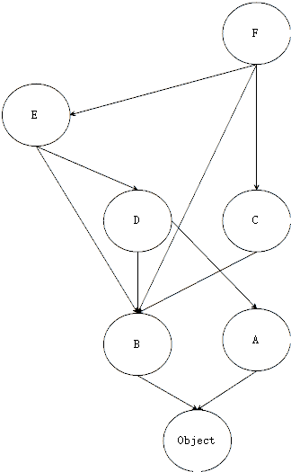
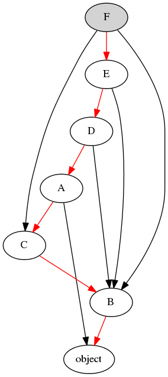

面向对象编程
================

在海滩上一群小孩子在堆沙堡，他们先把沙子装进不同的塑料模具里，然后再把成型的沙子倒出来，堆成一个个漂亮的沙堡。一个制造沙堡柱子的塑料模具可以制造出无数个带有相同花纹的沙柱，而小孩子的脚丫踩在沙滩上就留下一串相同的脚印。在工业制造上，使用模具来铸造机壳和零件更是司空见惯。所以在计算机编程语言中引入“模具”来制造用来编程的“零件”也就顺其自然了。

Python 是面向对象编程的语言，这一概念是相对于面向过程编程语言来讲的。在面向过程程序设计中，问题被看作一系列需要完成的任务，函数则用于完成这些任务，解决问题的焦点集中于函数，C 浯言是最常见的面向过程的编程语言。

面向对象编程（Object Oriented Programming，OOP）是一种程序设计思想。它把对象作为程序的基本单元，一个对象包含了数据和操作数据的函数，相同属性和操作方法的对象被抽象为类。类（Class）就类似上面所说的模具，而对象（Object）就是使用模具生产出的零件，对象就是类的实例（Instance）。

继承和多态、封装是面向对象编程的三个基本特征。

基本概念
----------

为了更深入的理解 Python 语言是如何支持面向对象机制的，先要厘清一些基本概念。在介绍这些概念之前，先看一个示例：

.. code-block:: python
  :linenos:
  :lineno-start: 0

  print(isinstance(object, type))
  print(isinstance(type, object))
  print(isinstance(type, type))
  print(isinstance(object, object))

  >>>
  True
  True
  True
  True

如果你已经可以解释清楚上面的执行结果，那么这一小结就可以跳过了。概念层面和实现层面往往有着令人不可思议的隔阂，就像古人无法理解原子一样。比如在 Python 的解释器 CPython 中没有对类（Class）的实现，只有对对象（Object）的实现，也即一切皆对象，Python 中的类更准确的应该被称为类型（Type）。

对象（Object）和类型（Type）是 Python 中两个最最基本的概念，它们是构筑 Python 语言大厦的基石，就像现实世界中的质子和电子一样。 这一章节主要参考 `Python 数据模型 <https://docs.python.org/dev/reference/datamodel.html>`_ 和 `Python 类 <https://docs.python.org/dev/tutorial/classes.html?highlight=virtual>`_ 。

对象（Object）
~~~~~~~~~~~~~~~

所有的数据类型，值，变量，函数，类，实例等等一切可操作的基本单元在 Python 都使用对象（Object）表示。每个对象有三个基本属性：ID，类型和值，也即有一块内存中存储了一个对象，这块内存中一定存有这三个属性。

.. code-block:: sh
  :linenos:
  :lineno-start: 0

  a = 1
  print(id(a), type(a), a)
  print(id(int), type(int), int)
  print(id(type), type(type), type)
  
  >>>
  1384836208 <class 'int'> 1
  1837755504 <class 'int'> 1
  1837581680 <class 'type'> <class 'int'>
  1837610960 <class 'type'> <class 'type'>

id()内建方法获取对象的唯一编号，它是一个整数，通常就是对象的内存地址。type() 内置方法获取对象的类型（Type），尽管这里冠以了 class 开头的说明，但是它就是指对象的数据类型，在 Python2.x 版本均是 <type 'xxx'>。

a 是一个对象，它的数据类型是 int，它的值是 1。int 和 type 也是对象，它们的数据类型均是 type。

一个对象也可能有一个或者多个基类（Bases），当一个对象表示数据类型时，比如 int 对象，它就具有了 __bases__ 属性。

.. code-block:: sh
  :linenos:
  :lineno-start: 0

  print(int.__bases__)
  print(type.__bases__)
  print(a.__bases__)
 
  >>>
  (<class 'object'>,)
  (<class 'object'>,)
  AttributeError: 'int' object has no attribute '__bases__'

type 和 bases 定义了该对象与其他对象间的关系，实际上对象内的 type 和 bases 均指向其他对象，是对其他对象的地址引用。

一个对象可以使用名字引用它，也可以没有，比如整数 1，一个不具名的对象我们无法同时测试它的三个属性，因为没有名字，第二次测试时无法保证还是原来的对象，但是依然可以测试匿名对象具有这三个属性。

.. code-block:: sh
  :linenos:
  :lineno-start: 0

  print(int.__name__)
  print(id(1), type(1), 1)
  
  print((1).__name__)
  
  >>>
  int
  1384836208 <class 'int'> 1
  AttributeError: 'int' object has no attribute '__name__'

类型（Type）
~~~~~~~~~~~~~~~

一个对象必有 Type 属性，同样 Type 是不能脱离开对象存在的。一个对象的类型定义了这个对象支持的行为以及它承载的值的类型，比如取名字，算数运算，求长度等等，一个 int 类型的对象只接受整型的数值。

type() 内置方法获取对象的类型。我们也可以使用类名加 “.__class__ ”来获取对象的类型，它们是等价的。

.. code-block:: sh
  :linenos:
  :lineno-start: 0
  
  a = 1
  print(type(a))
  print(a.__class__)
  
  >>>
  <class 'int'>
  <class 'int'>

类（Class）
~~~~~~~~~~~~~~~

在大多数编程语言中，类就是一组用来描述如何生成一个对象的代码段，由于 Python 是动态语言，类是动态生成的，它和传统意义上的类的意义不同。在 Python 中定义一个新类（Class）等于创建了一个新类型（Type）的对象（Object），解释器中一切对象均存储在 PyObject 结构中。

通过 class 关键字我们可以定义一个新的类型（New User-defined Type）。

.. code-block:: sh
  :linenos:
  :lineno-start: 0

  class Base():
      pass
  
  b = Base()
  print(id(Base), type(Base), Base)
  print(id(b), type(b), b)
  
  >>>
  2978875124248 <class 'type'> <class '__main__.Base'>
  2978906227544 <class '__main__.Base'> <__main__.Base object at 0x000002B594A5C358>

示例中，我们定义了一个自己的类型 Base，b 是它的实例（Instance），它的类型是 Base。

Class 和 Type 均是指类型（Type），Class 通常用于普通用户使用 class 自定义的类型。Type 通常指 Python 的解释器 CPython 内置的类型。

CPython 提供内置方法 type() 而没有定义 class()，因为它们本质是一样的，只是不同的语境产生的不同说法。 

Python 中支持类的多重继承，被继承的类称为当前类的基类（Base Classes）或者超类（Super Classes），也叫做父类。当前类被称为被继承类的子类（Subclasse），issubclass(class, class) 内置方法用于判断子类。

.. code-block:: python
  :linenos:
  :lineno-start: 0
  
  class A:
      pass
  class B(A):
      pass

  print(issubclass(B, A))
  print(issubclass(B, object))
  
  >>>
  True
  True

无论是自定义类，还是内置类型，它们均具有 __bases__ 属性，由于支持多继承，它是一个元组类型，指明了类型对象继承了哪些类。

.. code-block:: sh
  :linenos:
  :lineno-start: 0

  class A():
      pass
  class B():
      pass
  class C(A, B):
      pass

  print(C.__bases__)
 
  >>>
  (<class '__main__.A'>, <class '__main__.B'>)

类拥有创建对象的能力，而这就是为什么它是一个类的原因。但是它的本质仍然是一个对象，于是可以对它进行如下的操作：

- 可以将它赋值给一个变量
- 可以复制它
- 可以为它增加属性
- 可以将它作为函数参数进行传递
- 可以作为函数的返回值
- 可以动态的创建一个类

type() 内置方法不仅可以获取对象类型，还可以动态创建一个类：

.. code-block:: sh
  :linenos:
  :lineno-start: 0
  
  class A(object):
      name = 'A'
      
      def print_name(self):
          print(self.name)
  
  # 等价的类定义
  def print_name(self):
      print(self.name)
  
  A = type('A', (object,), {'name': 'A', "print_name" : print_name})

实例（Instance）
~~~~~~~~~~~~~~~~~~

实例（Instance）和对象（Object）也是不同的语境产生的不同说法。

“1 是一个 int 类型的实例” 和 “1 是 int 类型的对象” 是等价的。

如果把上句中的“类型”替换为“类”，就成了我们熟悉的面向对象编程中的说法：“1 是一个 int 类的实例” 和 “1 是 int 类的对象”。

当创建某个对象或强调某个对象的类型时，常常说这个对象是某某类的实例，当强调对象自身时，我们只说某某对象。

当一个对象是某个类的实例时，它也是这个类的基类的实例。内置方法 isinstance(obj, class) 用来判断一个对象是否是某个类的实例。

.. code-block:: sh
  :linenos:
  :lineno-start: 0
  
  class Base():
      pass
  
  b = Base()
  print(isinstance(b, Base))
  print(isinstance(b, object))
  
  >>>
  True
  True

对象和类型的关系
~~~~~~~~~~~~~~~~~~~

厘清了上述概念，开始分析 Python 中对象和类型的关系。

Python 中的对象之间存在两种关系：

1. 父子关系或继承关系（Subclass-Superclass 或 Object-Oriented），如“老鼠”类继承自“哺乳动物”类，我们说“老鼠是一种哺乳动物”（Mouse is a kind of mammal）。对象的 __bases__ 属性记录这种关系，使用 issubclass() 判断。
2. 类型实例关系（Type-Instance），如“米老鼠是一只老鼠”（Mickey is an instance of mouse），这里的米老鼠不再是抽象的类型，而是实实在在的一只老鼠。对象的 __class__ 属性记录这种关系，使用 isinstance() 判断。

Python 把对象分为两类，类型对象（Type）和非类型对象（Non-type）。

- int, type, list 等均是类型对象，可以被继承，也可以被实例化。
- 1, [1] 等均是非类型对象，它们不可再被继承和实例化，对象间可以根据所属类型进行各类操作，比如算数运算。

object 和 type 是 CPython 解释器内建对象，它们的地位非常特殊，是 Python 语言的顶层元素：

- object 是所有其他对象的基类，object 自身没有基类，它的数据类型被定义为 type。
- type 继承了 object，所有类型对象都是它的实例，包括它自身。判断一个对象是否为类型对象，就看它是否是 type 的实例。

.. figure:: imgs/obj.png
  :scale: 100%
  :align: center
  :alt: DAG

  object 和 type 关系图 （实线表继承关系，虚线表实例关系 Shalabh Chaturvedi）

现在回到开篇的问题，isinstance() 内置方法本质是在判断对象的数据类型，它会向基类回溯，直至回溯到 object，在 CPython 中最终调用如下函数:

.. code-block:: python
  :linenos:
  :lineno-start: 0

  static int
  type_is_subtype_base_chain(PyTypeObject *a, PyTypeObject *b)
  {
      do {
          if (a == b)
              return 1;
          a = a->tp_base;
      } while (a != NULL);
  
      return (b == &PyBaseObject_Type);
  }

  print(isinstance(object, type))  # 1
  print(isinstance(type, object))  # 2
  print(isinstance(type, type))    # 3
  print(isinstance(object, object))# 4

  print(object.__class__)  # <class 'type'>
  print(type.__class__)    # <class 'type'>
  
object 和 type 在 CPython 中分别对应 PyTypeObject（对 PyObject 的封装）类型的 PyBaseObject_Type 和 PyType_Type 变量，其中用于表示类型的成员 ob_type 是一个指针，均指向 PyType_Type。所以 object 和 type 对象类型均为 type。

1. object 的类型被定义为 type，所以为 true，这是人为通过指针定义的（ob_type 指针指向了 PyType_Type）。
2. type 的类型还是 type，它是自身的实例，type 继承自 object，所以也是 object 的实例，所以为 true。
3. 勿用解释。
4. object.__class__ 为 type，type 继承了 object，所以为 true。

Python 中还定义了一些常量，比如 True，False。其中有两个常量 None 和 NotImplemented 比较特殊，通过 type() 可以获取它们的类型为 NoneType 和 NotImplementedType，这两个类型不对外开放，也即普通用户无法继承它们，它们只存在于 CPython 解释器中。

类和对象
----------

类和对象是面向对象编程中封装特征的体现，类将一类属性和围绕属性操作的方法封装在一起，相同功能代码内聚成类，不同功能的类之间相互隔离。

类属性
~~~~~~~~~~~~

类自身可以具有自己的属性，被称为类属性，或者类成员变量。类属性可以直接通过类名访问，也可以通过实例访问。

.. code-block:: python
  :linenos:
  :lineno-start: 0
  
  class Employee():
      class_version = "v1.0"    # 类属性
      def __init__(self, id, name):
          self.id = id
          self.name = name
  
  print(Employee.class_version)   # 类名直接访问类属性
  worker0 = Employee(0, "John")
  print(worker0.class_version)    # 实例访问类属性
  
  >>>
  v1.0
  v1.0

如果要改变类属性，直接进行赋值操作是最简单的方法。对类属性赋予新的值，它的所有实例的类属性也会更新。
  
.. code-block:: python
  :linenos:
  :lineno-start: 0
  
  worker1 = Employee(1, "Bill")
  
  Employee.class_version = "v1.1" 
  print(Employee.class_version)
  print(worker0.class_version)
  print(worker1.class_version)
  
  >>>
  v1.1
  v1.1
  v1.1

实际上，类属性在创建实例时并不会被单独创建，都是引用的类的属性，它们在内存中只有一份。同样我们可以通过实例来改变类属性，此时将进行拷贝动作，该实例的类属性将脱离类的属性，实现了属性的解绑定，把原来类属性覆盖了，该属性成为了实例的私有属性，其他实例不会受影响。

.. code-block:: python
  :linenos:
  :lineno-start: 0

  worker0.class_version = "v1.2" # 类属性被复制，不影响类和其他实例
  print(worker0.class_version)
  
  print(Employee.class_version) 
  print(worker1.class_version)

  >>>
  v1.2
  v1.1
  v1.1

在实际的使用时，类属性应该只用于类相关的描述，类示例可以访问和使用它们，但不应该更改它们。

类私有属性和类方法
~~~~~~~~~~~~~~~~~~~

类的私有属性以两个下划线开头，它们不可以通过类名或者类示例来直接访问，它们被保护起来，只能通过类方法访问。 

.. code-block:: python
  :linenos:
  :lineno-start: 0
  
  class Employee():
      __class_version = "v1.0"    # 类的私有属性
      def __init__(self, id, name):
          self.id = id
          self.name = name
  
  print(Employee.__class_version)
  
  >>>
  AttributeError: type object 'Employee' has no attribute '__class_version'

类方法的第一个参数总是 cls，它指类自身，在调用时被隐式传递，声明类方法必须加上 @classmethod 装饰器说明符，参考 :ref:`buildin_decorator`。

.. code-block:: python
  :linenos:
  :lineno-start: 0
  
  class Employee():
      __class_version = "v1.0"
      def __init__(self, id, name):
          self.id = id
          self.name = name

    @classmethod
    def cls_ver_get(cls):
        return cls.__class_version
        
    @classmethod
    def cls_ver_set(cls, new_version):
        cls.__class_version = new_version

  print(Employee.cls_ver_get())
  Employee.cls_ver_set("v1.1")
  print(Employee.cls_ver_get())
  
  >>>
  v1.0
  v1.1

类的私有属性也可以被类的实例通过类方法访问或者修改类，但是修改过程不会出现拷贝，类私有属性在内存中永远只有一份，所有修改会影响到类和类的所有实例。

.. code-block:: python
  :linenos:
  :lineno-start: 0
  
  worker0 = Employee(0, "John")  
  worker1 = Employee(1, "Bill")
  
  worker0.cls_ver_set("v1.2")
  print(worker0.cls_ver_get())
  
  print(Employee.cls_ver_get())
  print(worker1.cls_ver_get())
  
  >>>
  v1.2
  v1.2
  v1.2

总结，类私有属性是类的私有“财产”，在内存中永远只有一份，只能通过类方法访问，实例可以通过类方法修改类的私有属性，修改会被“广播”到所有示例和类自身。

如果要定义只读属性，不要定义赋值动作的函数即可，比如这里的 cls_ver_set()。

类方法是访问类私有属性的接口，对私有属性提供了保护，在类方法中可以对设置的参数进行有效性检查。在使用类属性时应该明确用途，遵循先私有再公用的原则，以保证代码的高内聚和低耦合。不适当的对类属性的暴露将导致难于追溯的复杂问题，比如对象属性声明了与类属性同名的变量，将覆盖类的属性，类属性被解绑定了，这可能并不是我们所期待的。

类的静态方法
~~~~~~~~~~~~~~~~

使用 @staticmethod 装饰器说明符可以定义类的静态方法，参考 :ref:`buildin_decorator`。与类方法唯一的不同在于没有第一个隐式传递的参数 cls， 通常用于对一类函数进行封装。

.. code-block:: python
  :linenos:
  :lineno-start: 0
  
  class Employee():
      ......
      @staticmethod
      def static_get():
          print("This is a class static method")

  Employee.static_get()
  
  >>>
  This is a class static method

类的静态方法无法访问类属性。另外需注意，无论是类方法还是类的静态方法都只能通过类名加 '.' 的方式调用，不能间接调用它们，例如：
  
.. code-block:: python
  :linenos:
  :lineno-start: 0
  
  class Employee():
      __class_version = "v1.0"
      def __init__(self, id, name):
          self.id = id
          self.name = name
  
      @classmethod
      def cls_ver_get(cls):
          return cls.__class_version
  
      func_map = {'cls_ver_get':cls_ver_get}
      
      def call_func_map(self):
          self.func_map['cls_ver_get']()
      
  worker0 = Employee(0, "John")
  worker0.call_func_map()
  
  >>>
  TypeError: 'classmethod' object is not callable

查看类属性和方法
~~~~~~~~~~~~~~~~

::

  dir(...)
    dir([object]) -> list of strings

dir() 内建函数用于获取任意对象的所有属性和方法，在 Python 中一切都是基于对象实现的，在本质上类也是一个对象，可以使用 dir() 方法获取类的属性和方法。

.. code-block:: sh
  :linenos:
  :lineno-start: 0
  
  print(dir(Employee))
  
  >>>
  (<class '__main__.Employee'>, <class 'object'>)
  ['_Employee__class_version', '__class__', '__delattr__', '__dict__', '__dir__', '__doc__', 
   ......, 'cls_ver_get', 'cls_ver_set']

由于所有类默认都会继承内建对象的基类 object，这里看到的很多方法和属性均来自 object 对象，但是 _Employee__class_version 是我们自定义的属性，它自动被解释器添加了
_Employee前缀，而方法的名字则被保留。

.. code-block:: sh
  :linenos:
  :lineno-start: 0
  
  print(type(Employee.__init__))
  print(type(Employee.static_get))
  print(type(Employee.cls_ver_get))

  >>>
  <class 'function'>
  <class 'function'>
  <class 'method'>

注意，类中没有明确声明为类方法的函数类型均为 function，只有类方法的类型为 method。

动态绑定类属性和方法
~~~~~~~~~~~~~~~~~~~~~

我们可以为已定义的类动态的绑定新的属性和方法。

.. code-block:: python
  :linenos:
  :lineno-start: 0
  
  Employee.__class_version = "v1.3"
  dir(Employee)
  
  print(Employee.__class_version)
  print(Employee.cls_ver_get())
  
  >>>
  ['_Employee__class_version', '__class__', '__class_version', 
   ......, 'cls_ver_get', 'cls_ver_set']
  v1.3
  v1.2
  
我们曾在类定义中定义了私有属性 __class_version，令人费解的是为何直接访问 Employee.__class_version 会报错没有这个属性，而赋值操作却不会出错。
  
在上一小结，我们知道，类属性名在解释器中会被自动添加 _classname 的前缀，形成了类定义时的命名空间，如果我们在动态绑定类属性和方法，指定了同名的类属性，这个属性并不会被覆盖，而实际上会创建一个新的属性。通过 dir() 查看属性定义，发现多了 __class_version 属性，而类定义时的属性被命名为 _Employee__class_version。

所以尽管我们在赋值后可以 Employee.__class_version，实际上已经不是同一个属性，我们使用类的私有函数 cls_ver_get() 获取值依然没有改变。

同样，如果绑定一个同名的类方法，那么由于同名的方法没有被重命名，则会被覆盖。

.. code-block:: python
  :linenos:
  :lineno-start: 0
  
  def new_init(self, id, name, age):
      print("new_init")
      self.id = id
      self.name = name
      self.age = age
  
  Employee.__init__ = new_init
  worker1 = Employee(1, "Bill")
  
  >>>
  TypeError: new_init() missing 1 required positional argument: 'age'

我们这里定义新的初始化方法，并绑定到 Employee 类，现在如果还是用原来的参数来初始化对象，则会报参数错误。

为类动态创建的属性和方法，实例化的对象可以访问吗？我们看一个新的示例：

.. code-block:: python
  :linenos:
  :lineno-start: 0
  
  class Employee():
      __class_version = "v1.0"
      def __init__(self, id, name):
          self.id = id
          self.name = name
  
      @classmethod
      def cls_ver_get(cls):
          return cls.__class_version

  worker0 = Employee(0, "John")

  # worker0.say_name() 动态方法未绑定报错
  # print(worker0.class_version) 动态属性未绑定会报错 
  def say_name(self):
      print("My name is %s" % self.name)
  Employee.say_name = say_name
  Employee.class_version = "v1.0"
  
  worker0.say_name()
  print(worker0.class_version)
  
  >>>
  My name is John
  v1.0

可以看到在动态属性后者方法绑定后，即便是已经实例化的对象，也可以调用它们。我们不能通过动态绑定的方式定义类的私有属性。

尽管经过以上的分析，我们可以做一些“诡异”的动作，来尝试对一个只读属性赋值，也可以动态绑定一个私有属性，Python 不会阻止你干这样的“坏事”，但编码时不要这样做，这些均是基于解释器对定义时命名空间的行为，这一行为很可能随着版本改变，如果需要增加私有属性，请在类定义中添加。

.. code-block:: python
  :linenos:
  :lineno-start: 0
  
  Employee._Employee__class_version = "v1.3"
  print(Employee.cls_ver_get())
  Employee._Employee__private_arg = "private"
  print(Employee._Employee__private_arg)
  
  >>>
  v1.3
  private

对象的属性和方法
~~~~~~~~~~~~~~~~~~

对象是类的实例化，我们可以认为在创建对象时，复制了类的一份内存空间，并在内存空间中填入了实例的参数值。类的私有属性和类方法不可被实例化，它们还是指向原来的类。

对象和类一样，同样可以定义私有属性和方法，这些属性和方法必须以 "__" 开头，不可以通过对象名直接引用。

同样可以对一个对象进行动态添加属性和方法，只是它们均为这个对象所私有，不会影响类的其他实例对象。如果对象方法已经存在，则被覆盖。

.. code-block:: sh
  :linenos:
  :lineno-start: 0
  
  # 为对象添加新属性
  worker0.age = 25    
  def say_age(self):
      print("My id is %d" % self.age)
  
  # 为对象添加新方法
  from types import MethodType
  worker0.say_age = MethodType(say_age, worker0)
  print(type(worker0.say_age))
  print(type(say_age))

  worker0.say_age()

  >>>
  <class 'method'>
  <class 'function'>
  My id is 25
  
对象中的函数被称为 method 方法类型，普通函数类型为 function，这里需要借助 types 模块中的 MethodType() 将一个函数转化为一个对象的方法。

在类中定义的函数除非指明是类方法，它们的类型默认为 function，所以类可以通过赋值来动态绑定新的方法。对象是类的实例化，实例化过程会将 function 类型转换为 method 类型，所以类对象动态添加方法不能直接赋值。

访问对象属性
~~~~~~~~~~~~~~~~~~

如同类属性的访问一样，有两种方式访问对象的属性，直接使用对象名访问或者通过对象方法访问。类中所有第一个参数为 self 的函数都是对象的方法。

.. code-block:: python
  :linenos:
  :lineno-start: 0
  
  class Employee():
      def __init__(self, id, name):
          self.id = id
          self.name = name
          
      def get_name(self):
          return self.name
      
      def set_name(self, newname):
          self.name = newname
  
  worker0 = Employee(0, "John")
  print(worker0.name)
  print(worker0.get_name())
  
  worker0.name = "Lee"
  print(worker0.get_name())
  worker0.set_name("John")
  print(worker0.get_name())
  
  print(Employee.get_name(worker0)) # 通过类访问对象
  
  >>>
  John
  John
  Lee
  John
  John

示例中还给出了通过类来访问实例的方法，这可以加深对类定义中实例方法 self 参数的理解。

经过直接使用对象属性很方便，但是这未反了面向对象的思想，任何对外暴露对象属性的编码都暗喻着混乱的到来。比如我们如果要在更改姓名时做一些功能扩展，比如记录日志，那么使用类方法的维护成本要低得多，不仅如此，对参数合法性的检查也是对象方法的一大职能。

是否能既兼顾直接访问对象属性的方便，又不违反面向对象的编程思想呢？答案是使用 @property 装饰器，参考 :ref:`property_decorator`。

限制属性和方法
~~~~~~~~~~~~~~~~~~~~

我们可以动态的为对象添加属性和方法，这为程序设计提供了强大的灵活性，面向对象的一大优点在于封装，这种不恰当的扩展会破坏封装，类的特殊变量 __slots__ 可以给这种灵活性加以限制。

.. code-block:: python
  :linenos:
  :lineno-start: 0
  
  class Employee():
      __slots__ = ('id')
      def __init__(self, id, name):
          self.id = id
          self.name = name

  worker0 = Employee(0, "John")
  
  >>>
  AttributeError: 'Employee' object has no attribute 'name'
  
__slots__ 是一个名字字符串的元组，如果我们定义了它，所有的属性名都必须在其中声明，否则将提示错误。

.. code-block:: python
  :linenos:
  :lineno-start: 0
  
  class Employee():
      __slots__ = ('id', 'name')
      def __init__(self, id, name):
          self.id = id
          self.name = name
      
      def get_name(self):
          return self.name    

  worker0 = Employee(0, "John")
  worker0.age = 30
  
  >>>
  AttributeError: 'Employee' object has no attribute 'age'

这种限制同样对动态绑定起作用。同时方法也成为只读的，不能删除，也不能动态覆盖旧的方法，同时不能添加新方法。

.. code-block:: python
  :linenos:
  :lineno-start: 0
  
  def get_id(self):
      return self.id   
          
  worker0 = Employee(0, "John")
  
  del (worker0.get_name)
  worker0.get_name = None
  worker0.get_id = get_id
  
  >>>
  AttributeError: 'Employee' object attribute 'get_name' is read-only
  AttributeError: 'Employee' object attribute 'get_name' is read-only
  AttributeError: 'Employee' object has no attribute 'get_id'

但是这种限制只作用在类对象上，并不限制类自身，但是这个动态绑定的属性对于类对象是只读的，可以访问它，但是不能改写它，它是一个可以只可访问的类私有属性。

.. code-block:: python
  :linenos:
  :lineno-start: 0
  
  Employee.age = 25
  print(worker0.age) 
  
  worker0.age = 30 
  
  >>>
  25
  AttributeError: 'Employee' object attribute 'age' is read-only

如果子类也定义了 __slots__ 属性，则它会继承父类的 __slots__ 属性，否则不受父类的限制。

.. code-block:: python
  :linenos:
  :lineno-start: 0
  
  class Programmer(Employee):
      def __init__(self, id, name, lang):
          self.language = lang
          super().__init__(id, name)
  
  engineer = Programmer(0, "John", "Python")
  engineer.age = 30

以上继承不受 Employee 中 __slots__ 属性的影响，一旦子类中也定义了 __slots__，language 就不再是实例合法的属性了。

.. code-block:: python
  :linenos:
  :lineno-start: 0
  
  class Programmer(Employee):
      __slots__= () # 添加 'language' 使其变成合法属性
      def __init__(self, id, name, lang):
          self.language = lang
          super().__init__(id, name)
  
  engineer = Programmer(0, "John", "Python")
 
  >>>
  AttributeError: 'Programmer' object has no attribute 'language'

合理的运用类私有成员和 __slots__ 属性定义可以帮助我们编写具有高内聚，易扩展，可维护的代码，遵守规范能够获益的不仅仅是养成一个好习惯，它最大的挽救了我们的时间。

基类和继承
---------------

object和类特殊方法
~~~~~~~~~~~~~~~~~~~~~~~~

object 是所有类的基类（Base Class，也被称为超类（Super Class）或父类），如果一个类在定义中没有明确定义继承的基类，那么默认就会继承 object。

.. code-block:: sh
  :linenos:
  :lineno-start: 0
  
  class Employee():
  
  # 等价于
  class Employee(object):
  
  print(Employee.__mro__) # 打印类的继承关系
  
  >>>
  (<class '__main__.Employee'>, <class 'object'>)

__mro__ 属性记录类继承的关系，它是一个元组类型，从结果可以看出 Employee 继承自 object 基类。

object 自带一些属性和方法。对某些方法的了解有利于加深对类实例化过程的理解。

.. code-block:: sh
  :linenos:
  :lineno-start: 0
  
  dict0 = dir(object)
  for i in dict0:
      print("%-20s:%s" % (i, type(eval("object." + i))))
    
  >>>
  __delattr__         :<class 'wrapper_descriptor'>
  __dir__             :<class 'method_descriptor'>
  __doc__             :<class 'str'>
  __format__          :<class 'method_descriptor'>
  __getattribute__    :<class 'wrapper_descriptor'>
  __hash__            :<class 'wrapper_descriptor'>
  __init__            :<class 'wrapper_descriptor'>
  __init_subclass__   :<class 'builtin_function_or_method'>
  ......
  __repr__            :<class 'wrapper_descriptor'>
  __setattr__         :<class 'wrapper_descriptor'>
  __sizeof__          :<class 'method_descriptor'>
  __str__             :<class 'wrapper_descriptor'>

__dir__
``````````````

__dir__() 方法用于类的所有属性和方法名，它是一个字典，内置函数 dir() 就是对它的调用。

__doc__
```````````

__doc__ 属性指向当前类的描述字符串。描述字符串是放在类定义中第一个未被赋值的字符串，它不会被继承。

.. code-block:: python
  :linenos:
  :lineno-start: 0
  
  class C():
      "A Sample Class C"  # 对类的描述，如果没有则为""
      pass
  
  print(C.__doc__)
  print(object.__doc__)
  
  >>>
  A Sample Class C
  The most base type

__str__
```````````

__str__ 方法用于 str() 函数转换中，默认使用 print() 方法打印一个对象时，就是对它的调用，我们可以重写这个函数还实现自定义类向字符串的转换。

.. code-block:: python
  :linenos:
  :lineno-start: 0

  class C():
      pass
  
  print(C)   # 调用 object 的 __str__ 方法

  class C():
      def __str__(self):
          return "C Class"
  
  print(C()) # 调用类对象的 __str__ 方法

  >>>
  <__main__.C object at 0x0000027A98BE2828>
  C Class

__repr__
````````````

repr() 函数调用对象中的 __repr__() 方法，返回一个 Python 表达式，通常可以在 eval() 中运行它。

__call__
````````````

还有一些特殊方法没有在基类中实现，但是它们具有非常特殊的功能，比如 __call__() 可以将一个对象名函数化。实现了 __call__() 函数的类，其实例就是可调用的（Callable）。
可以像使用一个函数一样调用它。

.. code-block:: python
  :linenos:
  :lineno-start: 0
  
  class Employee():
      def __init__(self, id, name):
          self.id = id
          self.name = name
  
      def __call__(self, *args):
          print(*args)
          print('Printed from __call__')
  
  worker0 = Employee(0, "John")
  worker0("arg0", "arg1")
  
  >>>
  arg0 arg1
  Printed from __call__

:ref:`decorator_class` 就是基于 __call__() 方法来实现的。注意 __call__() 只能通过位置参数来传递可变参数，不支持关键字参数，除非函数明确定义形参。

可以使用 callable() 来判断一个对象是否可被调用，也即对象能否使用()括号的方法调用。

.. code-block:: python
  :linenos:
  :lineno-start: 0
  
  # 如果 Employee 类不实现 __call__，则返回 False
  callable(worker0) 
  
  >>>
  True
  
__iter__ __getitem__ 
`````````````````````

参考 :ref:`index_loop_access` 和 :ref:`iterator_obj` 。

属性方法实现
```````````````````

在基类中提供了3个与属性操作相关的方法：

- __delattr__，用于 del 语句，删除类或者对象的某个属性
- __setattr__，用于动态绑定属性
- __getattribute__，在获取类属性时调用，无论属性是否存在

.. code-block:: python
  :linenos:
  :lineno-start: 0
  
  class C():
      def __init__(self):
          self.hello = "123"
  
      def __delattr__(self, name):
          print("delattr %s" % name)
          super().__delattr__(name)       # 调用 object 的 __delattr__
    
      def __setattr__(self, attr, value):
          print("setattr %s" % attr)
          super().__setattr__(attr, value)# 调用 object 的 __setattr__
  
  c = C()
  del c.hello      # 调用类对象的 __delattr__
  print(c.hello)   # 报错 hello 属性不存在 

  c.newarg = "100" # 调用类对象的 __setattr__
  >>>
  delattr hello
  setattr newarg
  
为了使打印输出更清晰，这里单独来验证 __getattribute__ 方法，可以看到无论属性是否存在均会调用自定义的 __getattribute__ 方法。

.. code-block:: python
  :linenos:
  :lineno-start: 0
  
  class C():
      def __init__(self):
          self.hello = "123"
  
      def __getattribute__(self, name):
          print("getattribute %s" % name)
          return super().__getattribute__(name)

  print(C().hello)
  print(C().ARG)  # 报错没有 ARG 属性

  >>>
  getattribute hello
  getattribute ARG

这里之所以单独把属性相关的方法放在一起总结，在于 Python 提供了三个内置方法 getattr()，setattr() 和 hasattr()，它们均是基于类的属性方法来实现的。

attr 内置方法
~~~~~~~~~~~~~~~~~~~~

Python 提供了三个内置方法 getattr()，setattr() 和 hasattr() ，分别用于获取，设置和判定对象的属性。既然我们已经可以通过对象名直接访问它们，为何还要使用这些函数呢？通过它们我们可以对任意一个我们不熟悉的对象进行尝试性访问，而不会导致程序出错。

.. code-block:: python
  :linenos:
  :lineno-start: 0
  
  class C():
      def __init__(self):
          self.hello = "123"
  
  c = C()
  if hasattr(c, "hello"):
      print(c.hello)
  
  if not hasattr(c, "ARG"):
      setattr(c, "ARG", "ARGVal")
      print(getattr(c, "ARG"))
  
  print(getattr(c, "ARG0", "default value"))
  
  >>>
  123
  ARGVal
  default value

getattr() 方法最大的用途在于如果对象没有相应属性，可以不报错 AttributeError，可以为它指定一个默认值。

实例所属类的判定
~~~~~~~~~~~~~~~~~~~

判断一个对象是否是某个类的实例，可以用 isinstance() 内置方法判断。

.. code-block:: python
  :linenos:
  :lineno-start: 0
  
  print(isinstance([], list))
  print(isinstance("123", str))
  print(isinstance("123", object))
  print(isinstance(engineer, Employee))
  print(isinstance(engineer, Employee))
  print(isinstance(Programmer, Employee))

  >>>
  True
  True
  True
  True
  True
  False

在继承关系中，如果一个对象的是某个类的子类的实例，这个对象也被认为是这个类的实例。所有对象都是 object 基类的实例。

多重继承的顺序
~~~~~~~~~~~~~~~~~~~~

继承是面向对象编程的一大特征，继承可以使得子类具有父类的属性和方法，并可对属性和方法进行扩展。Python 中继承的最大特点是支持多重继承，也即一个类可以同时继承多个类。

我们可以在新类中使用父类定义的方法，也可以定义同名方法，覆盖父类的方法，还可以在自定义的方法中使用 super() 调用父类的同名方法。那么如果从多个类继承，多个类中又实现了同名的方法，如何确定它们的继承顺序呢？

.. code-block:: python
  :linenos:
  :lineno-start: 0
  
  class A(object):
      def f0(self):
          print('A f0')
  
      def f1(self):
          print('A f1')
  
  class B(object):
      def f0(self):
          print('B f0')
  
      def f1(self):
          print('B f1')
  
  class C(B):
      def f0(self):
          print('C f0')
  
  class D(A, B):
      def f1(self):
          print('D f1')
  
  class E(D, B):
      pass
  
  class F(E, C, B):
      pass
  
  print(F.__mro__)
  f = F()
  f.f0()
  f.f1()

这种继承顺序被称为方法解释顺序（MRO，Method Resolution Order）。Python2.3 版本后采用 C3 线性序列算法来计算 MRO。

类之间的继承关系可以用有向无环图（DAG, Directed Acyclic Graph）来描述，每个顶点代表一个类，顶点之间的有向边代表类之间的继承关系。C3算法对所有顶点进行线性排序。



  示例中类继承关系对应的有向无环图

生成线性顶点序列的步骤如下：

1. 找到入度为0的点 F，把 F 拿出来，把 F 相关的边剪掉，线性序列为 {F}
#. 现在有两个入度为0的点(E, C)，按照上一步被剪掉的类 F 中声明顺序优先原则，取 E，剪掉 E 相关的边，这时候的排序是{F, E}
#. 现在有两个入度为0的点(D, C)，按照上一步被剪掉的类 E 中声明顺序优先原则，剪掉 D 相关的边，这时候排序是{F, E, D}
#. 现在有两个入度为0的点(C, A)，按照上一步被剪掉的类 D 中声明顺序优先原则，剪掉 A 相关的边，这时候的排序是{F, E, D, A}
#. 这时入度为0的点只有 C，取 C，剪掉 C 相关的边，这时候的排序是{F, E, D, A, C}
#. 这时入度为0的点只有 B，取 B，剪掉 B 相关的边，这时候的排序是{F, E, D, A, C，B}，此时只剩下基类 object
#. 所以最后的排序是{F, E, D, A, C, B, object}

最终按照上述排序查找 f0() 和 f1() 的定义，上例中的结果为：



  示例中类的MRO关系图
  
.. code-block:: python
  :linenos:
  :lineno-start: 0
  
  >>>
  (<class '__main__.F'>, <class '__main__.E'>, <class '__main__.D'>, 
  <class '__main__.A'>, <class '__main__.C'>, <class '__main__.B'>, <class 'object'>)
  A f0
  D f1

注意，Python2.3 以前的版本，不继承任何父类的类被称为经典类（Classic Class），使用的是深度优先排序算法。在 Python3 任何类都会默认继承 object，被称为新式类（New-style Class）。

我们可以使用 PyCharm 生成类的继承图，在任意源码文件右击，选择 Diagrams->Show Diagram...，在显示的继承图界面右击选择 Layout，可以用多种方式显示继承关系。

枚举类
----------

Python 基本数据类型没有支持枚举，但是提供了 enum 模块。它实现了 Enum 类，用来定义唯一只读的序列集。 枚举类型的行为类似 :ref:`namedtuple`。

.. code-block:: python
  :linenos:
  :lineno-start: 0
  
  from enum import Enum
  
  Animal = Enum('Animal', 'ANT BEE CAT DOG')
  print(Animal.__name__)
  print(Animal.ANT)
  print(Animal.ANT.value)
  for i in Animal:
      print("%s: %s->%d" % (i, i.name, i.value))

  >>>
  Animal
  Animal.ANT
  1
  Animal.ANT: ANT->1
  Animal.BEE: BEE->2
  Animal.CAT: CAT->3
  Animal.DOG: DOG->4

Enum() 返回一个枚举类，第一个参数为枚举类名称，第二个参数使用空格分割，是枚举类的属性，从 1 开始被自动编号。注意这些属性均是只读的。上例中 Animal 类等价于下面的类定义：

.. code-block:: python
  :linenos:
  :lineno-start: 0

  class Animal(Enum):
      ANT = 1
      BEE = 2
      CAT = 3
      DOG = 4

unique 装饰器可以自动检查定义中是否有重复值。

.. code-block:: python
  :linenos:
  :lineno-start: 0
  
  from enum import unique
  @unique
  class Animal(Enum):
      ANT = 1
      BEE = 2
      CAT = 3
      DOG = 3

元类 metaclass
-----------------

“元类就是深度的魔法，99%的用户应该根本不必为此操心。如果你想搞清楚究竟是否需要用到元类，那么你就不需要它。那些实际用到元类的人都非常清楚地知道他们需要做什么，而且根本不需要解释为什么要用元类。”  —— Python界的领袖 Tim Peters

就笔者看来，元类是 Python 附送的彩蛋，如果你需要动态创建类，请使用 type() 内建方法。
