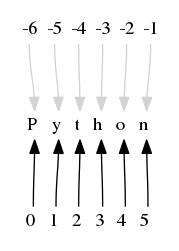

字符串处理
================

字符串(str)是 Python 中最常用的数据类型，可以使用单引号或双引号来创建字符串。

注意：
- Python不支持单字符类型，单字符在 Python 中也是作为一个字符串使用。

- 字符串是不可变类型，即无法直接修改字符串的某一索引对应的字符，需要转换为列表处理。可以认为字符串是特殊的元组类型。

创建字符串变量
-----------------

直接赋值创建字符串
~~~~~~~~~~~~~~~~~~~~~

Python 中通过各类引号（单双引号和三引号）标识字符串。

.. code-block:: sh
  :linenos:
  :lineno-start: 0

  str0 = "Hello"   # 双引号
  str1 = 'world!'  # 单引号
  str2 = """123""" # 三引号
  str3 = '''456'''
  # 多行
  str4 = "hello"\
         " world"
  str5 = """hello\
   world"""
          
  for i in range(6):
      print(eval("str" + str(i)))
  
  >>>
  Hello
  world!
  123
  456
  hello world
  hello world

由字符串组合生成新字符串
~~~~~~~~~~~~~~~~~~~~~~~~~~~

"+" 运算符实现字符串的拼接。

.. code-block:: python
  :linenos:
  :lineno-start: 0

  str0 = "Name:"
  str1 = "John"
  str2 = str0 + " " + str1
  str3 = "Age:" + " " + str(18)
  print(str2)
  print(str3)

  >>>
  Name: John
  Age: 18

"*" 运算符实现字符串重复。

.. code-block:: python
  :linenos:
  :lineno-start: 0

  str0 = "~" * 10
  print(str0)

  >>>
  ~~~~~~~~~~

操作符必须作用在 str 类型上，如果为其他类型必须使用 str() 函数进行
转换，例如这里的 str(18)。

新字符串也可以通过 :ref:`string-reference0` ，转换，切片，分割和替换等方式得到。

复制字符串
~~~~~~~~~~~~~

复制字符串是处理字符串的常用操作，通过切片实现。

.. code-block:: python
  :linenos:
  :lineno-start: 0

  str0 = ["0123456789"]
  str1 = str0[:]
  print(list1)
  
  >>>
  0123456789

其他类型转换为字符串
~~~~~~~~~~~~~~~~~~~~

str() 内建函数可以将多种其他数据类型转化为字符串。

.. code-block:: python
  :linenos:
  :lineno-start: 0
  
  print(str(1))
  print(str(1.0))
  print(str(1+1j))
  print(str([12, "abc"]))
  print(str((12, "abc")))
  print(str({"Name":"John", "Age": "18"}))
  
  >>>
  1
  1.0
  (1+1j)
  [12, 'abc']
  (12, 'abc')
  {'Name': 'John', 'Age': '18'}

可以注意到，将复杂数据类型转化为字符串时会保留其语法格式，若要进行更细致的操作
需要相应函数帮助，比如str.format()，它们提供了异常强大的转换功能。

特殊字符的转义处理
---------------------

所谓特殊字符，有些字符是不显示的，比如回车换行符，有些是用来做特殊控制的，比如单引号在代码中表示字符的开始或者结束，这些字符必须用可见的字符来表示，但是可见字符已经表示了其自身，解决方案就是通过在普通字符前添加 '\\' 前缀，实现对普通字符的转义，\\ 被称为转义符。

ASCII码值转义
~~~~~~~~~~~~~~~~

.. code-block:: python
  :linenos:
  :lineno-start: 0

  str0 = "A"
  print(ord(str0[0]))
  print("0x%02x" % ord(str0[0])) # 16进制输出
  print("%o" % ord(str0[0]))     # 8进制输出

  >>>
  65
  0x41
  101

"\\yyy" 和 "\\xyy" 分别表示三位八进制数和二位十六进制数 ascii 码对应的字符，8进制如果不够3位，前面必须补0，比如099。

.. code-block:: python
  :linenos:
  :lineno-start: 0
  
  str1 = "\101"
  str2 = "\x41"
  print(str0 == str1)
  print(str0 == str2)

  >>>
  True
  True

其他可转义字符可以在 `<https://docs.python.org/2.0/ref/strings.html>`_ 找到。

.. code-block:: python
  :linenos:
  :lineno-start: 0

  escape_characters = [["\'", "single quote"],
                       ["\"", "double quote"],
                       ["\\", "back slash"],
                       ["\r", "carriage return"],
                       ["\n", "new line"],
                       ["\t", "table"],
                       ["\a", "bell"],
                       ["\b", "backspace"],
                       ["\f", "form feed"],
                       ["\v", "vertical tab"],
                       ["\0", "null"]]

Unicode码值转义
~~~~~~~~~~~~~~~~

在字符串中，我们可以使用 '\\x0d' 和 '\\r' 表示回车符号，那么对于中文字符来说，也同样有两种表示方式：

.. code-block:: python
  :linenos:
  :lineno-start: 0

  str0 = '\u4f60'
  str1 = '你'
  print(str0, str1)

  >>>
  你 你

0x4f60 是中文字符 '你' 的 Unicode 码值，可以采用 '\\u' 前缀加 Unicode 码值的方式表示一个中文字符，它和 '你' 是等价的。 
注意Unicode 码值和 UTF-8 编码的区别，参考 :ref:`general_encode` 。

引号转义
~~~~~~~~~~~~~

对于字符串中的单双引号可以进行转义处理，也可以互斥使用单双引号：

.. code-block:: python
  :linenos:
  :lineno-start: 0

  str0 = '123"456'
  str1 = "123\"456"
  str2 = """123'''456"""
  print(str0)
  print(str1)
  print(str2)

  >>>
  123"456
  123"456
  123'''456

既有单引号又有双引号，可以使用转义，或者三引号处理。

.. code-block:: python
  :linenos:
  :lineno-start: 0

  str0 = "123\"\'456"               
  str1 = """123'"456"""
  print(str0)
  print(str1)
  
  >>>
  123"'456
  123'"456

可以指定多个字符串，字符串中间的空格被忽略。

.. code-block:: python
  :linenos:
  :lineno-start: 0

  str0 = "spam " "eggs"
  print(str0)

  >>>
  spam eggs

原生字符
~~~~~~~~~~~~

使用原生字符串输入标志r或R可以免除大量转义，直接原样输出。

.. code-block:: python
  :linenos:
  :lineno-start: 0

  str0 = r"123\"\'456"
  str1 = R"123\"\'456"
  print(str0)
  print(str1)
  
  >>>
  123\"\'456
  123\"\'456

注意：原生字符串必须保证代码行复合编码逻辑，也即起止标志(引号)必须配对，
比如字符串 ``r"123\"`` 是不能被解析的，右斜杠和引号同时存在令解析器认为字符串没有结束符"。
将提示 "SyntaxError: EOL while scanning string" 错误。

访问字符串中的值
-----------------------

要理解下标和切片访问方式，必须理解字符串的索引。和 C 语言类似，字符串中每一个字符都有一个唯一
的自然数字与它对应，从0开始。例如字符串 str0 = "Python"，其下标从0开始，则str0[0]对应字符'P'。
以此类推，str0[5]对应最后的字符'n'。

负数索引编号
~~~~~~~~~~~~~~~

与 C 语言不同，Python语言提供了负数下标，方便从字符串尾部进行访问。下标从-1向前依次递减。



  Python 支持负数索引

下标直接访问
~~~~~~~~~~~~~~~~~~~~~~~~~~~

.. code-block:: python
  :linenos:
  :lineno-start: 0

  str0 = "Python"
  print(str0[0], str0[-1])
  
  >>>
  P n

切片取子字符串
~~~~~~~~~~~~~~~~~~~~~~~~~~~

通过提供起止索引来访问子字符串的方式称为切片。下标超过最大索引，或者起始索引大于终止索引，返回空字符串。

切片操作支持指定步长，格式为 [索引:索引:步长]，前两个索引和普通切片一样。

.. code-block:: python
  :linenos:
  :lineno-start: 0

  str0 = "012456789"
  print(str0[1:3])
  print(str0[1::2])      # 2为步长
  print(str0[3:])
  print(str0[3:-1])
  print(len(str0[100:])) # 返回空字符串

  >>>
  12
  1468
  456789
  45678
  0

过滤特定的字符
~~~~~~~~~~~~~~~~

filter(function or None, iterable) --> filter object

内建函数 filter() 可以对迭代数据类型执行特定的过滤操作。返回迭代对象。

取数字组成的字符串中的偶数字符，并得到新字符串。

.. code-block:: python
  :linenos:
  :lineno-start: 0
  
  str0 = "0123456789"
  iterable0 = filter(lambda i: int(i)%2 == 0, str0)
  print("".join(iterable0))

  >>>
  02468

更新字符串中的值
-----------------

字符串不允许直接修改，只能转换为其他类型更新后在转换回字符串。

转换为列表再转回
~~~~~~~~~~~~~~~~~

字符串转换为列表后，每一个字符串称为列表的一个元素，此时通过索引就可以更新每一个字符，
然后再通过 join() 函数转回字符串。

.. code-block:: python
  :linenos:
  :lineno-start: 0
  
  str0 = "0123456"
  list0 = list(str0)
  
  print(list0)
  list0[0] = 'a'
  print(list0)
  
  str0 = ''.join(list0)
  print(str0)
  
  >>>
  ['0', '1', '2', '3', '4', '5', '6']
  ['a', '1', '2', '3', '4', '5', '6']
  a123456

切片更新字符串
~~~~~~~~~~~~~~~~~~~~~~~~

.. code-block:: python
  :linenos:
  :lineno-start: 0
  
  str0 = "abcdef"
  str1 = str0[:3] + 'D' + str0[3:]
  print(str1)
  
  >>>
  abcDdef

如果只是在头部或者尾部追加，可以直接使用"+"拼接运算符实现。
更复杂的操作需要通过替换函数等实现。

字符串格式化
-----------------

常用格式化符号
~~~~~~~~~~~~~~~~

  =====  ================================================
  符号    描述
  =====  ================================================
  %c	 格式化字符及其ASCII码
  %s	 格式化字符串
  %d	 格式化整数
  %u	 格式化无符号整型
  %o	 格式化无符号八进制数
  %x	 格式化无符号十六进制数
  %X	 格式化无符号十六进制数（大写）
  %f	 格式化浮点数字，可指定小数点后的精度
  %e	 用科学计数法格式化浮点数
  %E	 作用同%e，用科学计数法格式化浮点数
  %g	 %d 和 %e 的简写
  %G	 %d 和 %E 的简写
  %      直接输出 % 
  =====  ================================================

.. code-block:: python
  :linenos:
  :lineno-start: 0

  print("%c" % 'a')
  print("%s" % "string")
  print("%s" % 123)   # 自动调用str()转换为str
  print("%d" % 100.0) # 自动调用int()转换为int
  print("%u" % 100)
  print("%o" % 100)
  print("0x%x" % 100)
  print("0X%X" % 100)
  print("%f" % 100)
  print("%e" % 100)
  print("%E" % 100)
  print("%g" % 100.0)
  print("%G" % 100.0)
  print("%")         # 直接输出 %，无需 %%

  >>>
  a
  string
  123
  100
  100
  144
  0x64
  0X64
  100.000000
  1.000000e+02
  1.000000E+02
  100
  100
  %

转换符格式化
~~~~~~~~~~~~~~~~

转换符格式化 (conversion specifier) 可以引用字典变量。
转换符的格式为 %(mapping_key)flags，mapping_key指明引用变量的名称，flags指明转换格式。

.. code-block:: python
  :linenos:
  :lineno-start: 0

  print('%(language)s has %(number)01d quote types.' % {'language': "Python", "number": 2})
  
  >>>
  Python has 2 quote types.

更复杂的格式化使用str.format()更便捷。

format函数格式化
~~~~~~~~~~~~~~~~~

Python2.6 开始，新增了一种格式化字符串的函数 str.format()，它增强了字符串格式化的功能。
基本语法是通过 {} 和 : 来代替以前的 %。format 函数可以接受不限个参数，位置可以不按顺序。

为格式化参数指定顺序
`````````````````````

.. code-block:: python
  :linenos:
  :lineno-start: 0

  print("{} {}".format("abc", "123"))        # 不指定位置，按默认顺序
  print("{0} {1}".format("abc", "123"))      # 设置指定位置
  print("{1} {0} {1}".format("abc", "123"))  # 设置指定位置

  >>>
  abc 123
  abc 123
  123 abc 123

通过名称或索引指定参数
```````````````````````

直接通过名称引用，或者可以通过字典和列表传递参数。

.. code-block:: python
  :linenos:
  :lineno-start: 0

  print("name: {name}, age: {age}".format(name="John", age="25"))
   
  # 通过字典设置参数
  man = {"name": "John", "age": "25"}
  print("name: {name}, age: {age}".format(**man))
   
  # 通过列表索引设置参数
  man_list = ['John', '25']
  print("name: {0[0]}, age: {0[1]}".format(man_list))  # "0" 是必须的
  
  >>>
  name: John, age: 25
  name: John, age: 25
  name: John, age: 25

直接传递对象
`````````````

.. code-block:: python
  :linenos:
  :lineno-start: 0

  class testobj(object):
      def __init__(self, value):
          self.value = value
  testval = testobj(100)

  print('value: {0.value}'.format(testval))  # 只有一个对象，此时 "0" 是可选的
  
  >>>
  100

数字格式化
```````````````

str.format() 提供了强大的数字格式化方法。

  ==========  =======  ========== ================================
    数字        格式      输出          描述
  ==========  =======  ========== ================================
  3.1415926   {:.2f}    3.14      保留小数点后两位
  3.1415926   {:+.2f}   +3.14     带符号保留小数点后两位
  -1          {:+.2f}   -1.00     带符号保留小数点后两位
  2.71828     {:.0f}    3         不带小数, <=0.5舍，>0.5入
  5           {:0>2d}   05        数字补零 (填充左边, 宽度为2)
  5           {:x<4d}   5xxx      数字补x (填充右边, 宽度为4)
  10          {:x<4d}   10xx      数字补x (填充右边, 宽度为4)
  1000000     {:,}      1,000,000 以逗号分隔的数字格式
  0.25        {:.2%}    25.00%    百分比格式
  1000000000  {:.2e}	1.00e+09  指数记法
  13          {:10d}	13	  右对齐 (默认, 宽度为10)
  13          {:<10d}   13        左对齐 (宽度为10)
  13          {:^10d}   13        中间对齐 (宽度为10)  
  ==========  =======  ========== ================================

针对不同的进制，str.format() 提供了以下格式化方法：

.. code-block:: python
  :linenos:
  :lineno-start: 0
	
  print('{:b}'.format(11))     # 二进制
  print('0b{:0>5b}'.format(11))# 二进制，数字补零 (填充左边, 宽度为5
  print('{:d}'.format(11))     # 十进制
  print('{:o}'.format(11))     # 八进制
  print('{:x}'.format(11))     # 16进制
  print('{:#x}'.format(11))    # 16进制带0x前缀
  print('{:#X}'.format(11))    # 16进制带0X前缀
  
  >>>
  1011
  0b01011
  11
  13
  b
  0xb
  0XB

^, <, > 分别是居中、左对齐、右对齐，后面带宽度。

: 号后面带填充的字符，只能是一个字符，不指定则默认是用空格填充。

+ 表示在正数前显示 +，负数前显示 -； （空格）表示在正数前加空格。

b、d、o、x/X 分别是二进制、十进制、八进制、十六进制。

转义大括号
`````````````

由于大括号在format()函数作为参数引用的特殊用途，如果要在字符串中输出大括号，则
使用大括号 {} 来转义大括号。

.. code-block:: python
  :linenos:
  :lineno-start: 0

  print("{0} is {{0}}".format("value"))
  print("{0} is ".format("value") + "{0}") # 连接字符串

  >>>
  value is {0}
  value is {0}

应采用字符串连接的方式来组合含有大括号的字符串，这样更清晰。

字符串查找和统计
-------------------

判断子字符串存在
~~~~~~~~~~~~~~~~

使用 in 和 not in 判定子串自否存在。

.. code-block:: python
  :linenos:
  :lineno-start: 0

  str0 = "0123456789"
  print("123" in str0)
  print("123" not in str0)
  if "123" in str0:
      print("123 in {0}".format(str0))

  >>>
  True
  False
  123 in 0123456789

指定范围查找字符串
~~~~~~~~~~~~~~~~~~~~

本小结主要针对 find()，index()和rindex()函数的使用。

S.find(sub [,start [,end]]) -> int

find() 在 [start, end) 索引范围内查找 sub 字符串，如果存在返回第一个的索引，否则返回-1。

.. code-block:: python
  :linenos:
  :lineno-start: 0

  str0 = "0123456789"
  print(str0.find("78"))
  print(str0.find("ab"))
  print(str0.find("78", 1, 5))
  
  >>>
  7
  -1
  -1

S.index(sub [,start [,end]]) -> int

index()函数与find()函数非常类似，找不到时会抛出 ValueError 异常。

S.rindex(sub [,start [,end]]) -> int

rindex() 与 index() 作用类似，从右侧开始查找。

字符是否以子串开始或结束
~~~~~~~~~~~~~~~~~~~~~~~~~

S.endswith(suffix[, start[, end]]) -> bool

endswith() 函数返回True或者False，start和end指定查找范围，可选。

.. code-block:: python
  :linenos:
  :lineno-start: 0

  print(str0.endswith("89"))
  print(str0.endswith("89", 0, 9))

  >>>
  True
  False

S.startswith(prefix[, start[, end]]) -> bool

与 endswith()类似，判断字符串是否以 prefix 子串开始。

字符串最大最小值
~~~~~~~~~~~~~~~~~~~~~~~~~

max() 和 min() 用于获取字符串中的最大ascii码和最小ascii码的字符。

.. code-block:: python
  :linenos:
  :lineno-start: 0

  str0 = "0123456789"
  print(max(str0), min(str0))

  >>>
  9 0

统计字符串出现次数
~~~~~~~~~~~~~~~~~~~~~~~~~

S.count(sub[, start[, end]]) -> int

count() 返回 str 在 string 里面出现的次数，
如果 start 或者 end 指定则返回指定范围内 str 出现的次数。

.. code-block:: python
  :linenos:
  :lineno-start: 0

  str0 = "0123456789"
  print(str0.count("0", 0, 9))
  print(str0.count("0", 1, 9))
  print(str0.count("abc"))
  
  >>>
  1
  0
  0

统计字符串不同字符数
~~~~~~~~~~~~~~~~~~~~~~~~~

set() 函数可以对字符串进行归一化处理。需要注意，set()函数返回的字符集合是无序的。

.. code-block:: python
  :linenos:
  :lineno-start: 0

  str0 = "00112233"
  print(set(str0))

  for i in set(str0):
      print("%s count %d" % (i, str0.count(i)))
  
  >>>
  set(['1', '0', '3', '2'])
  1 count 2
  0 count 2
  3 count 2
  2 count 2

字符串大小写转换
------------------

首字符转化为大写
~~~~~~~~~~~~~~~~~~

S.capitalize() -> string

capitalize()将字符串的第一个字母变成大写,其他字母变小写。

.. code-block:: python
  :linenos:
  :lineno-start: 0

  print("a, B".capitalize())
  print(" a,B".capitalize())   # 第一个字符是空格，a不大写
  print("a,BC D".capitalize())

  >>>
  A, b
   a,b
  A,bc d

转为大写或小写
~~~~~~~~~~~~~~~~~~~~~

S.upper() -> string 

S.lower() -> string

upper()和lower()分别对字符串进行大写和小写转换。

.. code-block:: sh
  :linenos:
  :lineno-start: 0

  str0 = "Hello World!"
  print(str0.upper())
  print(str0.lower())

  >>>
  HELLO WORLD!
  hello world!

大小写反转
~~~~~~~~~~~~

S.swapcase() -> string

小写变大写，大写变小写，非字符字符保持不变。

.. code-block:: sh
  :linenos:
  :lineno-start: 0

  str0 = "Hello World!"
  print(str0.swapcase())
  
  >>>
  hELLO wORLD!

标题化字符串
~~~~~~~~~~~~~~

S.title() -> string

title() 返回"标题化"的字符串，即所有单词都是以大写开始，其余字母均为小写。

.. code-block:: sh
  :linenos:
  :lineno-start: 0
  
  str0 = "HI world!"
  print(str0.title())
  >>>
  Hi World!

字符串对齐和填充
-----------------

关于字符串对齐参考 :ref:`my-reference-label0`。

S.zfill(width) -> string

zfill() 函数返回指定长度的字符串，原字符串右对齐，前面填充字符0。

.. code-block:: python
  :linenos:
  :lineno-start: 0
  
  str0 = "Hello world"
  print(str0.zfill(20))
  print(str0.zfill(30))
  print(str0.rjust(30, '0'))
  
  >>>
  000000000Hello world
  0000000000000000000Hello world
  0000000000000000000Hello world
  
由示例可以得知 zfill(width) 和 rjust(width, '0')是等价的。

字符串strip和分割
------------------

.. _string-whitespace:

strip字符串
~~~~~~~~~~~~~~~

S.strip([chars]) -> string or unicode

strip()函数默认将字符串头部和尾部的空白符(whitespace)移除。
注意：该函数不删除中间部分的空白符。

也可以通过chars参数指定要出去的字符集。

POSIX标准给出空白符包括如下几种：

  =======  ================================================
  符号       描述
  =======  ================================================
   space       空格
   \\f         换页 (form feed)
   \\n         换行 (newline) 
   \\r         回车 (carriage  return)
   \\t         水平制表符 (horizontal tab)
   \\v         垂直制表符 (vertical tab)
  =======  ================================================

.. code-block:: python
  :linenos:
  :lineno-start: 0
  
  str0 = "  hello  \r\n\t\v\f" 
  str1 = "00000hell10o10000"
  print(str0.strip())       # 去除首尾空白符号
  print(str1.strip("01"))   # 去除首尾字符 1和0
  
  >>>
  hello
  hell10o

如果参数 chars 为 unicode 类型，则首先将要处理的字符串 S 转换为 unicode类型。

S.lstrip([chars]) -> string or unicode

S.rstrip([chars]) -> string or unicode

lstrip() 和 rstrip() 方法与strip()类似，只是只去除头部或者尾部的空白符，或指定的字符集
中的字符。

单次分割
~~~~~~~~~~~~~~~~~~

S.partition(sep) -> (head, sep, tail)

partition()方法用来根据指定的分隔符将字符串进行分割，sep 若包含多个字符，则作为一个整体分割。

rpartition()方法从右侧开始分割。

如果字符串包含指定的分隔符，则返回一个3元的元组，
第一个为分隔符左边的子串，第二个为分隔符本身，第三个为分隔符右边的子串。

.. code-block:: python
  :linenos:
  :lineno-start: 0

  str0 = "www.google.com"
  print(str0.partition("."))
  print(str0.rpartition("."))
  print(str0.partition("1"))     # 如果没有则元组前两个元素为空字符
  print(str0.partition("google"))# "google" 作为整体充当分割符

  >>>
  ('www', '.', 'google.com')
  ('www.google', '.', 'com')
  ('', '', 'www.google.com')
  ('www.', 'google', '.com')
  
字符串切片
~~~~~~~~~~~~~~

S.split([sep [,maxsplit]]) -> list of strings

split() 通过指定分隔符对字符串进行切片，默认使用所有空白符，如果参数 maxsplit 有指定值，则仅分隔 maxsplit 个子字符串。

注意：split() 返回的是一个字符串列表。

.. code-block:: python
  :linenos:
  :lineno-start: 0
  
  str0 = "abcdef \n12345 \nxyz";
  print(str0.split())
  print(str0.split(' ', 1))
  print(str0.split('A'))   # 如果没有，返回的列表只包含原字符串
  print(str0.split('15'))  # "15" 作为整体分隔符，而不是分别用1和5做分隔符
    
  >>>
  ['abcdef', '12345', 'xyz']
  ['abcdef', '\n12345 \nxyz']
  ['abcdef \n12345 \nxyz']
  ['abcdef \n12345 \nxyz']

按换行符切割
~~~~~~~~~~~~~~~~

S.splitlines(keepends=False) -> list of strings

splitlines() 按照换行符('\\r', '\\r\\n', \\n')分隔，
返回一个包含各行作为元素的列表，如果参数 keepends 为 False，
不包含换行符，如果为 True，则保留换行符。

.. code-block:: python
  :linenos:
  :lineno-start: 0
  
  str0 = 'str1\n\nstr2\n\rstr3\rstr4\r\n\r\n'
  print(str0.splitlines())
  print(str0.splitlines(True))
  
  >>>
  ['str1', '', 'str2', '', 'str3', 'str4', '']
  ['str1\n', '\n', 'str2\n', '\r', 'str3\r', 'str4\r\n', '\r\n']

字符串替换
----------------

制表符替换为空格
~~~~~~~~~~~~~~~~~~

S.expandtabs([tabsize]) -> string

expandtabs() 方法把字符串中的水平制表符('\\t')转为空格，默认的空格数是 8。

.. code-block:: python
  :linenos:
  :lineno-start: 0
  
  str0="s\te"
  print(str0)
  print(str0.expandtabs())
  print(str0.expandtabs(4))

  >>>
  s       e
  s       e
  s   e
 
新子串替换旧子串
~~~~~~~~~~~~~~~~~~

S.replace(old, new[, count]) -> string

replace() 方法把字符串中的旧字符串 old 替换成新字符串 new，如果指定第三个参数 count，则替换不超过 count 次。

.. code-block:: python
  :linenos:
  :lineno-start: 0
  
  str0 = "old old old old"
  print(str0.replace("old", "new"))
  print(str0.replace("old", "new", 3))
  
  >>>
  new new new new
  new new new old

replace() 方法只能把参数作为一个整体进行替换，如果我们要替换字符串中的多个字符，可以借助 re 正则表达式模块。

.. code-block:: python
  :linenos:
  :lineno-start: 0
  
  import re
  
  str0 = '\r\nhello 1213 \nworld'
  print(re.sub('[\r\n\t23]', '', str0))
  
  >>>
  hello 11 world

字符映射替换
~~~~~~~~~~~~~~

::

  S.translate(table [,deletechars]) -> string [Python2.x]
  S.translate(table) -> str [Python3.x]

translate() 函数根据参数 table 给出的转换表（它是一个长度为 256 的字符串）转换字符串的单个字符，要过滤掉的字符通过 deletechars 参数传入。

.. code-block:: python
  :linenos:
  :lineno-start: 0
  
  # 引用 maketrans 函数生成转换表
  from string import maketrans

  # intab 和 outtab 长度必须相同   
  intab  = "aeiou+"
  outtab = "12345-"
  trantab = maketrans(intab, outtab) 

  str0 = "aeiou+r1m"
  print(str0.translate(trantab, "rm"))

  # Python 3.x 版本不支持 deletechars
  print(str0.translate(trantab))

  >>>
  12345-1
  12345-r1m

translate() 只限于单个字符的映射替换。

.. _strs_map_replace:

字符串映射替换
~~~~~~~~~~~~~~~~~~~

为了解决 translate() 方法单字符映射的限制，使用 re 功能可以无副作用的替换多个字符串。

.. code-block:: python
  :linenos:
  :lineno-start: 0

  # count 表示替换的次数，默认替换所有
  def replace_strs(instr, map_dict, count=0):
      import re
  
      # escape all key strings
      re_dict = dict((re.escape(i), j) for i, j in map_dict.items())
      pattern = re.compile('|'.join(re_dict.keys()))
      
      return pattern.sub(lambda x: re_dict[re.escape(x.group(0))], instr, count)

  str0 = "This and That."
  map_dict = {'This' : 'That', 'That' : 'This'}
  
  print(replace_strs(str0, map_dict))

  # 注意重复调用 replace() 方法带来的副作用
  newstr = str0.replace('This', 'That').replace('That', 'This')
  print(newstr)

  >>>
  That and This.
  This and This.

字符串排序
--------------

对一个字符串排序，通常有两种方式：

- 转换为列表，使用列表的 sort() 方法。
- 使用内建函数 sorted()，它可以为任何迭代对象进行排序，还可以指定 key 来忽略大小写排序。参考 :ref:`sorted_func` 。

这两种方式都需要把排序后的列表转换回字符串。

.. code-block:: python
  :linenos:
  :lineno-start: 0

  str0 = "hello"
  strlist = list(str0)
  strlist.sort()
  print(''.join(strlist))
  
  print(''.join(sorted(str0)))
  
  >>>
  ehllo
  ehllo

.. _string-reference0:

字符串合并
-----------

如同 int 类一样，字符串类重载了 + 运算符，使用 + 运算符合并两个子串是最简洁的。

S.join(iterable) -> str

join() 方法用于将可迭代类型中的元素以指定的字符连接生成一个新的字符串。

.. code-block:: python
  :linenos:
  :lineno-start: 0
  
  str0 = "ABC"
  tuple0 = ("a", "b", "c")
  list0 = ["1", "2", "3"]
  
  print("--".join(str0))
  print("--".join(tuple0))
  print("--".join(list0))
  print("".join(list0))
  
  >>>
  a--b--c
  1--2--3
  A--B--C
  ABC

字符串特征类型判定
-------------------

判定函数均返回 布尔值。非空表示如果字符为空字符则返回 False。

为何更好的理解字符类型特征，请参考
`Unicode的字符集分类 <http://www.fileformat.info/info/unicode/category/index.htm>`_ 。

  ====================    ======================================================  
       方法                              描述                                     
  ====================    ======================================================  
   string.isalnum()        - 非空，全为字母或者数字 (alphanumeric character)
   
                           - 等价于 isalpha() or isdecimal() or isdigit() or isnumeric()
   string.isalpha()        - 非空，全为字母 (alphabetic character)
                              
                           - Unicode "Letter"字符集，包含 Lm, Lt, Lu, Ll 和 Lo   
   string.isdigit()        - 非空，全为十进制数字 (0-9)
                        
                           - Unicode "Decimal, Digit"字符集 Nd
   string.isspace()        - 非空，全为空白符(whitespace), 参考 :ref:`string-whitespace`
                
                           - Unicode "Separator" 字符集，包含 ZI, Zp 和 Zs       
   string.istitle()        - 非空，是否为标题化字符串，至少包含一个区分大小写的字符
   
                           - 区分大小写的字符称为 cased characters
                           
                           - 包含 Lu (Letter, uppercase) Ll (Letter, lowercase)和Lt (Letter, titlecase).
   string.isupper()         非空，至少包含一个区分大小写的字符，且全为大写
   string.lower()           非空，至少包含一个区分大小写的字符，且全为小写
   ustring.isnumeric()     - 非空，全为数字，只存在于unicode对象
   
                           - Unicode "Digit, Decimal, Numeric"字符集, 包含 Nd, Ni 和 No  
   ustring.isdecimal()      非空，全为数字，只存在于unicode对象，包含 Nd
   string.isascii()          空，或者全为ASCII码字符，U+0000-U+007F 3.7版本引入
  string.isprintable()      - 空，或全为可打印字符
                            - 不可打印字符 Unicode "Separator" 字符集，包含 ZI, Zp 和 Zs
                            - 例外：空格是可打印字符
  ====================    ====================================================== 

对于 isdecimal() 和 isnumeric() 的区别做如下测试。

.. code-block:: sh
  :linenos:
  :lineno-start: 0
  
  list0 = [u"1234", u"０１２３", u"٠١٢٣٤٥٦٧٨٩", u"¼½", u"一二三四",
           u"〇零参百万千亿", u"廿卅卌", u"ⅠⅡⅢⅣ", u"①"]
  for i in list0:
      print("%s\t\t: %s %s %s" % (i, str(i.isdecimal()), str(i.isnumeric()),\
            str(i.isdigit())))

  >>>
  1234             : True True True
  ０１２３         : True True True
  ٠١٢٣٤٥٦٧٨٩       : True True True
  ¼½               : False True False
  一二三四         : False True False
  〇零参百万千亿   : False True False
  廿卅卌           : False True False
  ⅠⅡⅢⅣ         : False True False
  ①                : False True True

isnumeric() 在unicode空间上要宽泛得多。


字符编解码
-------------------

世界上存在这各种各样的符号，有数学符号，有语言符号，为了在计算机中统一表达，制定了
统一编码规范，被称为Unicode编码。它让计算机具有了跨语言、跨平台的文本和符号的处理能力。

`字符编码笔记：ASCII，Unicode 和 UTF-8 <http://www.ruanyifeng.com/blog/2007/10/ascii_unicode_and_utf-8.html>`_ 和
`彻底理解字符编码 <http://www.cnblogs.com/leesf456/p/5317574.html>`_ 是两篇了解字符编码比较深入浅出的文章。
这里只做简单的总结性介绍。

.. _general_encode:

常见的编码方式
~~~~~~~~~~~~~~~~~~

- ASCII编码：美国制定，单字节编码，只用了8位的后7位，第一位总是0，一共128个字符
- ISO-8859-1(别名Latin1)：ISO组织制定，单字节编码，扩展了Ascii编码的最高位，一共256个字符
- GB2312：分区编码，针对简体中文，2字节编码，高字节表示区，低字节表示位，共收录6763个中文字符
- BIG5：针对繁体中文，2字节编码，共收录13060个中文字符
- GBK(别名cp936)：“国标”、“扩展”汉语拼音的第一个字母缩写，2字节编码。扩展了GB2312编码，完全兼容GB2312，包含繁体字符，但是不兼容BIG5 (所以BIG5编码的文档采用GBK打开是乱码，GB2312采用GBK打开可以正常浏览)
- Unicode(统一码/万国码/单一码)：全球通用的单一字符集，包含人类迄今使用的所有字符，但只规定了符号的编码值，没有规定计算机如何编码和存储，针对Unicode有两种编码方案。

Unicode编码方案主要有两条主线：UCS和UTF。

- UCS(Universal Character Set)：由ISO/IEC标准组织维护管理，包含两种编码方案
  
  - UCS-2：2字节编码
  - UCS-4: 4字节编码，需要BOM机制
- UTF(Unicode Transformation Format)：由Unicode Consortium进行维护管理，目前有三种编码方案

  - UTF-8：1-4字节变长编码，压缩了存储空间，加快了数据传输速度，无需BOM机制。
  - UTF-16：2或者4字节编码
  - UTF-32: 4字节编码 
  
目前最普遍使用的是UTF-8编码。

编码码值和字符转换
~~~~~~~~~~~~~~~~~~~

ASCII编码字符转换
````````````````````

ord() 和 chr() 方法实现了字符和编码值的转换。它们不仅支持0-127的ASCII值，
还支持ISO-8859-1扩充部分，也即0-255的编码值。

.. code-block:: python
  :linenos:
  :lineno-start: 0
  
  print(ord('a')) # 返回单个字符的ascii码，整型
  print(chr(65))  # 返回ascii码对应的字符，参数范围:0-255
  print(ord(chr(255)))
  
  >>>
  97
  A
  255

UTF8编码字符转换
```````````````````

ord() 还接受传入1个UTF-8编码的字符，并以整数返回码值。

此时与 ord()相对应的函数是 unichr()，它也支持ASCII码值，因为ASCII码是UTF-8的子集。

.. code-block:: sh
  :linenos:
  :lineno-start: 0
  
  print("Oct: %d Hex: u%04x" % (ord(u"一"), ord(u"一")))
  print(u"\u4e00")  # python3 中等同 print("\u4e00")
  print(unichr(19968))
  print(unichr(65))
  
  >>>
  Oct: 19968 Hex: u4e00
  一
  一
  A
 
Python3中取消了该函数，chr()将参数范围扩展到了所有UTF-8码值范围。
在Python2版本中，存在str和unicode两种字符串类型，Python3中只有一种即UTF-8编码字符串类型。

字节序列 Bytes
-----------------

Python3 中明确区分字符串类型 (str) 和 字节序列类型 (bytes)，也称为字节流。内存，磁盘中均是以字节流的形式保存数据，它由一个一个的字节 （byte，8bit）顺序构成，然而人们并不习惯直接使用字节，既读不懂，操作起来也很麻烦，人们容易看懂的是字符串。

所以字符串和字节流需要进行转化，字节流转换为人们可以读懂的过程叫做解码，与此相反，将字符串转换为字节流的过程叫做编码。我们已经了解对于值在 0-128 之间的字符，可以使用 ASCII 编码，而对于多字节的中文，则需要 GBK 或者 utf-8 编码。

当我们读取文件时，如果打开模式时文本模式，就会自动进行解码的转换，当我们写出字符串时，也会进行编码转换，不需要显式的进行编码，如果要进行网络传输，那么就要手动进行编解码。

Python 对 bytes 类型的数据用带 b 前缀加字符串（如果字节值在 ascii 码值内则显示对应的 ascii 字符，否则显示 \\\x 表示的16进制字节值）表示。

.. code-block:: python
  :linenos:
  :lineno-start: 0
  
  bytes0 = bytes('abc', 'utf-8')
  print(type(bytes0).__name__, bytes0)
  
  bytes0 = bytes('abc', 'ascii')
  print(type(bytes0).__name__, bytes0)

  >>>
  bytes b'abc'
  bytes b'abc' 

显然对于 'abc' 英文字母构成的字符串使用 'utf-8' 和 'ascii' 方式所得到的字节流是一样的。而对于扩展的单字符，比如值为 255 的字符 'ÿ'，使用 'ascii' 编码则会报错：

.. code-block:: python
  :linenos:
  :lineno-start: 0
    
  ch = chr(255)
  bytes0 = bytes('abc' + ch, 'ascii')

  >>>
  UnicodeEncodeError: 'ascii' codec can't encode character 
  '\xff' in position 3: ordinal not in range(128)

此时使用扩展编码 latin1 就不会报错了：

.. code-block:: python
  :linenos:
  :lineno-start: 0
  
  ch = chr(255)
  bytes0 = bytes('abc' + ch, 'latin1')
  print(type(bytes0).__name__, bytes0)
  
  >>>
  bytes b'abc\xff'

utf-8 是一种适用于全世界各种语言文字符号进行编码的编码格式。默认在编写 Python 代码时也使用该编码格式。可以看到一个中文字符，在 utf-8 中通常使用 3 个字节进行编码：

.. code-block:: sh
  :linenos:
  :lineno-start: 0
  
  bytes0 = bytes('中文', 'utf-8')
  print(type(bytes0), bytes0)
  
  >>>
  <class 'bytes'> b'\xe4\xb8\xad\xe6\x96\x87'
  
字节流类型具有只读属性，字节流中的每个字节都是 int 型，可以通过下标访问，但不可更改字节值：

.. code-block:: sh
  :linenos:
  :lineno-start: 0
  
  print(bytes0[0])
  print(type(bytes0[0]))
  bytes0[0] = 0
  
  >>>
  228   # 也即 0xe4
  <class 'int'>
  TypeError: 'bytes' object does not support item assignment

.. _bytes:

bytes
~~~~~~~~~~~

bytes() 类支持以下参数来实例化一个字节流对象：

1. 不提供参数，生成一个空对象，值为 b''。
#. 字符串参数，必须提供编码参数 encoding，此时可以传入 errors='ignore' 忽略错误的字节。
#. 正整数 n，返回含 n 个 \\x00 字节的对象。
#. bytearray 对象，将可读写的 bytearray 对象转换为只读的 bytes 对象，参考 :ref:`bytearray` 。
#. 整数型可迭代对象，比如 [1, 2, 3]，每个元素值必须在 [0-255] 之间。

.. code-block:: python
  :linenos:
  :lineno-start: 0
  
  print(bytes()) # 等价于 bytes(0)
  
  # 等价于 print('string'.encode('utf-8'))
  # 等价于 print(bytes('string', 'utf-8')
  print(bytes('string', encoding='utf-8')) 
  
  print(bytes(3))
    
  ba = bytearray([1, 2])
  print(bytes(ba))
  
  print(bytes([1, 2, 3]))

  >>>
  b''
  b'string'
  b'\x00\x00\x00'
  b'\x01\x02'
  b'\x01\x02\x03'

bytes 对象具有 decode() 方法，将字节流转换回字符串：

.. code-block:: python
  :linenos:
  :lineno-start: 0
  
  bytes0 = bytes('中文', 'utf-8')
  print(bytes0.decode('utf-8'))

  >>>
  中文

.. _bytearray:

bytearray
~~~~~~~~~~~~~~~~

bytearray() 创建一个可读写的字节流对象。其他参数和属性与 bytes() 一致。

.. code-block:: sh
  :linenos:
  :lineno-start: 0
  
  ba = bytearray(3)
  print(type(ba), ba)
  
  ba[0] = 1 # 修改字节值
  print(ba)
  
  >>>
  <class 'bytearray'> bytearray(b'\x00\x00\x00')
  bytearray(b'\x01\x00\x00')

hex
~~~~~~~~~~~~~~~~

hex() 方法可以以 16 进制字符串方式显示字节流对象：

.. code-block:: python
  :linenos:
  :lineno-start: 0
  
  bytes0 = bytes('中文', 'utf-8')
  print(bytes0)
  print(bytes0.hex())
  
  >>>
  
  b'\xe4\xb8\xad\xe6\x96\x87'
  e4b8ade69687
  
当然也可以将一个 16 进制字符串转换为 bytes 对象：

.. code-block:: python
  :linenos:
  :lineno-start: 0

  int0 = 0x12345678
  hexstr = hex(int0)
  print(hexstr)
  bytes0 = bytes.fromhex(hexstr[2:]) # 去除 0x 前缀
  print(bytes0)
  
  >>>
  0x12345678
  b'\x124Vx'  
    
类字符串操作
~~~~~~~~~~~~~~

字节流对象类似 str，所以定义了很多类似字符串的方法，比如转换其中 ascii 字符的大小写，查找等，例如：

.. code-block:: python
  :linenos:
  :lineno-start: 0

  bytes0 = bytes('string', encoding='utf-8')
  print(bytes0.find(b't')) # 参数必须也是 bytes 类型
  print(bytes0.swapcase())
  
  >>>
  1
  b'STRING'


