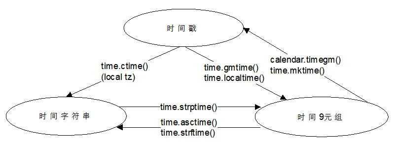

时间处理
================

Python 提供了三个与时间操作相关的模块。

- time 模块侧重于底层时间操作，给其他高层模块提供接口，侧重点在时分秒处理。
- datetime 模块主要是用来表示日期的，提供获取并操作时间中的年月日时分秒信息的能力。
- calendar 模块主要是用来表示年月日，星期几等日历信息。

为了深入理解时间模块提供的各种方法函数，首先了解几个与时间相关的概念。

时间相关的概念
---------------

.. glossary::

   epoch
      本意为纪元，也即一个时刻的开始。它在计算机计时系统中就是指时间基准点，在Unix系统中，这个基准点就是 UTC 时间的1970年1月1日0时0分0秒整那个时间点。只有有了参考点，计时系统才能工作，否则经过了10s，现在的时刻还是无法确定，有了基准点，只要计数了经过的秒数，就能计算出现在的年月日时分秒。

   GMT, UTC
      GMT 是格林尼治时间(Greenwich Mean Time)的缩写，还叫做世界协调时 UTC(Coordinated Universal Time)。历史上，先有GMT，后有UTC。
      UTC 是现在使用的时间标准，它根据原子钟来计算时间，而GMT根据地球的自转和公转来计算时间，GMT是老的时间计量标准。
      可以认为UTC是真正的基准时间，GMT相对UTC的偏差为0。
      
      计算机中有一个称为实时时钟（RTC，Real-Time Clock）的硬件模块，它会实时记录UTC时间，该模块有单独的电池供电，即使关机也不影响。
   
   时区，TZ/TZONE
   
      尽管有了时间基准，和精确计数时间的原子钟，已经可以精确地表示一个时间，但是很多情况下，还是要根据地区实际情况对时间进行一个调整，由于世界各国家与地区经度不同，地方时也有所不同，因此会划分为不同的时区。全球一共划分24个时区，其中 GMT 时间被定义为 0 时区，其他时区根据东西方向偏移，计算出本地时区的时间。
      
      北京时间CST（China Standard Time）为东八区，也即 GMT+8，当前表示为 UTC+8。

   夏令时，DST  
      DST 全称是Daylight Saving Time，为了充分利用日光，减少用电，人为地对时间做出一个调整，这取决于不同国家和地区的政策法规。比如说，夏天天亮的很早，如果还是像冬天一样规定从早上9:00到5:00上班，就不能充分利用日照，这有两种做法，就是每个企业都规定一套自己的夏季上下班时间，这比较麻烦，那么统一由授时中心在进入夏天的某个时刻，通常为凌晨，人为将时间提前一小时，这样原来的早上9:00上班的规定没变，但是实际上已经是8:00上班了。等夏季过去，夏令时结束，再在某个时间点把时间推后一个小时。

   NTP
      NTP 是网络时间协议(Network Time Protocol)的缩写，尽管每台计算机都有自己的 RTC 系统，但它们的精确度是不一致的，会存在走时误差，为了协调时间的同步，操作系统在启用了 NTP 之后，会自动在计算机联网之后与时间服务器同步时间，并更新RTC中的时间。

时间的表示方式
----------------

在 Python 中，通常用这三种方式来表示时间：

- 时间戳（timestamp）通常来说，时间戳表示的是从 epoch 开始按秒计算的偏移量，在 Python 中是一个浮点数。
- 格式化的时间字符串 ，比如 Thu Nov 29 20:50:50 CST 2018，用于人的解读。
- 元组格式，对应 C 语言中的 struct_time 数据结构，一共有 9 个元素。

元组中的 9 个元素名称和意义表示如下：

  ===== ========= =======================
  序号	  属性	  意义
  ===== ========= =======================
  0     tm_year	  （年）2008
  1     tm_mon	  （月）1 到 12
  2     tm_mday	  （日）1 到 31
  3     tm_hour	  （时）0 到 23
  4     tm_min	  （分）0 到 59
  5     tm_sec	  （秒）0 到 61  (60或61是闰秒)
  6     tm_wday	  （周）0 到 6   (0是周一)
  7     tm_yday	  （年）1 到 366 (儒略历)
  8     tm_isdst  （夏令时）0 未启用，1 启用, -1 未知
  ===== ========= =======================

获取各类格式的时间
------------------

time.time() 方法返回浮点型时间戳，单位秒。

.. code-block:: python
  :linenos:
  :lineno-start: 0
    
  import time
  timestamp = time.time()
  print(timestamp)

  >>>
  1543497999.9993412

time.gmtime() 可以获取 UTC 9 元组。

.. code-block:: python
  :linenos:
  :lineno-start: 0
  
  gmt = time.gmtime()
  print(gmt)
  
  >>>
  time.struct_time(tm_year=2018, tm_mon=11,
  tm_mday=29, tm_hour=13, tm_min=31, tm_sec=1, 
  tm_wday=3, tm_yday=333, tm_isdst=0) 

time.localtime() 可以获取本地时区 9 元组。

.. code-block:: python
  :linenos:
  :lineno-start: 0
  
  ltime = time.localtime()
  print(ltime)

  >>>
  time.struct_time(tm_year=2018, tm_mon=11, 
  tm_mday=29, tm_hour=21, tm_min=34, tm_sec=18, 
  tm_wday=3, tm_yday=333, tm_isdst=0)

可以发现本地时区北京时间的 tm_hour 为 UTC 时区 tm_hour + 8。

time.gmtime() 和 time.localtime() 可以接受一个时间戳为参数，如果不提供，默认使用当前的时间戳。

.. code-block:: python
  :linenos:
  :lineno-start: 0
  
  gmt0 = time.gmtime()
  gmt1 = time.gmtime(time.time())
  print(gmt0 == gmt1)
  
  ltime0 = time.localtime()
  ltime1 = time.localtime(time.time())
  print(ltime0 == ltime1)
  
  >>>
  True
  True

所以如果传入参数 0，那么就可以看到 epoch 时刻对应的 9 元组表示形式。

.. code-block:: python
  :linenos:
  :lineno-start: 0
  
  print(time.gmtime(0))

  >>>
  time.struct_time(tm_year=1970, tm_mon=1, 
  tm_mday=1, tm_hour=0, tm_min=0, tm_sec=0, 
  tm_wday=3, tm_yday=1, tm_isdst=0)

.. code-block:: python
  :linenos:
  :lineno-start: 0
  
  print(time.ctime())
  print(time.asctime(time.localtime())) # 与 time.ctime() 等价
  
  print(time.ctime(0))
  
  >>>
  Thu Nov 29 21:44:48 2018
  Thu Nov 29 21:44:48 2018
  Thu Jan  1 08:00:00 1970

time.ctime() 默认使用当前的时间戳，也可以传入时间戳，比如0，生成本地时区的时间字符串。

时间格式化
------------

time.ctime() 默认的格式化方式如不能满足需求，可以指定格式化字符串，输出特定的时间字符串。

Python 中常用的时间格式化符号如下所示：

  ====== ===========================
  符号    意义
  ====== ===========================
      %y 两位数的年份表示（00-99）
      %Y 四位数的年份表示（0000-9999）
      %m 月份（01-12）
      %d 月内中的一天（0-31）
      %H 24小时制小时数（0-23）
      %I 12小时制小时数（01-12）
      %M 分钟数（00=59）
      %S 秒（00-59）
      %a 本地简化星期名称，例如 Thu
      %A 本地完整星期名称，例如 Thursday
      %b 本地简化的月份名称
      %B 本地完整的月份名称
      %c 本地相应的日期表示和时间表示，例如 Thu Nov 29 21:56:29 2018
      %j 年内的一天（001-366）
      %p 本地A.M.或P.M.的等价符，例如 AM 和 PM
      %U 一年中的星期数（00-53）星期天为星期的开始
      %w 星期（0-6），星期天为星期的开始
      %W 一年中的星期数（00-53）星期一为星期的开始
      %x 本地相应的日期表示  例如 11/29/18
      %X 本地相应的时间表示，例如 21:55:07
      %z 当前时区偏移值，例如 +0800
      %Z 当前时区的名称，例如 CST
      %% %号本身
  ====== ===========================    

.. code-block:: python
  :linenos:
  :lineno-start: 0
  
  # 1970-01-01 00:00:00
  timestr = time.strftime("%Y-%m-%d %H:%M:%S", time.localtime()) 
  print(timestr)
  
  # Thu Jan  1 00:00:00 1970
  timestr = time.strftime("%a %b %d %H:%M:%S %Y", time.localtime())
  print(timestr)
  
  # 另一种更便捷的方式
  print(time.asctime(time.localtime()))
  
  >>>
  2018-11-29 21:59:13
  Thu Nov 29 21:59:13 2018
  Thu Nov 29 21:59:13 2018

时间格式转换
--------------

在 Python 中，有三种时间表示格式，几种格式间相互转换使用的方法如下：
  
  =================== ================ =======================
  From 	                  To 	         方法
  =================== ================ =======================
  时间戳              UTC 9元组        time.gmtime()
  时间戳              本地时区 9元组   time.localtime()	
  时间戳              时间字符串       time.ctime()
  UTC 9元组 	        时间戳           calendar.timegm()	
  本地时区 9元组	    时间戳           time.mktime()
  9 元组              时间字符串       time.asctime() 或 time.strftime()
  时间字符串          9元组            time.strptime()
  =================== ================ =======================

时间字符串无法直接转换为时间戳，需要先转换为9元组。下图以更清晰的方式展现了它们之间的转换关系。

  Python 不同时间格式之间的转换函数
  
时间戳转时间元组
~~~~~~~~~~~~~~~~~~~~

时间戳转时间元组，如果不提供参数，默认为当前时间时间戳，即 time.time()。

.. code-block:: python
  :linenos:
  :lineno-start: 0
  
  gmt0 = time.gmtime(0)      # 转 UTC 9元组
  ltime0 = time.localtime(0) # 转本地时区 9元组
  print(gmt0)
  print(ltime0)
  
  >>>
  time.struct_time(tm_year=1970, tm_mon=1, tm_mday=1, tm_hour=0, 
                   tm_min=0, tm_sec=0, tm_wday=3, tm_yday=1, tm_isdst=0)
  time.struct_time(tm_year=1970, tm_mon=1, tm_mday=1, tm_hour=8, 
                   tm_min=0, tm_sec=0, tm_wday=3, tm_yday=1, tm_isdst=0)
         
时间元组转字符串
~~~~~~~~~~~~~~~~~~~~

时间元组转字符串有两种方式，time.asctime()提供了固定格式，如果不提供参数，默认为当前时间时间戳。time.strftime()可以任意定制时间字符串。

.. code-block:: python
  :linenos:
  :lineno-start: 0
  
  ctstr = time.asctime(time.localtime(0))
  ftstr0 = time.strftime("%a %b %d %H:%M:%S %Y", time.localtime(0))
  ftstr1 = time.strftime("%a %b %d %H:%M:%S %Y", time.gmtime(0))
  print(ctstr)
  print(ftstr0)
  print(ftstr1)
  
  >>>
  Thu Jan  1 08:00:00 1970
  Thu Jan 01 08:00:00 1970
  Thu Jan 01 00:00:00 1970

时间戳转时间字符串
~~~~~~~~~~~~~~~~~~~~

time.ctime()，默认为当前时间，获取本地时区的时间字符串。

.. code-block:: python
  :linenos:
  :lineno-start: 0
  
  print(time.ctime(0))
  
  >>>
  Thu Jan  1 08:00:00 1970

时间字符串转时间元组
~~~~~~~~~~~~~~~~~~~~

.. code-block:: python
  :linenos:
  :lineno-start: 0
    
  print(time.strptime('2017-9-30 11:32:23', '%Y-%m-%d %H:%M:%S'))
  
  >>>
  time.struct_time(tm_year=2017, tm_mon=9, tm_mday=30, tm_hour=11, 
  tm_min=32, tm_sec=23, tm_wday=5, tm_yday=273, tm_isdst=-1)

时间元组转时间戳
~~~~~~~~~~~~~~~~~~~~~

UTC 9元组转时间戳使用 calendar.timegm()，本地时区 9元组转时间戳使用 time.mktime()。

.. code-block:: python
  :linenos:
  :lineno-start: 0
  
  old_gmt = time.gmtime()
  old_ltime = time.localtime()
  
  print(time.time())              # 使用的当前时间戳
  print(calendar.timegm(old_gmt)) # UTC 转回的时间戳
  print(time.mktime(old_ltime))   # 本地时区转回的时间戳
  
  >>>
  1543549663.177866
  1543549663
  1543549663.0

时间字符串转时间戳
~~~~~~~~~~~~~~~~~~~~

时间字符串无法直接转换为时间戳，需要先转换为9元组。然后根据时间字符串是否为本地时间，再选择时间元组转时间戳的时间函数。

.. code-block:: python
  :linenos:
  :lineno-start: 0

  # inpput timestr as "Thu Jan  1 08:00:00 1970"
  def timestr2stamp(timestr, isutc=False):
      try:
          tuple_time = time.strptime(timestr,"%a %b %d %H:%M:%S %Y")
          time_stamp = calendar.timegm(tuple_time) if isutc else time.mktime(tuple_time)
      except Exception as e:
          print(e)
          return False,0
      return True,time_stamp
  
  # 字符串表示的是本地时间
  status, time_stamp = timestr2stamp("Thu Jan  1 08:00:00 1970")
  if status:
      print(time_stamp)
      print(time.ctime(time_stamp))

  # 字符串表示的是UTC时间
  status, time_stamp = timestr2stamp("Thu Jan  1 00:00:00 1970", True)
  if status:
      print(time_stamp)
      print(time.ctime(time_stamp))
      
  >>>
  0.0
  Thu Jan  1 08:00:00 1970
  0
  Thu Jan  1 08:00:00 1970

时间格式转换类
~~~~~~~~~~~~~~~~~~~~

尝试记住时间各类格式之间的转换函数是一件头疼的事，这里按照通常的命名方法来实现一个时间格式转换类，并直接定义为类方法。

.. code-block:: python
  :linenos:
  :lineno-start: 0
  
  import time,calendar

  class TimeFmtConverter():
      # stamp to utc 9tuple
      @classmethod
      def stamp2utuple(cls, stamp=None):
          if stamp == None:
              stamp = time.time()
          return time.gmtime(stamp)
      
      # stamp to local tz 9tuple
      @classmethod
      def stamp2ltuple(cls, stamp=None):
          if stamp == None:
              stamp = time.time()
          return time.localtime(stamp)
      
      # tuple to time string with time.asctime()
      @classmethod
      def tuple2str(cls, intuple=None):
          if intuple == None:
              intuple = time.localtime()
          return time.asctime(intuple)
      
      # tuple to time string with time.strftime()
      @classmethod
      def tuple_fmt2str(cls, fmt="%a %b %d %H:%M:%S %Y", intuple=None):
          if intuple == None:
              intuple = time.localtime()
          return time.strftime(fmt, intuple)
      
      # stamp to utc time string
      @classmethod
      def stamp2ustr(cls, stamp=None):
          if stamp == None:
              stamp = time.time()
              
          return cls.tuple2str(time.gmtime(stamp))
      
      # stamp to local tz string
      @classmethod
      def stamp2lstr(cls, stamp=None):
          if stamp == None:
              stamp = time.time()
              
          return time.ctime(stamp)
      
      # local tz 9tuple to stamp
      @classmethod
      def ltuple2stamp(cls, intuple=None):
          if intuple == None:
              intuple = time.localtime()
              
          return time.mktime(intuple)
      
      # utc tuple to stamp
      @classmethod
      def utuple2stamp(cls, intuple=None):
          if intuple == None:
              intuple = time.gmtime()
  
          return calendar.timegm(intuple)
   
      # utc time string to time stamp
      # inpput timestr style as "Thu Jan  1 00:00:00 1970"
      @classmethod
      def ustr2stamp(cls, timestr=None):
          if timestr == None:
              return cls.utuple2stamp()
          
          tuple_time = time.strptime(timestr, "%a %b %d %H:%M:%S %Y")
          return calendar.timegm(tuple_time) 
      
      # local tz time string to time stamp
      # inpput timestr style as "Thu Jan  1 08:00:00 1970"
      @classmethod
      def lstr2stamp(cls, timestr=None):
          if timestr == None:
              return cls.ltuple2stamp()
          
          tuple_time = time.strptime(timestr, "%a %b %d %H:%M:%S %Y")
          return time.mktime(tuple_time) 
      
      @classmethod
      def test(cls):
          print(cls.stamp2utuple())
          print(cls.stamp2ltuple())
          print(cls.tuple2str())
          print(cls.tuple_fmt2str())
          print(cls.stamp2lstr())
          print(cls.stamp2ustr())
          print(cls.stamp2lstr(cls.ltuple2stamp()))
          print(cls.stamp2ustr(cls.ustr2stamp("Thu Jan  1 00:00:00 1970")))
          print(cls.stamp2lstr(cls.lstr2stamp("Thu Jan  1 08:00:00 1970")))
  
  TimeFmtConverter.test()
  
  >>>
  time.struct_time(tm_year=2018, tm_mon=12, tm_mday=1, tm_hour=14, 
  tm_min=24, tm_sec=0, tm_wday=5, tm_yday=335, tm_isdst=0)
  time.struct_time(tm_year=2018, tm_mon=12, tm_mday=1, tm_hour=22, 
  tm_min=24, tm_sec=0, tm_wday=5, tm_yday=335, tm_isdst=0)
  Sat Dec  1 22:24:00 2018
  Sat Dec 01 22:24:00 2018
  Sat Dec  1 22:24:00 2018
  Sat Dec  1 14:24:00 2018
  Sat Dec  1 22:24:00 2018
  Thu Jan  1 00:00:00 1970
  Thu Jan  1 08:00:00 1970

datetime 模块
------------------

datetime 模块提供了强大的时间相关的运算，比如偏移，统计等方法。
